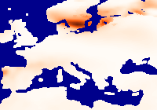

# Time series decomposition of the data cube


```julia
using CABLAB
import Patchwork
Patchwork.load_js_runtime()
```


<script>(function e(t,n,r){function s(o,u){if(!n[o]){if(!t[o]){var a=typeof require=="function"&&require;if(!u&&a)return a(o,!0);if(i)return i(o,!0);var f=new Error("Cannot find module '"+o+"'");throw f.code="MODULE_NOT_FOUND",f}var l=n[o]={exports:{}};t[o][0].call(l.exports,function(e){var n=t[o][1][e];return s(n?n:e)},l,l.exports,e,t,n,r)}return n[o].exports}var i=typeof require=="function"&&require;for(var o=0;o<r.length;o++)s(r[o]);return s})({1:[function(require,module,exports){
var VNode = require('vtree/vnode');
var svg = require('virtual-hyperscript/svg');
var VText = require('vtree/vtext');
var VPatch = require('vtree/vpatch');
var diff = require('virtual-dom/diff');
var patch = require('virtual-dom/patch');
var createElement = require('virtual-dom/create-element');
var nodeIndex = require('./node-index');
var patchVNode = require('./patch-vnode');
var isArray = require('x-is-array');
var isVPatch = require('./is-vpatch');

var P = Patchwork = {
    nodes: {},
    debug: false,
    Node: function (id, jlNode, el, renderOpts) {
        if (typeof(el) === "undefined") {
            el = document.getElementById(id)
        }
        this.id = id
        this.renderOptions = renderOpts
        if (jlNode) {
            // Note: makes this.root
            var vnode = P.makeVNode(jlNode)
            P.log("makeVNode: ", jlNode, "=>", vnode)
            this.mount(vnode, el, renderOpts)
        }
        P.nodes[id] = this
    },
    NAMESPACES: {
        "xhtml": null,
        "svg": "http://www.w3.org/2000/svg",
        null: null,
        undefined: null
    },
    refDiff: function (a, b, p) {
        var a = P.makeVNode(a)
            b = P.makeVNode(b)
            p = P.makeVPatches(a, p)
        console.log(p, diff(a, b));
    },
    massageProps: function (props) {
        if ("attributes" in props) {
            // we can't send undefined over JSON, so we turn nulls into undefs
            // so that VDom calls removeAttribute on the DOM node.
            //console.log("attributes ", props.attributes)
            for (var attr in props.attributes) {
                if (!props.attributes.hasOwnProperty(attr)) {
                    continue
                }
                if (props.attributes[attr] === null) {
                //console.log("remove ", attr, props.attributes[attr]);
                    props.attributes[attr] = undefined
                }
            }
        }
        return props;
    },
    makeVNode: function (jlNode) {
        if ('txt' in jlNode) return new VText(jlNode.txt);
        var children = [],
            props = P.massageProps(jlNode.p || {})

        if (jlNode.c) {
            for (var i = 0, l = jlNode.c.length; i < l; i++) {
                children[i] = P.makeVNode(jlNode.c[i])
            }
        }

        if (jlNode.n === "svg") {
            return svg(jlNode.t, props, children)
        } else {
            var key = null
            if (props && props.key) {
                key = props.key
                delete props.key
            }
            return new VNode(jlNode.t,
                             props,
                             children,
                             key,
                             P.NAMESPACES[jlNode.n]);
        }
    },
    makeVPatches: function (root, jlPatches) {
        var indices = [];
        var vpatches = {a: root}
        for (var idx in jlPatches) {
            if (!jlPatches.hasOwnProperty(idx)) {
                continue
            }
            indices.push(Number(idx))
        }
        nodes = nodeIndex(root, indices)

        for (var idx in jlPatches) {
            vpatches[idx] = P.makeVPatch(nodes[idx], jlPatches[idx]);
        }
        return vpatches
    },
    makeVPatch: function (vnode, jlPatch) {
        if (isArray(jlPatch)) {
            // multiple patches to the same VNode
            var ps = [];
            for (var i=0, l=jlPatch.length; i < l; i++) {
                ps[i] = P.makeVPatch(vnode, jlPatch[i])
            }
            return ps
        }

        var type, patch;
        for (var k in jlPatch) {
            type = k;
            patch = jlPatch[k];
            break; // inorite?
        }

        function vpatch(p) { return new VPatch(type, vnode, p); }

        switch (Number(type)) {
        case VPatch.VTEXT:
            return vpatch(new VText(patch));
        case VPatch.VNODE:
            return vpatch(P.makeVNode(patch));
        case VPatch.PROPS:
            patch = P.massageProps(patch)
            if (vnode.namespace === P.NAMESPACES["svg"]) {
                patch = svg('dummy', patch, []).properties
            }
            return vpatch(patch);
        case VPatch.ORDER:
            return vpatch(patch);
        case VPatch.INSERT:
            return vpatch(P.makeVNode(patch));
        case VPatch.REMOVE:
            return vpatch(null);
        default:
            return null;
        }
    },
    log: function () {
        if (console && P.debug) {
            console.log.apply(console, arguments);
        }
    }
}

Patchwork.Node.prototype = {
    mount: function (vnode, outer, renderOpts) {
        var el = createElement(vnode, renderOpts);
        P.log("createElement: ", vnode, "=>", el)
        outer.appendChild(el)
        this.element = el
        this.root = vnode;
        return el;
    },
    applyPatch: function (vpatches) {
        // apply patch to DOM nodes
        if (!isVPatch(vpatches)) {
            vpatches = P.makeVPatches(this.root, vpatches)
        }
        this.element = patch(this.element, vpatches, this.renderOptions)
        this.root = patchVNode(this.root, vpatches)
    }
}

function init(nb, cue) {
    if (!Patchwork.inited) {
        try {
            console.log("attempting Patchwork setup, cue:", cue)
            var commMgr =  nb.kernel.comm_manager;
            commMgr.register_target("PatchStream", function (comm, msg) {
                var nodeId = msg.content.data.pwid;
                comm.on_msg(function (msg) {
                    var node = P.nodes[nodeId],
                        patches = msg.content.data
                    node.applyPatch(patches)
                    P.log("received patches", patches)
                });
            });
            Patchwork.inited = true;
        } catch (e) {
            Patchwork.inited = false;
            console.log("ERROR initializing patchwork: ", e);
            console.log("attempting failed, cue:", cue)
        }
    }
}

// IJulia setup
if (typeof(window.IPython) !== "undefined") {
    init(IPython.notebook, "immediate");
    $(document).ready(function () { init(IPython.notebook, "document ready"); });
    $([IPython.events]).on("kernel_ready.Kernel kernel_created.Kernel", function (evt, nb) {
        init(nb, "kernel start")
    })
}

window.Patchwork = Patchwork;

},{"./is-vpatch":2,"./node-index":3,"./patch-vnode":58,"virtual-dom/create-element":5,"virtual-dom/diff":6,"virtual-dom/patch":23,"virtual-hyperscript/svg":47,"vtree/vnode":53,"vtree/vpatch":54,"vtree/vtext":55,"x-is-array":56}],2:[function(require,module,exports){
var version = require("vtree/version")

module.exports = isVirtualPatch

function isVirtualPatch(x) {
    return x && x.type === "VirtualPatch" && x.version === version
}

},{"vtree/version":52}],3:[function(require,module,exports){
module.exports = nodeIndex

function nodeIndex(tree, indices, nodes) {
    if (!indices || indices.length === 0) {
        return {}
    } else {
        indices.sort(ascending)
        return recurse(tree, indices, nodes, 0)
    }
}

function recurse(tree, indices, nodes, rootIndex) {
    nodes = nodes || {}


    if (tree) {
        if (indexInRange(indices, rootIndex, rootIndex)) {
            nodes[rootIndex] = tree
        }

        var vChildren = tree.children

        if (vChildren) {

            for (var i = 0; i < vChildren.length; i++) {
                rootIndex += 1

                var vChild = vChildren[i]
                var nextIndex = rootIndex + (vChild.count || 0)

                // skip recursion down the tree if there are no nodes down here
                if (indexInRange(indices, rootIndex, nextIndex)) {
                    recurse(vChild, indices, nodes, rootIndex)
                }

                rootIndex = nextIndex
            }
        }
    } else {
        rootIndex
    }

    return nodes
}

// Binary search for an index in the interval [left, right]
function indexInRange(indices, left, right) {
    if (indices.length === 0) {
        return false
    }

    var minIndex = 0
    var maxIndex = indices.length - 1
    var currentIndex
    var currentItem

    while (minIndex <= maxIndex) {
        currentIndex = ((maxIndex + minIndex) / 2) >> 0
        currentItem = indices[currentIndex]

        if (minIndex === maxIndex) {
            return currentItem >= left && currentItem <= right
        } else if (currentItem < left) {
            minIndex = currentIndex + 1
        } else  if (currentItem > right) {
            maxIndex = currentIndex - 1
        } else {
            return true
        }
    }

    return false;
}

function ascending(a, b) {
    return a > b ? 1 : -1
}

},{}],4:[function(require,module,exports){
module.exports = isObject

function isObject(x) {
    return typeof x === "object" && x !== null
}

},{}],5:[function(require,module,exports){
var createElement = require("vdom/create-element")

module.exports = createElement

},{"vdom/create-element":8}],6:[function(require,module,exports){
var diff = require("vtree/diff")

module.exports = diff

},{"vtree/diff":14}],7:[function(require,module,exports){
var isObject = require("is-object")
var isHook = require("vtree/is-vhook")

module.exports = applyProperties

function applyProperties(node, props, previous, renderOptions) {
    var domNode = renderOptions && renderOptions.extractNode ?
            renderOptions.extractNode(node) : node

    for (var propName in props) {
        var propValue = props[propName]

        if (propValue === undefined) {
            removeProperty(domNode, props, previous, propName);
        } else if (isHook(propValue)) {
            propValue.hook(domNode,
                propName,
                previous ? previous[propName] : undefined)
        } else {
            if (isObject(propValue)) {
                patchObject(domNode, props, previous, propName, propValue);
            } else if (propValue !== undefined) {
                domNode[propName] = propValue
            }
        }
    }
}

function removeProperty(node, props, previous, propName) {
    if (previous) {
        var previousValue = previous[propName]

        if (!isHook(previousValue)) {
            if (propName === "attributes") {
                for (var attrName in previousValue) {
                    node.removeAttribute(attrName)
                }
            } else if (propName === "style") {
                for (var i in previousValue) {
                    node.style[i] = ""
                }
            } else if (typeof previousValue === "string") {
                node[propName] = ""
            } else {
                node[propName] = null
            }
        }
    }
}

function patchObject(node, props, previous, propName, propValue) {
    var previousValue = previous ? previous[propName] : undefined

    // Set attributes
    if (propName === "attributes") {
        for (var attrName in propValue) {
            var attrValue = propValue[attrName]

            if (attrValue === undefined) {
                node.removeAttribute(attrName)
            } else {
                node.setAttribute(attrName, attrValue)
            }
        }

        return
    }

    if(previousValue && isObject(previousValue) &&
        getPrototype(previousValue) !== getPrototype(propValue)) {
        node[propName] = propValue
        return
    }

    if (!isObject(node[propName])) {
        node[propName] = {}
    }

    var replacer = propName === "style" ? "" : undefined

    for (var k in propValue) {
        var value = propValue[k]
        node[propName][k] = (value === undefined) ? replacer : value
    }
}

function getPrototype(value) {
    if (Object.getPrototypeOf) {
        return Object.getPrototypeOf(value)
    } else if (value.__proto__) {
        return value.__proto__
    } else if (value.constructor) {
        return value.constructor.prototype
    }
}

},{"is-object":4,"vtree/is-vhook":17}],8:[function(require,module,exports){
var document = require("global/document")

var applyProperties = require("./apply-properties")

var isVNode = require("vtree/is-vnode")
var isVText = require("vtree/is-vtext")
var isWidget = require("vtree/is-widget")
var handleThunk = require("vtree/handle-thunk")

module.exports = createElement

function id(x) { return x }

function createElement(vnode, opts) {

    var doc = opts ? opts.document || document : document
    var warn = opts ? opts.warn : null

    vnode = handleThunk(vnode).a

    if (isWidget(vnode)) {
        return vnode.init()
    } else if (isVText(vnode)) {
        return doc.createTextNode(vnode.text)
    } else if (!isVNode(vnode)) {
        if (warn) {
            warn("Item is not a valid virtual dom node", vnode)
        }
        return null
    }

    var node = (vnode.namespace === null) ?
        doc.createElement(vnode.tagName, vnode.properties.is) :
        doc.createElementNS(vnode.namespace, vnode.tagName)

    var props = vnode.properties
    applyProperties(node, props, null, opts)

    var children = vnode.children

    for (var i = 0; i < children.length; i++) {
        var childNode = createElement(children[i], opts)
        if (childNode) {
            node.appendChild(childNode)
        }
    }

    return node
}

},{"./apply-properties":7,"global/document":10,"vtree/handle-thunk":15,"vtree/is-vnode":18,"vtree/is-vtext":19,"vtree/is-widget":20}],9:[function(require,module,exports){
// Maps a virtual DOM tree onto a real DOM tree in an efficient manner.
// We don't want to read all of the DOM nodes in the tree so we use
// the in-order tree indexing to eliminate recursion down certain branches.
// We only recurse into a DOM node if we know that it contains a child of
// interest.

var noChild = {}

module.exports = domIndex

function domIndex(rootNode, tree, indices, nodes) {
    if (!indices || indices.length === 0) {
        return {}
    } else {
        indices.sort(ascending)
        return recurse(rootNode, tree, indices, nodes, 0)
    }
}

function recurse(rootNode, tree, indices, nodes, rootIndex) {
    nodes = nodes || {}


    if (rootNode) {
        if (indexInRange(indices, rootIndex, rootIndex)) {
            nodes[rootIndex] = rootNode
        }

        var vChildren = tree.children

        if (vChildren) {

            var childNodes = rootNode.childNodes

            for (var i = 0; i < tree.children.length; i++) {
                rootIndex += 1

                var vChild = vChildren[i] || noChild
                var nextIndex = rootIndex + (vChild.count || 0)

                // skip recursion down the tree if there are no nodes down here
                if (indexInRange(indices, rootIndex, nextIndex)) {
                    recurse(childNodes[i], vChild, indices, nodes, rootIndex)
                }

                rootIndex = nextIndex
            }
        }
    }

    return nodes
}

// Binary search for an index in the interval [left, right]
function indexInRange(indices, left, right) {
    if (indices.length === 0) {
        return false
    }

    var minIndex = 0
    var maxIndex = indices.length - 1
    var currentIndex
    var currentItem

    while (minIndex <= maxIndex) {
        currentIndex = ((maxIndex + minIndex) / 2) >> 0
        currentItem = indices[currentIndex]

        if (minIndex === maxIndex) {
            return currentItem >= left && currentItem <= right
        } else if (currentItem < left) {
            minIndex = currentIndex + 1
        } else  if (currentItem > right) {
            maxIndex = currentIndex - 1
        } else {
            return true
        }
    }

    return false;
}

function ascending(a, b) {
    return a > b ? 1 : -1
}

},{}],10:[function(require,module,exports){
(function (global){
var topLevel = typeof global !== 'undefined' ? global :
    typeof window !== 'undefined' ? window : {}
var minDoc = require('min-document');

if (typeof document !== 'undefined') {
    module.exports = document;
} else {
    var doccy = topLevel['__GLOBAL_DOCUMENT_CACHE@4'];

    if (!doccy) {
        doccy = topLevel['__GLOBAL_DOCUMENT_CACHE@4'] = minDoc;
    }

    module.exports = doccy;
}

}).call(this,typeof global !== "undefined" ? global : typeof self !== "undefined" ? self : typeof window !== "undefined" ? window : {})
},{"min-document":60}],11:[function(require,module,exports){
var applyProperties = require("./apply-properties")

var isWidget = require("vtree/is-widget")
var VPatch = require("vtree/vpatch")

var render = require("./create-element")
var updateWidget = require("./update-widget")

module.exports = applyPatch

function applyPatch(vpatch, domNode, renderOptions) {
    var type = vpatch.type
    var vNode = vpatch.vNode
    var patch = vpatch.patch

    switch (type) {
        case VPatch.REMOVE:
            return removeNode(domNode, vNode)
        case VPatch.INSERT:
            return insertNode(domNode, patch, renderOptions)
        case VPatch.VTEXT:
            return stringPatch(domNode, vNode, patch, renderOptions)
        case VPatch.WIDGET:
            return widgetPatch(domNode, vNode, patch, renderOptions)
        case VPatch.VNODE:
            return vNodePatch(domNode, vNode, patch, renderOptions)
        case VPatch.ORDER:
            reorderChildren(domNode, patch)
            return domNode
        case VPatch.PROPS:
            applyProperties(domNode, patch, vNode.properties, renderOptions)
            return domNode
        case VPatch.THUNK:
            return replaceRoot(domNode,
                renderOptions.patch(domNode, patch, renderOptions))
        default:
            return domNode
    }
}

function removeNode(domNode, vNode) {
    var parentNode = domNode.parentNode

    if (parentNode) {
        parentNode.removeChild(domNode)
    }

    destroyWidget(domNode, vNode);

    return null
}

function insertNode(parentNode, vNode, renderOptions) {
    var newNode = render(vNode, renderOptions)

    if (parentNode) {
        parentNode.appendChild(newNode)
    }

    return parentNode
}

function stringPatch(domNode, leftVNode, vText, renderOptions) {
    var newNode

    if (domNode.nodeType === 3) {
        domNode.replaceData(0, domNode.length, vText.text)
        newNode = domNode
    } else {
        var parentNode = domNode.parentNode
        newNode = render(vText, renderOptions)

        if (parentNode) {
            parentNode.replaceChild(newNode, domNode)
        }
    }

    destroyWidget(domNode, leftVNode)

    return newNode
}

function widgetPatch(domNode, leftVNode, widget, renderOptions) {
    if (updateWidget(leftVNode, widget)) {
        return widget.update(leftVNode, domNode) || domNode
    }

    var parentNode = domNode.parentNode
    var newWidget = render(widget, renderOptions)

    if (parentNode) {
        parentNode.replaceChild(newWidget, domNode)
    }

    destroyWidget(domNode, leftVNode)

    return newWidget
}

function vNodePatch(domNode, leftVNode, vNode, renderOptions) {
    var parentNode = domNode.parentNode
    var newNode = render(vNode, renderOptions)

    if (parentNode) {
        parentNode.replaceChild(newNode, domNode)
    }

    destroyWidget(domNode, leftVNode)

    return newNode
}

function destroyWidget(domNode, w) {
    if (typeof w.destroy === "function" && isWidget(w)) {
        w.destroy(domNode)
    }
}

function reorderChildren(domNode, bIndex) {
    var children = []
    var childNodes = domNode.childNodes
    var len = childNodes.length
    var i
    var reverseIndex = bIndex.reverse

    for (i = 0; i < len; i++) {
        children.push(domNode.childNodes[i])
    }

    var insertOffset = 0
    var move
    var node
    var insertNode
    for (i = 0; i < len; i++) {
        move = bIndex[i]
        if (move !== undefined && move !== i) {
            // the element currently at this index will be moved later so increase the insert offset
            if (reverseIndex[i] > i) {
                insertOffset++
            }

            node = children[move]
            insertNode = childNodes[i + insertOffset] || null
            if (node !== insertNode) {
                domNode.insertBefore(node, insertNode)
            }

            // the moved element came from the front of the array so reduce the insert offset
            if (move < i) {
                insertOffset--
            }
        }

        // element at this index is scheduled to be removed so increase insert offset
        if (i in bIndex.removes) {
            insertOffset++
        }
    }
}

function replaceRoot(oldRoot, newRoot) {
    if (oldRoot && newRoot && oldRoot !== newRoot && oldRoot.parentNode) {
        console.log(oldRoot)
        oldRoot.parentNode.replaceChild(newRoot, oldRoot)
    }

    return newRoot;
}

},{"./apply-properties":7,"./create-element":8,"./update-widget":13,"vtree/is-widget":20,"vtree/vpatch":22}],12:[function(require,module,exports){
var document = require("global/document")
var isArray = require("x-is-array")

var domIndex = require("./dom-index")
var patchOp = require("./patch-op")
module.exports = patch

function patch(rootNode, patches, renderOptions) {
    return patchRecursive(rootNode, patches, renderOptions)
}

function patchRecursive(rootNode, patches, renderOptions) {
    var indices = patchIndices(patches)

    if (indices.length === 0) {
        return rootNode
    }

    var index = domIndex(rootNode, patches.a, indices)
    var ownerDocument = rootNode.ownerDocument

    if (!renderOptions) {
        renderOptions = {}
        if (ownerDocument !== document) {
            renderOptions.document = ownerDocument
        }
    }

    if (!renderOptions.patch) {
        renderOptions.patch = patchRecursive
    }

    for (var i = 0; i < indices.length; i++) {
        var nodeIndex = indices[i]
        rootNode = applyPatch(rootNode,
            index[nodeIndex],
            patches[nodeIndex],
            renderOptions)
    }

    return rootNode
}

function applyPatch(rootNode, domNode, patchList, renderOptions) {
    if (!domNode) {
        return rootNode
    }

    var newNode

    if (isArray(patchList)) {
        for (var i = 0; i < patchList.length; i++) {
            newNode = patchOp(patchList[i], domNode, renderOptions)

            if (domNode === rootNode) {
                rootNode = newNode
            }
        }
    } else {
        newNode = patchOp(patchList, domNode, renderOptions)

        if (domNode === rootNode) {
            rootNode = newNode
        }
    }

    return rootNode
}

function patchIndices(patches) {
    var indices = []

    for (var key in patches) {
        if (key !== "a") {
            indices.push(Number(key))
        }
    }

    return indices
}

},{"./dom-index":9,"./patch-op":11,"global/document":10,"x-is-array":56}],13:[function(require,module,exports){
var isWidget = require("vtree/is-widget")

module.exports = updateWidget

function updateWidget(a, b) {
    if (isWidget(a) && isWidget(b)) {
        if ("name" in a && "name" in b) {
            return a.id === b.id
        } else {
            return a.init === b.init
        }
    }

    return false
}

},{"vtree/is-widget":20}],14:[function(require,module,exports){
var isArray = require("x-is-array")
var isObject = require("is-object")

var VPatch = require("./vpatch")
var isVNode = require("./is-vnode")
var isVText = require("./is-vtext")
var isWidget = require("./is-widget")
var isThunk = require("./is-thunk")
var handleThunk = require("./handle-thunk")

module.exports = diff

function diff(a, b) {
    var patch = { a: a }
    walk(a, b, patch, 0)
    return patch
}

function walk(a, b, patch, index) {
    if (a === b) {
        if (isThunk(a) || isThunk(b)) {
            thunks(a, b, patch, index)
        } else {
            hooks(b, patch, index)
        }
        return
    }

    var apply = patch[index]

    if (b == null) {
        apply = appendPatch(apply, new VPatch(VPatch.REMOVE, a, b))
        destroyWidgets(a, patch, index)
    } else if (isThunk(a) || isThunk(b)) {
        thunks(a, b, patch, index)
    } else if (isVNode(b)) {
        if (isVNode(a)) {
            if (a.tagName === b.tagName &&
                a.namespace === b.namespace &&
                a.key === b.key) {
                var propsPatch = diffProps(a.properties, b.properties, b.hooks)
                if (propsPatch) {
                    apply = appendPatch(apply,
                        new VPatch(VPatch.PROPS, a, propsPatch))
                }
                apply = diffChildren(a, b, patch, apply, index)
            } else {
                apply = appendPatch(apply, new VPatch(VPatch.VNODE, a, b))
                destroyWidgets(a, patch, index)
            }
        } else {
            apply = appendPatch(apply, new VPatch(VPatch.VNODE, a, b))
            destroyWidgets(a, patch, index)
        }
    } else if (isVText(b)) {
        if (!isVText(a)) {
            apply = appendPatch(apply, new VPatch(VPatch.VTEXT, a, b))
            destroyWidgets(a, patch, index)
        } else if (a.text !== b.text) {
            apply = appendPatch(apply, new VPatch(VPatch.VTEXT, a, b))
        }
    } else if (isWidget(b)) {
        apply = appendPatch(apply, new VPatch(VPatch.WIDGET, a, b))

        if (!isWidget(a)) {
            destroyWidgets(a, patch, index)
        }
    }

    if (apply) {
        patch[index] = apply
    }
}

function diffProps(a, b, hooks) {
    var diff

    for (var aKey in a) {
        if (!(aKey in b)) {
            diff = diff || {}
            diff[aKey] = undefined
        }

        var aValue = a[aKey]
        var bValue = b[aKey]

        if (hooks && aKey in hooks) {
            diff = diff || {}
            diff[aKey] = bValue
        } else {
            if (isObject(aValue) && isObject(bValue)) {
                if (getPrototype(bValue) !== getPrototype(aValue)) {
                    diff = diff || {}
                    diff[aKey] = bValue
                } else {
                    var objectDiff = diffProps(aValue, bValue)
                    if (objectDiff) {
                        diff = diff || {}
                        diff[aKey] = objectDiff
                    }
                }
            } else if (aValue !== bValue) {
                diff = diff || {}
                diff[aKey] = bValue
            }
        }
    }

    for (var bKey in b) {
        if (!(bKey in a)) {
            diff = diff || {}
            diff[bKey] = b[bKey]
        }
    }

    return diff
}

function getPrototype(value) {
    if (Object.getPrototypeOf) {
        return Object.getPrototypeOf(value)
    } else if (value.__proto__) {
        return value.__proto__
    } else if (value.constructor) {
        return value.constructor.prototype
    }
}

function diffChildren(a, b, patch, apply, index) {
    var aChildren = a.children
    var bChildren = reorder(aChildren, b.children)

    var aLen = aChildren.length
    var bLen = bChildren.length
    var len = aLen > bLen ? aLen : bLen

    for (var i = 0; i < len; i++) {
        var leftNode = aChildren[i]
        var rightNode = bChildren[i]
        index += 1

        if (!leftNode) {
            if (rightNode) {
                // Excess nodes in b need to be added
                apply = appendPatch(apply,
                    new VPatch(VPatch.INSERT, null, rightNode))
            }
        } else if (!rightNode) {
            if (leftNode) {
                // Excess nodes in a need to be removed
                patch[index] = new VPatch(VPatch.REMOVE, leftNode, null)
                destroyWidgets(leftNode, patch, index)
            }
        } else {
            walk(leftNode, rightNode, patch, index)
        }

        if (isVNode(leftNode) && leftNode.count) {
            index += leftNode.count
        }
    }

    if (bChildren.moves) {
        // Reorder nodes last
        apply = appendPatch(apply, new VPatch(VPatch.ORDER, a, bChildren.moves))
    }

    return apply
}

// Patch records for all destroyed widgets must be added because we need
// a DOM node reference for the destroy function
function destroyWidgets(vNode, patch, index) {
    if (isWidget(vNode)) {
        if (typeof vNode.destroy === "function") {
            patch[index] = new VPatch(VPatch.REMOVE, vNode, null)
        }
    } else if (isVNode(vNode) && vNode.hasWidgets) {
        var children = vNode.children
        var len = children.length
        for (var i = 0; i < len; i++) {
            var child = children[i]
            index += 1

            destroyWidgets(child, patch, index)

            if (isVNode(child) && child.count) {
                index += child.count
            }
        }
    }
}

// Create a sub-patch for thunks
function thunks(a, b, patch, index) {
    var nodes = handleThunk(a, b);
    var thunkPatch = diff(nodes.a, nodes.b)
    if (hasPatches(thunkPatch)) {
        patch[index] = new VPatch(VPatch.THUNK, null, thunkPatch)
    }
}

function hasPatches(patch) {
    for (var index in patch) {
        if (index !== "a") {
            return true;
        }
    }

    return false;
}

// Execute hooks when two nodes are identical
function hooks(vNode, patch, index) {
    if (isVNode(vNode)) {
        if (vNode.hooks) {
            patch[index] = new VPatch(VPatch.PROPS, vNode.hooks, vNode.hooks)
        }

        if (vNode.descendantHooks) {
            var children = vNode.children
            var len = children.length
            for (var i = 0; i < len; i++) {
                var child = children[i]
                index += 1

                hooks(child, patch, index)

                if (isVNode(child) && child.count) {
                    index += child.count
                }
            }
        }
    }
}

// List diff, naive left to right reordering
function reorder(aChildren, bChildren) {

    var bKeys = keyIndex(bChildren)

    if (!bKeys) {
        return bChildren
    }

    var aKeys = keyIndex(aChildren)

    if (!aKeys) {
        return bChildren
    }

    var bMatch = {}, aMatch = {}

    for (var key in bKeys) {
        bMatch[bKeys[key]] = aKeys[key]
    }

    for (var key in aKeys) {
        aMatch[aKeys[key]] = bKeys[key]
    }

    var aLen = aChildren.length
    var bLen = bChildren.length
    var len = aLen > bLen ? aLen : bLen
    var shuffle = []
    var freeIndex = 0
    var i = 0
    var moveIndex = 0
    var moves = {}
    var removes = moves.removes = {}
    var reverse = moves.reverse = {}
    var hasMoves = false

    while (freeIndex < len) {
        var move = aMatch[i]
        if (move !== undefined) {
            shuffle[i] = bChildren[move]
            if (move !== moveIndex) {
                moves[move] = moveIndex
                reverse[moveIndex] = move
                hasMoves = true
            }
            moveIndex++
        } else if (i in aMatch) {
            shuffle[i] = undefined
            removes[i] = moveIndex++
            hasMoves = true
        } else {
            while (bMatch[freeIndex] !== undefined) {
                freeIndex++
            }

            if (freeIndex < len) {
                var freeChild = bChildren[freeIndex]
                if (freeChild) {
                    shuffle[i] = freeChild
                    if (freeIndex !== moveIndex) {
                        hasMoves = true
                        moves[freeIndex] = moveIndex
                        reverse[moveIndex] = freeIndex
                    }
                    moveIndex++
                }
                freeIndex++
            }
        }
        i++
    }

    if (hasMoves) {
        shuffle.moves = moves
    }

    return shuffle
}

function keyIndex(children) {
    var i, keys

    for (i = 0; i < children.length; i++) {
        var child = children[i]

        if (child.key !== undefined) {
            keys = keys || {}
            keys[child.key] = i
        }
    }

    return keys
}

function appendPatch(apply, patch) {
    if (apply) {
        if (isArray(apply)) {
            apply.push(patch)
        } else {
            apply = [apply, patch]
        }

        return apply
    } else {
        return patch
    }
}

},{"./handle-thunk":15,"./is-thunk":16,"./is-vnode":18,"./is-vtext":19,"./is-widget":20,"./vpatch":22,"is-object":4,"x-is-array":56}],15:[function(require,module,exports){
var isVNode = require("./is-vnode")
var isVText = require("./is-vtext")
var isWidget = require("./is-widget")
var isThunk = require("./is-thunk")

module.exports = handleThunk

function handleThunk(a, b) {
    var renderedA = a
    var renderedB = b

    if (isThunk(b)) {
        renderedB = renderThunk(b, a)
    }

    if (isThunk(a)) {
        renderedA = renderThunk(a, null)
    }

    return {
        a: renderedA,
        b: renderedB
    }
}

function renderThunk(thunk, previous) {
    var renderedThunk = thunk.vnode

    if (!renderedThunk) {
        renderedThunk = thunk.vnode = thunk.render(previous)
    }

    if (!(isVNode(renderedThunk) ||
            isVText(renderedThunk) ||
            isWidget(renderedThunk))) {
        throw new Error("thunk did not return a valid node");
    }

    return renderedThunk
}

},{"./is-thunk":16,"./is-vnode":18,"./is-vtext":19,"./is-widget":20}],16:[function(require,module,exports){
module.exports = isThunk

function isThunk(t) {
    return t && t.type === "Thunk"
}

},{}],17:[function(require,module,exports){
module.exports = isHook

function isHook(hook) {
    return hook && typeof hook.hook === "function" &&
        !hook.hasOwnProperty("hook")
}

},{}],18:[function(require,module,exports){
var version = require("./version")

module.exports = isVirtualNode

function isVirtualNode(x) {
    return x && x.type === "VirtualNode" && x.version === version
}

},{"./version":21}],19:[function(require,module,exports){
var version = require("./version")

module.exports = isVirtualText

function isVirtualText(x) {
    return x && x.type === "VirtualText" && x.version === version
}

},{"./version":21}],20:[function(require,module,exports){
module.exports = isWidget

function isWidget(w) {
    return w && w.type === "Widget"
}

},{}],21:[function(require,module,exports){
module.exports = "1"

},{}],22:[function(require,module,exports){
var version = require("./version")

VirtualPatch.NONE = 0
VirtualPatch.VTEXT = 1
VirtualPatch.VNODE = 2
VirtualPatch.WIDGET = 3
VirtualPatch.PROPS = 4
VirtualPatch.ORDER = 5
VirtualPatch.INSERT = 6
VirtualPatch.REMOVE = 7
VirtualPatch.THUNK = 8

module.exports = VirtualPatch

function VirtualPatch(type, vNode, patch) {
    this.type = Number(type)
    this.vNode = vNode
    this.patch = patch
}

VirtualPatch.prototype.version = version
VirtualPatch.prototype.type = "VirtualPatch"

},{"./version":21}],23:[function(require,module,exports){
var patch = require("vdom/patch")

module.exports = patch

},{"vdom/patch":12}],24:[function(require,module,exports){
module.exports = AttributeHook;

function AttributeHook(value) {
    if (!(this instanceof AttributeHook)) {
        return new AttributeHook(value);
    }

    this.value = value;
}

AttributeHook.prototype.hook = function (node, prop, prev) {
    if (prev && prev.value === this.value) {
        return;
    }

    node.setAttributeNS(null, prop, this.value)
}

},{}],25:[function(require,module,exports){
var DataSet = require("data-set")

module.exports = DataSetHook;

function DataSetHook(value) {
    if (!(this instanceof DataSetHook)) {
        return new DataSetHook(value);
    }

    this.value = value;
}

DataSetHook.prototype.hook = function (node, propertyName) {
    var ds = DataSet(node)
    var propName = propertyName.substr(5)

    ds[propName] = this.value;
};

},{"data-set":30}],26:[function(require,module,exports){
var DataSet = require("data-set")

module.exports = DataSetHook;

function DataSetHook(value) {
    if (!(this instanceof DataSetHook)) {
        return new DataSetHook(value);
    }

    this.value = value;
}

DataSetHook.prototype.hook = function (node, propertyName) {
    var ds = DataSet(node)
    var propName = propertyName.substr(3)

    ds[propName] = this.value;
};

},{"data-set":30}],27:[function(require,module,exports){
module.exports = SoftSetHook;

function SoftSetHook(value) {
    if (!(this instanceof SoftSetHook)) {
        return new SoftSetHook(value);
    }

    this.value = value;
}

SoftSetHook.prototype.hook = function (node, propertyName) {
    if (node[propertyName] !== this.value) {
        node[propertyName] = this.value;
    }
};

},{}],28:[function(require,module,exports){
var VNode = require("vtree/vnode.js")
var VText = require("vtree/vtext.js")
var isVNode = require("vtree/is-vnode")
var isVText = require("vtree/is-vtext")
var isWidget = require("vtree/is-widget")
var isHook = require("vtree/is-vhook")
var isVThunk = require("vtree/is-thunk")
var TypedError = require("error/typed")

var parseTag = require("./parse-tag.js")
var softSetHook = require("./hooks/soft-set-hook.js")
var dataSetHook = require("./hooks/data-set-hook.js")
var evHook = require("./hooks/ev-hook.js")

var UnexpectedVirtualElement = TypedError({
    type: "virtual-hyperscript.unexpected.virtual-element",
    message: "Unexpected virtual child passed to h().\n" +
        "Expected a VNode / Vthunk / VWidget / string but:\n" +
        "got a {foreignObjectStr}.\n" +
        "The parent vnode is {parentVnodeStr}.\n" +
        "Suggested fix: change your `h(..., [ ... ])` callsite.",
    foreignObjectStr: null,
    parentVnodeStr: null,
    foreignObject: null,
    parentVnode: null
})

module.exports = h

function h(tagName, properties, children) {
    var childNodes = []
    var tag, props, key, namespace

    if (!children && isChildren(properties)) {
        children = properties
        props = {}
    }

    props = props || properties || {}
    tag = parseTag(tagName, props)

    // support keys
    if ("key" in props) {
        key = props.key
        props.key = undefined
    }

    // support namespace
    if ("namespace" in props) {
        namespace = props.namespace
        props.namespace = undefined
    }

    // fix cursor bug
    if (tag === "input" &&
        "value" in props &&
        props.value !== undefined &&
        !isHook(props.value)
    ) {
        props.value = softSetHook(props.value)
    }

    var keys = Object.keys(props)
    var propName, value
    for (var j = 0; j < keys.length; j++) {
        propName = keys[j]
        value = props[propName]
        if (isHook(value)) {
            continue
        }

        // add data-foo support
        if (propName.substr(0, 5) === "data-") {
            props[propName] = dataSetHook(value)
        }

        // add ev-foo support
        if (propName.substr(0, 3) === "ev-") {
            props[propName] = evHook(value)
        }
    }

    if (children !== undefined && children !== null) {
        addChild(children, childNodes, tag, props)
    }


    var node = new VNode(tag, props, childNodes, key, namespace)

    return node
}

function addChild(c, childNodes, tag, props) {
    if (typeof c === "string") {
        childNodes.push(new VText(c))
    } else if (isChild(c)) {
        childNodes.push(c)
    } else if (Array.isArray(c)) {
        for (var i = 0; i < c.length; i++) {
            addChild(c[i], childNodes, tag, props)
        }
    } else if (c === null || c === undefined) {
        return
    } else {
        throw UnexpectedVirtualElement({
            foreignObjectStr: JSON.stringify(c),
            foreignObject: c,
            parentVnodeStr: JSON.stringify({
                tagName: tag,
                properties: props
            }),
            parentVnode: {
                tagName: tag,
                properties: props
            }
        })
    }
}

function isChild(x) {
    return isVNode(x) || isVText(x) || isWidget(x) || isVThunk(x)
}

function isChildren(x) {
    return typeof x === "string" || Array.isArray(x) || isChild(x)
}

},{"./hooks/data-set-hook.js":25,"./hooks/ev-hook.js":26,"./hooks/soft-set-hook.js":27,"./parse-tag.js":46,"error/typed":37,"vtree/is-thunk":38,"vtree/is-vhook":39,"vtree/is-vnode":40,"vtree/is-vtext":41,"vtree/is-widget":42,"vtree/vnode.js":44,"vtree/vtext.js":45}],29:[function(require,module,exports){
module.exports = createHash

function createHash(elem) {
    var attributes = elem.attributes
    var hash = {}

    if (attributes === null || attributes === undefined) {
        return hash
    }

    for (var i = 0; i < attributes.length; i++) {
        var attr = attributes[i]

        if (attr.name.substr(0,5) !== "data-") {
            continue
        }

        hash[attr.name.substr(5)] = attr.value
    }

    return hash
}

},{}],30:[function(require,module,exports){
var createStore = require("weakmap-shim/create-store")
var Individual = require("individual")

var createHash = require("./create-hash.js")

var hashStore = Individual("__DATA_SET_WEAKMAP@3", createStore())

module.exports = DataSet

function DataSet(elem) {
    var store = hashStore(elem)

    if (!store.hash) {
        store.hash = createHash(elem)
    }

    return store.hash
}

},{"./create-hash.js":29,"individual":31,"weakmap-shim/create-store":32}],31:[function(require,module,exports){
(function (global){
var root = typeof window !== 'undefined' ?
    window : typeof global !== 'undefined' ?
    global : {};

module.exports = Individual

function Individual(key, value) {
    if (root[key]) {
        return root[key]
    }

    Object.defineProperty(root, key, {
        value: value
        , configurable: true
    })

    return value
}

}).call(this,typeof global !== "undefined" ? global : typeof self !== "undefined" ? self : typeof window !== "undefined" ? window : {})
},{}],32:[function(require,module,exports){
var hiddenStore = require('./hidden-store.js');

module.exports = createStore;

function createStore() {
    var key = {};

    return function (obj) {
        if (typeof obj !== 'object' || obj === null) {
            throw new Error('Weakmap-shim: Key must be object')
        }

        var store = obj.valueOf(key);
        return store && store.identity === key ?
            store : hiddenStore(obj, key);
    };
}

},{"./hidden-store.js":33}],33:[function(require,module,exports){
module.exports = hiddenStore;

function hiddenStore(obj, key) {
    var store = { identity: key };
    var valueOf = obj.valueOf;

    Object.defineProperty(obj, "valueOf", {
        value: function (value) {
            return value !== key ?
                valueOf.apply(this, arguments) : store;
        },
        writable: true
    });

    return store;
}

},{}],34:[function(require,module,exports){
module.exports = function(obj) {
    if (typeof obj === 'string') return camelCase(obj);
    return walk(obj);
};

function walk (obj) {
    if (!obj || typeof obj !== 'object') return obj;
    if (isDate(obj) || isRegex(obj)) return obj;
    if (isArray(obj)) return map(obj, walk);
    return reduce(objectKeys(obj), function (acc, key) {
        var camel = camelCase(key);
        acc[camel] = walk(obj[key]);
        return acc;
    }, {});
}

function camelCase(str) {
    return str.replace(/[_.-](\w|$)/g, function (_,x) {
        return x.toUpperCase();
    });
}

var isArray = Array.isArray || function (obj) {
    return Object.prototype.toString.call(obj) === '[object Array]';
};

var isDate = function (obj) {
    return Object.prototype.toString.call(obj) === '[object Date]';
};

var isRegex = function (obj) {
    return Object.prototype.toString.call(obj) === '[object RegExp]';
};

var has = Object.prototype.hasOwnProperty;
var objectKeys = Object.keys || function (obj) {
    var keys = [];
    for (var key in obj) {
        if (has.call(obj, key)) keys.push(key);
    }
    return keys;
};

function map (xs, f) {
    if (xs.map) return xs.map(f);
    var res = [];
    for (var i = 0; i < xs.length; i++) {
        res.push(f(xs[i], i));
    }
    return res;
}

function reduce (xs, f, acc) {
    if (xs.reduce) return xs.reduce(f, acc);
    for (var i = 0; i < xs.length; i++) {
        acc = f(acc, xs[i], i);
    }
    return acc;
}

},{}],35:[function(require,module,exports){
var nargs = /\{([0-9a-zA-Z]+)\}/g
var slice = Array.prototype.slice

module.exports = template

function template(string) {
    var args

    if (arguments.length === 2 && typeof arguments[1] === "object") {
        args = arguments[1]
    } else {
        args = slice.call(arguments, 1)
    }

    if (!args || !args.hasOwnProperty) {
        args = {}
    }

    return string.replace(nargs, function replaceArg(match, i, index) {
        var result

        if (string[index - 1] === "{" &&
            string[index + match.length] === "}") {
            return i
        } else {
            result = args.hasOwnProperty(i) ? args[i] : null
            if (result === null || result === undefined) {
                return ""
            }

            return result
        }
    })
}

},{}],36:[function(require,module,exports){
module.exports = extend

function extend(target) {
    for (var i = 1; i < arguments.length; i++) {
        var source = arguments[i]

        for (var key in source) {
            if (source.hasOwnProperty(key)) {
                target[key] = source[key]
            }
        }
    }

    return target
}

},{}],37:[function(require,module,exports){
var camelize = require("camelize")
var template = require("string-template")
var extend = require("xtend/mutable")

module.exports = TypedError

function TypedError(args) {
    if (!args) {
        throw new Error("args is required");
    }
    if (!args.type) {
        throw new Error("args.type is required");
    }
    if (!args.message) {
        throw new Error("args.message is required");
    }

    var message = args.message

    if (args.type && !args.name) {
        var errorName = camelize(args.type) + "Error"
        args.name = errorName[0].toUpperCase() + errorName.substr(1)
    }

    createError.type = args.type;
    createError._name = args.name;

    return createError;

    function createError(opts) {
        var result = new Error()

        Object.defineProperty(result, "type", {
            value: result.type,
            enumerable: true,
            writable: true,
            configurable: true
        })

        var options = extend({}, args, opts)

        extend(result, options)
        result.message = template(message, options)

        return result
    }
}


},{"camelize":34,"string-template":35,"xtend/mutable":36}],38:[function(require,module,exports){
module.exports=require(16)
},{"/home/shashi/.julia/v0.3/Patchwork/runtime/node_modules/virtual-dom/node_modules/vtree/is-thunk.js":16}],39:[function(require,module,exports){
module.exports=require(17)
},{"/home/shashi/.julia/v0.3/Patchwork/runtime/node_modules/virtual-dom/node_modules/vtree/is-vhook.js":17}],40:[function(require,module,exports){
module.exports=require(18)
},{"./version":43,"/home/shashi/.julia/v0.3/Patchwork/runtime/node_modules/virtual-dom/node_modules/vtree/is-vnode.js":18}],41:[function(require,module,exports){
module.exports=require(19)
},{"./version":43,"/home/shashi/.julia/v0.3/Patchwork/runtime/node_modules/virtual-dom/node_modules/vtree/is-vtext.js":19}],42:[function(require,module,exports){
module.exports=require(20)
},{"/home/shashi/.julia/v0.3/Patchwork/runtime/node_modules/virtual-dom/node_modules/vtree/is-widget.js":20}],43:[function(require,module,exports){
module.exports=require(21)
},{"/home/shashi/.julia/v0.3/Patchwork/runtime/node_modules/virtual-dom/node_modules/vtree/version.js":21}],44:[function(require,module,exports){
var version = require("./version")
var isVNode = require("./is-vnode")
var isWidget = require("./is-widget")
var isVHook = require("./is-vhook")

module.exports = VirtualNode

var noProperties = {}
var noChildren = []

function VirtualNode(tagName, properties, children, key, namespace) {
    this.tagName = tagName
    this.properties = properties || noProperties
    this.children = children || noChildren
    this.key = key != null ? String(key) : undefined
    this.namespace = (typeof namespace === "string") ? namespace : null

    var count = (children && children.length) || 0
    var descendants = 0
    var hasWidgets = false
    var descendantHooks = false
    var hooks

    for (var propName in properties) {
        if (properties.hasOwnProperty(propName)) {
            var property = properties[propName]
            if (isVHook(property)) {
                if (!hooks) {
                    hooks = {}
                }

                hooks[propName] = property
            }
        }
    }

    for (var i = 0; i < count; i++) {
        var child = children[i]
        if (isVNode(child)) {
            descendants += child.count || 0

            if (!hasWidgets && child.hasWidgets) {
                hasWidgets = true
            }

            if (!descendantHooks && (child.hooks || child.descendantHooks)) {
                descendantHooks = true
            }
        } else if (!hasWidgets && isWidget(child)) {
            if (typeof child.destroy === "function") {
                hasWidgets = true
            }
        }
    }

    this.count = count + descendants
    this.hasWidgets = hasWidgets
    this.hooks = hooks
    this.descendantHooks = descendantHooks
}

VirtualNode.prototype.version = version
VirtualNode.prototype.type = "VirtualNode"

},{"./is-vhook":39,"./is-vnode":40,"./is-widget":42,"./version":43}],45:[function(require,module,exports){
var version = require("./version")

module.exports = VirtualText

function VirtualText(text) {
    this.text = String(text)
}

VirtualText.prototype.version = version
VirtualText.prototype.type = "VirtualText"

},{"./version":43}],46:[function(require,module,exports){
var classIdSplit = /([\.#]?[a-zA-Z0-9_:-]+)/
var notClassId = /^\.|#/

module.exports = parseTag

function parseTag(tag, props) {
    if (!tag) {
        return "div"
    }

    var noId = !("id" in props)

    var tagParts = tag.split(classIdSplit)
    var tagName = null

    if (notClassId.test(tagParts[1])) {
        tagName = "div"
    }

    var classes, part, type, i
    for (i = 0; i < tagParts.length; i++) {
        part = tagParts[i]

        if (!part) {
            continue
        }

        type = part.charAt(0)

        if (!tagName) {
            tagName = part
        } else if (type === ".") {
            classes = classes || []
            classes.push(part.substring(1, part.length))
        } else if (type === "#" && noId) {
            props.id = part.substring(1, part.length)
        }
    }

    if (classes) {
        if (props.className) {
            classes.push(props.className)
        }

        props.className = classes.join(" ")
    }

    return tagName ? tagName.toLowerCase() : "div"
}

},{}],47:[function(require,module,exports){
var attributeHook = require("./hooks/attribute-hook.js")
var h = require("./index.js")

var BLACKLISTED_KEYS = {
    "style": true,
    "namespace": true,
    "key": true
}
var SVG_NAMESPACE = "http://www.w3.org/2000/svg"

module.exports = svg

function svg(tagName, properties, children) {
    if (!children && isChildren(properties)) {
        children = properties
        properties = {}
    }

    properties = properties || {}

    // set namespace for svg
    properties.namespace = SVG_NAMESPACE

    // for each key, if attribute & string, bool or number then
    // convert it into a setAttribute hook
    for (var key in properties) {
        if (!properties.hasOwnProperty(key)) {
            continue
        }

        if (BLACKLISTED_KEYS[key]) {
            continue
        }

        var value = properties[key]
        if (typeof value !== "string" &&
            typeof value !== "number" &&
            typeof value !== "boolean"
        ) {
            continue
        }

        properties[key] = attributeHook(value)
    }

    return h(tagName, properties, children)
}

function isChildren(x) {
    return typeof x === "string" || Array.isArray(x)
}

},{"./hooks/attribute-hook.js":24,"./index.js":28}],48:[function(require,module,exports){
module.exports=require(17)
},{"/home/shashi/.julia/v0.3/Patchwork/runtime/node_modules/virtual-dom/node_modules/vtree/is-vhook.js":17}],49:[function(require,module,exports){
module.exports=require(18)
},{"./version":52,"/home/shashi/.julia/v0.3/Patchwork/runtime/node_modules/virtual-dom/node_modules/vtree/is-vnode.js":18}],50:[function(require,module,exports){
module.exports=require(19)
},{"./version":52,"/home/shashi/.julia/v0.3/Patchwork/runtime/node_modules/virtual-dom/node_modules/vtree/is-vtext.js":19}],51:[function(require,module,exports){
module.exports=require(20)
},{"/home/shashi/.julia/v0.3/Patchwork/runtime/node_modules/virtual-dom/node_modules/vtree/is-widget.js":20}],52:[function(require,module,exports){
module.exports=require(21)
},{"/home/shashi/.julia/v0.3/Patchwork/runtime/node_modules/virtual-dom/node_modules/vtree/version.js":21}],53:[function(require,module,exports){
module.exports=require(44)
},{"./is-vhook":48,"./is-vnode":49,"./is-widget":51,"./version":52,"/home/shashi/.julia/v0.3/Patchwork/runtime/node_modules/virtual-hyperscript/node_modules/vtree/vnode.js":44}],54:[function(require,module,exports){
module.exports=require(22)
},{"./version":52,"/home/shashi/.julia/v0.3/Patchwork/runtime/node_modules/virtual-dom/node_modules/vtree/vpatch.js":22}],55:[function(require,module,exports){
module.exports=require(45)
},{"./version":52,"/home/shashi/.julia/v0.3/Patchwork/runtime/node_modules/virtual-hyperscript/node_modules/vtree/vtext.js":45}],56:[function(require,module,exports){
var nativeIsArray = Array.isArray
var toString = Object.prototype.toString

module.exports = nativeIsArray || isArray

function isArray(obj) {
    return toString.call(obj) === "[object Array]"
}

},{}],57:[function(require,module,exports){
isObject = require('is-object')

module.exports = {reorder: reorder,
                  patchObject: patchObject}

function reorder(array, moves) {
    if (!arr) { return }
    var copy = array.slice(0)

    for (var i=0, l=array.length; i < l; i++) {
        var move = moves[i]
        if (move !== undefined) {
            array[move] = copy[i]
        }
    }
    return array
}

function patchObject(obj, patch) {
    for (var key in patch) {
        if (isObject(patch[key]) && isObject(obj[key])) {
            obj[key] = patchObject(obj[key], patch[key]);
        } else {
            obj[key] = patch[key]
        }
    }
}


},{"is-object":4}],58:[function(require,module,exports){
var mutateNode = require("./vnode-patch-op")
var isArray = require('x-is-array')

module.exports = patchVNode

function patchVNode(root, patches) {

    linkParents(root)

    for (var key in patches) {
        if (key === "a") continue
        patch = patches[key]
        if (isArray(patch)) {

            for (var i=0, l=patch.length; i < l; i++) {
                mutateNode(patch[i].type, patch[i].vNode, patch[i].patch)
            }
        } else {
            mutateNode(patch.type, patch.vNode, patch.patch)
        }
    }

    return root
}

function linkParents(vNode) {
    if (!vNode || !vNode.children) { return }

    var children = vNode.children
    for (var i=0, l=children.length; i < l; i++) {
        children[i].up = vNode
        linkParents(children[i])
    }
}

},{"./vnode-patch-op":59,"x-is-array":56}],59:[function(require,module,exports){
var isWidget = require("vtree/is-widget")
var isVText = require("vtree/is-vtext")
var VPatch = require("vtree/vpatch")
var patchUtil = require("./patch-util.js")

module.exports = applyPatch

function applyPatch(type, vNode, patch) {

    switch (type) {
        case VPatch.REMOVE:
            return removeNode(vNode)
        case VPatch.INSERT:
            return insertNode(vNode, patch)
        case VPatch.VTEXT:
            return stringPatch(vNode, patch)
        case VPatch.VNODE:
            return vNodePatch(vNode, patch)
        case VPatch.ORDER:
            patchUtil.reorder(vNode.children, patch)
            return vNode
        case VPatch.PROPS:
            patchUtil.patchObject(vNode.properties, patch)
            return vNode
        default:
            return vNode
    }
}

function offsetCount(node, count) {
    if (!node) { return }
    if (node.count !== undefined) {
        node.count = node.count + count
        offsetCount(node.up, count)
    } else {
        node.count = count
    }
}

function removeNode(node) {
    if (!node) { return }
    var count = node.count,
        up = node.up

    var idx = up.children.indexOf(node)
    if (idx > -1) {
        up.children.splice(idx, 1)
        var count = 0
        if (isVText(node)) {
            count = -1
        } else {
            count = -node.count - 1
        }
        offsetCount(up, count)
    }
    delete node

    return null
}

function insertNode(node, child) {
    node.children.push(child)
    var count = 0
    if (isVText(child)) {
        count = 1
    } else {
        count = child.count + 1
    }
    offsetCount(node, count)
    child.up = node
    return node
}

function stringPatch(node, patch) {
    node.text = patch.text
    return node
}

function vNodePatch(node, patch) {
    var up = node.up
    if (!up) {
        // copy over the patch to the root node
        for (key in patch) {
            if (!patch.hasOwnProperty(key)) continue
            node[key] = patch[key]
        }
        return
    }
    var idx = up.children.indexOf(node),
        count = patch.count || 0

    if (idx > -1) {
        up.children[idx] = patch
        if (node.count != count) {
            offsetCount(up, count - node.count)
        }
    }

    return node
}

},{"./patch-util.js":57,"vtree/is-vtext":50,"vtree/is-widget":51,"vtree/vpatch":54}],60:[function(require,module,exports){

},{}]},{},[1]);
</script>


```julia
c             = Cube("/Net/Groups/BGI/scratch/fgans/cubecopy/datacube/")
vars          = ["t2m","SoilMoisture","Emission"];
cdata         = getCubeData(c,latitude=(30,65), longitude=(-10,40),variable=vars);
```

We want to decompose the time series into a signals of Trend, Seasonal cycle, low-frequency variations and high-frequency variantions. Here we use a Fourier-based approach by calling **filterTSFFT**. Before doing so, we need to do some gapFilling


```julia
cube_filled=mapCube(gapFillMSC,cdata);
```


```julia
xout=mapCube(filterTSFFT,cube_filled);
```

And we can plot the resulting decomposed time series


```julia
plotXY(xout,xaxis=1,group=2)
```


<div id="pwid17733"><script>new Patchwork.Node("pwid17733", {"t":"div","c":[{"t":"div","p":{"style":{"min-height":"560px"},"id":"vgWR4"},"c":[{"txt":""}]},{"t":"script","p":{"type":"text/javascript"},"c":[{"txt":"    require.config({\n      paths: {\n        d3: [\"https://vega.github.io/vega-editor/vendor/d3.min\", \"/files/vegajl/assets/bower_components/d3/d3.min\"],\n        vega: [\"https://vega.github.io/vega/vega.min\", \"/files/vegajl/assets/bower_components/vega/vega.min\"],\n        cloud: [\"https://vega.github.io/vega-editor/vendor/d3.layout.cloud\", \"/files/vegajl/assets/bower_components/d3-cloud/build/d3.layout.cloud\"],\n        topojson: [\"https://vega.github.io/vega-editor/vendor/topojson\", \"/files/vegajl/assets/bower_components/topojson/topojson\"]\n      }\n    });\n\n    require([\"d3\", \"topojson\", \"cloud\"], function(d3, topojson, cloud){\n\n        window.d3 = d3;\n        window.topojson = topojson;\n        window.d3.layout.cloud = cloud;\n\n              require([\"vega\"], function(vg) {\n\n              vg.parse.spec({\"name\":\"lineplot\",\"height\":450,\"padding\":\"auto\",\"marks\":[{\"marks\":[{\"properties\":{\"enter\":{\"stroke\":{\"field\":\"group\",\"scale\":\"group\"},\"x\":{\"field\":\"x\",\"scale\":\"x\"},\"strokeWidth\":{\"value\":2},\"y\":{\"field\":\"y\",\"scale\":\"y\"}}},\"type\":\"line\"}],\"from\":{\"data\":\"table_rep4g\",\"transform\":[{\"groupby\":[\"group\"],\"type\":\"facet\"}]},\"type\":\"group\"}],\"axes\":[{\"layer\":\"front\",\"properties\":{\"title\":{\"fontSize\":{\"value\":14}}},\"title\":\"x\",\"grid\":false,\"type\":\"x\",\"scale\":\"x\"},{\"layer\":\"front\",\"properties\":{\"title\":{\"fontSize\":{\"value\":14}}},\"title\":\"y\",\"grid\":false,\"type\":\"y\",\"scale\":\"y\"}],\"data\":[{\"name\":\"table_rep4g\",\"values\":[{\"x2\":0,\"x\":0.0,\"y2\":0,\"group\":\"Trend\",\"y\":7.277549},{\"x2\":0,\"x\":0.021739130434782608,\"y2\":0,\"group\":\"Trend\",\"y\":7.278451},{\"x2\":0,\"x\":0.043478260869565216,\"y2\":0,\"group\":\"Trend\",\"y\":7.2793527},{\"x2\":0,\"x\":0.06521739130434782,\"y2\":0,\"group\":\"Trend\",\"y\":7.2802544},{\"x2\":0,\"x\":0.08695652173913043,\"y2\":0,\"group\":\"Trend\",\"y\":7.2811565},{\"x2\":0,\"x\":0.10869565217391304,\"y2\":0,\"group\":\"Trend\",\"y\":7.2820582},{\"x2\":0,\"x\":0.13043478260869565,\"y2\":0,\"group\":\"Trend\",\"y\":7.28296},{\"x2\":0,\"x\":0.15217391304347827,\"y2\":0,\"group\":\"Trend\",\"y\":7.283862},{\"x2\":0,\"x\":0.17391304347826086,\"y2\":0,\"group\":\"Trend\",\"y\":7.284764},{\"x2\":0,\"x\":0.1956521739130435,\"y2\":0,\"group\":\"Trend\",\"y\":7.285666},{\"x2\":0,\"x\":0.21739130434782608,\"y2\":0,\"group\":\"Trend\",\"y\":7.2865677},{\"x2\":0,\"x\":0.2391304347826087,\"y2\":0,\"group\":\"Trend\",\"y\":7.2874694},{\"x2\":0,\"x\":0.2608695652173913,\"y2\":0,\"group\":\"Trend\",\"y\":7.2883716},{\"x2\":0,\"x\":0.2826086956521739,\"y2\":0,\"group\":\"Trend\",\"y\":7.2892733},{\"x2\":0,\"x\":0.30434782608695654,\"y2\":0,\"group\":\"Trend\",\"y\":7.290175},{\"x2\":0,\"x\":0.32608695652173914,\"y2\":0,\"group\":\"Trend\",\"y\":7.291077},{\"x2\":0,\"x\":0.34782608695652173,\"y2\":0,\"group\":\"Trend\",\"y\":7.291979},{\"x2\":0,\"x\":0.3695652173913043,\"y2\":0,\"group\":\"Trend\",\"y\":7.2928805},{\"x2\":0,\"x\":0.391304347826087,\"y2\":0,\"group\":\"Trend\",\"y\":7.2937827},{\"x2\":0,\"x\":0.41304347826086957,\"y2\":0,\"group\":\"Trend\",\"y\":7.2946844},{\"x2\":0,\"x\":0.43478260869565216,\"y2\":0,\"group\":\"Trend\",\"y\":7.295586},{\"x2\":0,\"x\":0.45652173913043476,\"y2\":0,\"group\":\"Trend\",\"y\":7.2964883},{\"x2\":0,\"x\":0.4782608695652174,\"y2\":0,\"group\":\"Trend\",\"y\":7.29739},{\"x2\":0,\"x\":0.5,\"y2\":0,\"group\":\"Trend\",\"y\":7.298292},{\"x2\":0,\"x\":0.5217391304347826,\"y2\":0,\"group\":\"Trend\",\"y\":7.299194},{\"x2\":0,\"x\":0.5434782608695652,\"y2\":0,\"group\":\"Trend\",\"y\":7.3000956},{\"x2\":0,\"x\":0.5652173913043478,\"y2\":0,\"group\":\"Trend\",\"y\":7.3009977},{\"x2\":0,\"x\":0.5869565217391305,\"y2\":0,\"group\":\"Trend\",\"y\":7.3018994},{\"x2\":0,\"x\":0.6086956521739131,\"y2\":0,\"group\":\"Trend\",\"y\":7.302801},{\"x2\":0,\"x\":0.6304347826086957,\"y2\":0,\"group\":\"Trend\",\"y\":7.3037033},{\"x2\":0,\"x\":0.6521739130434783,\"y2\":0,\"group\":\"Trend\",\"y\":7.304605},{\"x2\":0,\"x\":0.6739130434782609,\"y2\":0,\"group\":\"Trend\",\"y\":7.3055067},{\"x2\":0,\"x\":0.6956521739130435,\"y2\":0,\"group\":\"Trend\",\"y\":7.306409},{\"x2\":0,\"x\":0.717391304347826,\"y2\":0,\"group\":\"Trend\",\"y\":7.3073106},{\"x2\":0,\"x\":0.7391304347826086,\"y2\":0,\"group\":\"Trend\",\"y\":7.3082123},{\"x2\":0,\"x\":0.7608695652173914,\"y2\":0,\"group\":\"Trend\",\"y\":7.3091145},{\"x2\":0,\"x\":0.782608695652174,\"y2\":0,\"group\":\"Trend\",\"y\":7.310016},{\"x2\":0,\"x\":0.8043478260869565,\"y2\":0,\"group\":\"Trend\",\"y\":7.3109183},{\"x2\":0,\"x\":0.8260869565217391,\"y2\":0,\"group\":\"Trend\",\"y\":7.31182},{\"x2\":0,\"x\":0.8478260869565217,\"y2\":0,\"group\":\"Trend\",\"y\":7.3127217},{\"x2\":0,\"x\":0.8695652173913043,\"y2\":0,\"group\":\"Trend\",\"y\":7.313624},{\"x2\":0,\"x\":0.8913043478260869,\"y2\":0,\"group\":\"Trend\",\"y\":7.3145256},{\"x2\":0,\"x\":0.9130434782608695,\"y2\":0,\"group\":\"Trend\",\"y\":7.3154273},{\"x2\":0,\"x\":0.9347826086956522,\"y2\":0,\"group\":\"Trend\",\"y\":7.3163295},{\"x2\":0,\"x\":0.9565217391304348,\"y2\":0,\"group\":\"Trend\",\"y\":7.317231},{\"x2\":0,\"x\":0.9782608695652174,\"y2\":0,\"group\":\"Trend\",\"y\":7.318133},{\"x2\":0,\"x\":1.0,\"y2\":0,\"group\":\"Trend\",\"y\":7.319035},{\"x2\":0,\"x\":1.0217391304347827,\"y2\":0,\"group\":\"Trend\",\"y\":7.3199368},{\"x2\":0,\"x\":1.0434782608695652,\"y2\":0,\"group\":\"Trend\",\"y\":7.3208385},{\"x2\":0,\"x\":1.065217391304348,\"y2\":0,\"group\":\"Trend\",\"y\":7.3217406},{\"x2\":0,\"x\":1.0869565217391304,\"y2\":0,\"group\":\"Trend\",\"y\":7.3226423},{\"x2\":0,\"x\":1.108695652173913,\"y2\":0,\"group\":\"Trend\",\"y\":7.3235445},{\"x2\":0,\"x\":1.1304347826086956,\"y2\":0,\"group\":\"Trend\",\"y\":7.324446},{\"x2\":0,\"x\":1.1521739130434783,\"y2\":0,\"group\":\"Trend\",\"y\":7.325348},{\"x2\":0,\"x\":1.173913043478261,\"y2\":0,\"group\":\"Trend\",\"y\":7.32625},{\"x2\":0,\"x\":1.1956521739130435,\"y2\":0,\"group\":\"Trend\",\"y\":7.327152},{\"x2\":0,\"x\":1.2173913043478262,\"y2\":0,\"group\":\"Trend\",\"y\":7.3280535},{\"x2\":0,\"x\":1.2391304347826086,\"y2\":0,\"group\":\"Trend\",\"y\":7.3289557},{\"x2\":0,\"x\":1.2608695652173914,\"y2\":0,\"group\":\"Trend\",\"y\":7.3298573},{\"x2\":0,\"x\":1.2826086956521738,\"y2\":0,\"group\":\"Trend\",\"y\":7.330759},{\"x2\":0,\"x\":1.3043478260869565,\"y2\":0,\"group\":\"Trend\",\"y\":7.331661},{\"x2\":0,\"x\":1.326086956521739,\"y2\":0,\"group\":\"Trend\",\"y\":7.332563},{\"x2\":0,\"x\":1.3478260869565217,\"y2\":0,\"group\":\"Trend\",\"y\":7.3334646},{\"x2\":0,\"x\":1.3695652173913044,\"y2\":0,\"group\":\"Trend\",\"y\":7.334367},{\"x2\":0,\"x\":1.391304347826087,\"y2\":0,\"group\":\"Trend\",\"y\":7.3352685},{\"x2\":0,\"x\":1.4130434782608696,\"y2\":0,\"group\":\"Trend\",\"y\":7.3361707},{\"x2\":0,\"x\":1.434782608695652,\"y2\":0,\"group\":\"Trend\",\"y\":7.3370724},{\"x2\":0,\"x\":1.4565217391304348,\"y2\":0,\"group\":\"Trend\",\"y\":7.337974},{\"x2\":0,\"x\":1.4782608695652173,\"y2\":0,\"group\":\"Trend\",\"y\":7.3388762},{\"x2\":0,\"x\":1.5,\"y2\":0,\"group\":\"Trend\",\"y\":7.339778},{\"x2\":0,\"x\":1.5217391304347827,\"y2\":0,\"group\":\"Trend\",\"y\":7.3406796},{\"x2\":0,\"x\":1.5434782608695652,\"y2\":0,\"group\":\"Trend\",\"y\":7.341582},{\"x2\":0,\"x\":1.565217391304348,\"y2\":0,\"group\":\"Trend\",\"y\":7.3424835},{\"x2\":0,\"x\":1.5869565217391304,\"y2\":0,\"group\":\"Trend\",\"y\":7.343385},{\"x2\":0,\"x\":1.608695652173913,\"y2\":0,\"group\":\"Trend\",\"y\":7.3442874},{\"x2\":0,\"x\":1.6304347826086956,\"y2\":0,\"group\":\"Trend\",\"y\":7.345189},{\"x2\":0,\"x\":1.6521739130434783,\"y2\":0,\"group\":\"Trend\",\"y\":7.346091},{\"x2\":0,\"x\":1.673913043478261,\"y2\":0,\"group\":\"Trend\",\"y\":7.346993},{\"x2\":0,\"x\":1.6956521739130435,\"y2\":0,\"group\":\"Trend\",\"y\":7.3478947},{\"x2\":0,\"x\":1.7173913043478262,\"y2\":0,\"group\":\"Trend\",\"y\":7.348797},{\"x2\":0,\"x\":1.7391304347826086,\"y2\":0,\"group\":\"Trend\",\"y\":7.3496985},{\"x2\":0,\"x\":1.7608695652173914,\"y2\":0,\"group\":\"Trend\",\"y\":7.3506002},{\"x2\":0,\"x\":1.7826086956521738,\"y2\":0,\"group\":\"Trend\",\"y\":7.3515024},{\"x2\":0,\"x\":1.8043478260869565,\"y2\":0,\"group\":\"Trend\",\"y\":7.352404},{\"x2\":0,\"x\":1.826086956521739,\"y2\":0,\"group\":\"Trend\",\"y\":7.353306},{\"x2\":0,\"x\":1.8478260869565217,\"y2\":0,\"group\":\"Trend\",\"y\":7.354208},{\"x2\":0,\"x\":1.8695652173913044,\"y2\":0,\"group\":\"Trend\",\"y\":7.3551097},{\"x2\":0,\"x\":1.891304347826087,\"y2\":0,\"group\":\"Trend\",\"y\":7.3560114},{\"x2\":0,\"x\":1.9130434782608696,\"y2\":0,\"group\":\"Trend\",\"y\":7.3569136},{\"x2\":0,\"x\":1.934782608695652,\"y2\":0,\"group\":\"Trend\",\"y\":7.3578153},{\"x2\":0,\"x\":1.9565217391304348,\"y2\":0,\"group\":\"Trend\",\"y\":7.358717},{\"x2\":0,\"x\":1.9782608695652173,\"y2\":0,\"group\":\"Trend\",\"y\":7.359619},{\"x2\":0,\"x\":2.0,\"y2\":0,\"group\":\"Trend\",\"y\":7.360521},{\"x2\":0,\"x\":2.0217391304347827,\"y2\":0,\"group\":\"Trend\",\"y\":7.3614225},{\"x2\":0,\"x\":2.0434782608695654,\"y2\":0,\"group\":\"Trend\",\"y\":7.3623247},{\"x2\":0,\"x\":2.0652173913043477,\"y2\":0,\"group\":\"Trend\",\"y\":7.3632264},{\"x2\":0,\"x\":2.0869565217391304,\"y2\":0,\"group\":\"Trend\",\"y\":7.3641286},{\"x2\":0,\"x\":2.108695652173913,\"y2\":0,\"group\":\"Trend\",\"y\":7.3650303},{\"x2\":0,\"x\":2.130434782608696,\"y2\":0,\"group\":\"Trend\",\"y\":7.365932},{\"x2\":0,\"x\":2.152173913043478,\"y2\":0,\"group\":\"Trend\",\"y\":7.366834},{\"x2\":0,\"x\":2.1739130434782608,\"y2\":0,\"group\":\"Trend\",\"y\":7.367736},{\"x2\":0,\"x\":2.1956521739130435,\"y2\":0,\"group\":\"Trend\",\"y\":7.3686376},{\"x2\":0,\"x\":2.217391304347826,\"y2\":0,\"group\":\"Trend\",\"y\":7.3695397},{\"x2\":0,\"x\":2.239130434782609,\"y2\":0,\"group\":\"Trend\",\"y\":7.3704414},{\"x2\":0,\"x\":2.260869565217391,\"y2\":0,\"group\":\"Trend\",\"y\":7.371343},{\"x2\":0,\"x\":2.282608695652174,\"y2\":0,\"group\":\"Trend\",\"y\":7.3722453},{\"x2\":0,\"x\":2.3043478260869565,\"y2\":0,\"group\":\"Trend\",\"y\":7.373147},{\"x2\":0,\"x\":2.3260869565217392,\"y2\":0,\"group\":\"Trend\",\"y\":7.374049},{\"x2\":0,\"x\":2.347826086956522,\"y2\":0,\"group\":\"Trend\",\"y\":7.374951},{\"x2\":0,\"x\":2.369565217391304,\"y2\":0,\"group\":\"Trend\",\"y\":7.3758526},{\"x2\":0,\"x\":2.391304347826087,\"y2\":0,\"group\":\"Trend\",\"y\":7.3767548},{\"x2\":0,\"x\":2.4130434782608696,\"y2\":0,\"group\":\"Trend\",\"y\":7.3776565},{\"x2\":0,\"x\":2.4347826086956523,\"y2\":0,\"group\":\"Trend\",\"y\":7.378558},{\"x2\":0,\"x\":2.4565217391304346,\"y2\":0,\"group\":\"Trend\",\"y\":7.3794603},{\"x2\":0,\"x\":2.4782608695652173,\"y2\":0,\"group\":\"Trend\",\"y\":7.380362},{\"x2\":0,\"x\":2.5,\"y2\":0,\"group\":\"Trend\",\"y\":7.3812637},{\"x2\":0,\"x\":2.5217391304347827,\"y2\":0,\"group\":\"Trend\",\"y\":7.382166},{\"x2\":0,\"x\":2.5434782608695654,\"y2\":0,\"group\":\"Trend\",\"y\":7.3830676},{\"x2\":0,\"x\":2.5652173913043477,\"y2\":0,\"group\":\"Trend\",\"y\":7.3839693},{\"x2\":0,\"x\":2.5869565217391304,\"y2\":0,\"group\":\"Trend\",\"y\":7.3848715},{\"x2\":0,\"x\":2.608695652173913,\"y2\":0,\"group\":\"Trend\",\"y\":7.385773},{\"x2\":0,\"x\":2.630434782608696,\"y2\":0,\"group\":\"Trend\",\"y\":7.386675},{\"x2\":0,\"x\":2.652173913043478,\"y2\":0,\"group\":\"Trend\",\"y\":7.387577},{\"x2\":0,\"x\":2.6739130434782608,\"y2\":0,\"group\":\"Trend\",\"y\":7.3884788},{\"x2\":0,\"x\":2.6956521739130435,\"y2\":0,\"group\":\"Trend\",\"y\":7.389381},{\"x2\":0,\"x\":2.717391304347826,\"y2\":0,\"group\":\"Trend\",\"y\":7.3902826},{\"x2\":0,\"x\":2.739130434782609,\"y2\":0,\"group\":\"Trend\",\"y\":7.3911843},{\"x2\":0,\"x\":2.760869565217391,\"y2\":0,\"group\":\"Trend\",\"y\":7.3920865},{\"x2\":0,\"x\":2.782608695652174,\"y2\":0,\"group\":\"Trend\",\"y\":7.392988},{\"x2\":0,\"x\":2.8043478260869565,\"y2\":0,\"group\":\"Trend\",\"y\":7.39389},{\"x2\":0,\"x\":2.8260869565217392,\"y2\":0,\"group\":\"Trend\",\"y\":7.394792},{\"x2\":0,\"x\":2.847826086956522,\"y2\":0,\"group\":\"Trend\",\"y\":7.395694},{\"x2\":0,\"x\":2.869565217391304,\"y2\":0,\"group\":\"Trend\",\"y\":7.3965955},{\"x2\":0,\"x\":2.891304347826087,\"y2\":0,\"group\":\"Trend\",\"y\":7.3974977},{\"x2\":0,\"x\":2.9130434782608696,\"y2\":0,\"group\":\"Trend\",\"y\":7.3983994},{\"x2\":0,\"x\":2.9347826086956523,\"y2\":0,\"group\":\"Trend\",\"y\":7.399301},{\"x2\":0,\"x\":2.9565217391304346,\"y2\":0,\"group\":\"Trend\",\"y\":7.400203},{\"x2\":0,\"x\":2.9782608695652173,\"y2\":0,\"group\":\"Trend\",\"y\":7.401105},{\"x2\":0,\"x\":3.0,\"y2\":0,\"group\":\"Trend\",\"y\":7.402007},{\"x2\":0,\"x\":3.0217391304347827,\"y2\":0,\"group\":\"Trend\",\"y\":7.402909},{\"x2\":0,\"x\":3.0434782608695654,\"y2\":0,\"group\":\"Trend\",\"y\":7.4038105},{\"x2\":0,\"x\":3.0652173913043477,\"y2\":0,\"group\":\"Trend\",\"y\":7.4047127},{\"x2\":0,\"x\":3.0869565217391304,\"y2\":0,\"group\":\"Trend\",\"y\":7.4056144},{\"x2\":0,\"x\":3.108695652173913,\"y2\":0,\"group\":\"Trend\",\"y\":7.406516},{\"x2\":0,\"x\":3.130434782608696,\"y2\":0,\"group\":\"Trend\",\"y\":7.4074183},{\"x2\":0,\"x\":3.152173913043478,\"y2\":0,\"group\":\"Trend\",\"y\":7.40832},{\"x2\":0,\"x\":3.1739130434782608,\"y2\":0,\"group\":\"Trend\",\"y\":7.4092216},{\"x2\":0,\"x\":3.1956521739130435,\"y2\":0,\"group\":\"Trend\",\"y\":7.410124},{\"x2\":0,\"x\":3.217391304347826,\"y2\":0,\"group\":\"Trend\",\"y\":7.4110255},{\"x2\":0,\"x\":3.239130434782609,\"y2\":0,\"group\":\"Trend\",\"y\":7.411927},{\"x2\":0,\"x\":3.260869565217391,\"y2\":0,\"group\":\"Trend\",\"y\":7.4128294},{\"x2\":0,\"x\":3.282608695652174,\"y2\":0,\"group\":\"Trend\",\"y\":7.413731},{\"x2\":0,\"x\":3.3043478260869565,\"y2\":0,\"group\":\"Trend\",\"y\":7.4146333},{\"x2\":0,\"x\":3.3260869565217392,\"y2\":0,\"group\":\"Trend\",\"y\":7.415535},{\"x2\":0,\"x\":3.347826086956522,\"y2\":0,\"group\":\"Trend\",\"y\":7.4164367},{\"x2\":0,\"x\":3.369565217391304,\"y2\":0,\"group\":\"Trend\",\"y\":7.417339},{\"x2\":0,\"x\":3.391304347826087,\"y2\":0,\"group\":\"Trend\",\"y\":7.4182405},{\"x2\":0,\"x\":3.4130434782608696,\"y2\":0,\"group\":\"Trend\",\"y\":7.4191422},{\"x2\":0,\"x\":3.4347826086956523,\"y2\":0,\"group\":\"Trend\",\"y\":7.4200444},{\"x2\":0,\"x\":3.4565217391304346,\"y2\":0,\"group\":\"Trend\",\"y\":7.420946},{\"x2\":0,\"x\":3.4782608695652173,\"y2\":0,\"group\":\"Trend\",\"y\":7.421848},{\"x2\":0,\"x\":3.5,\"y2\":0,\"group\":\"Trend\",\"y\":7.42275},{\"x2\":0,\"x\":3.5217391304347827,\"y2\":0,\"group\":\"Trend\",\"y\":7.4236517},{\"x2\":0,\"x\":3.5434782608695654,\"y2\":0,\"group\":\"Trend\",\"y\":7.4245534},{\"x2\":0,\"x\":3.5652173913043477,\"y2\":0,\"group\":\"Trend\",\"y\":7.4254556},{\"x2\":0,\"x\":3.5869565217391304,\"y2\":0,\"group\":\"Trend\",\"y\":7.4263573},{\"x2\":0,\"x\":3.608695652173913,\"y2\":0,\"group\":\"Trend\",\"y\":7.4272594},{\"x2\":0,\"x\":3.630434782608696,\"y2\":0,\"group\":\"Trend\",\"y\":7.428161},{\"x2\":0,\"x\":3.652173913043478,\"y2\":0,\"group\":\"Trend\",\"y\":7.429063},{\"x2\":0,\"x\":3.6739130434782608,\"y2\":0,\"group\":\"Trend\",\"y\":7.429965},{\"x2\":0,\"x\":3.6956521739130435,\"y2\":0,\"group\":\"Trend\",\"y\":7.4308667},{\"x2\":0,\"x\":3.717391304347826,\"y2\":0,\"group\":\"Trend\",\"y\":7.4317684},{\"x2\":0,\"x\":3.739130434782609,\"y2\":0,\"group\":\"Trend\",\"y\":7.4326706},{\"x2\":0,\"x\":3.760869565217391,\"y2\":0,\"group\":\"Trend\",\"y\":7.4335723},{\"x2\":0,\"x\":3.782608695652174,\"y2\":0,\"group\":\"Trend\",\"y\":7.434474},{\"x2\":0,\"x\":3.8043478260869565,\"y2\":0,\"group\":\"Trend\",\"y\":7.435376},{\"x2\":0,\"x\":3.8260869565217392,\"y2\":0,\"group\":\"Trend\",\"y\":7.436278},{\"x2\":0,\"x\":3.847826086956522,\"y2\":0,\"group\":\"Trend\",\"y\":7.4371796},{\"x2\":0,\"x\":3.869565217391304,\"y2\":0,\"group\":\"Trend\",\"y\":7.4380817},{\"x2\":0,\"x\":3.891304347826087,\"y2\":0,\"group\":\"Trend\",\"y\":7.4389834},{\"x2\":0,\"x\":3.9130434782608696,\"y2\":0,\"group\":\"Trend\",\"y\":7.4398856},{\"x2\":0,\"x\":3.9347826086956523,\"y2\":0,\"group\":\"Trend\",\"y\":7.4407873},{\"x2\":0,\"x\":3.9565217391304346,\"y2\":0,\"group\":\"Trend\",\"y\":7.441689},{\"x2\":0,\"x\":3.9782608695652173,\"y2\":0,\"group\":\"Trend\",\"y\":7.442591},{\"x2\":0,\"x\":4.0,\"y2\":0,\"group\":\"Trend\",\"y\":7.443493},{\"x2\":0,\"x\":4.021739130434782,\"y2\":0,\"group\":\"Trend\",\"y\":7.4443946},{\"x2\":0,\"x\":4.043478260869565,\"y2\":0,\"group\":\"Trend\",\"y\":7.445297},{\"x2\":0,\"x\":4.065217391304348,\"y2\":0,\"group\":\"Trend\",\"y\":7.4461985},{\"x2\":0,\"x\":4.086956521739131,\"y2\":0,\"group\":\"Trend\",\"y\":7.4471},{\"x2\":0,\"x\":4.108695652173913,\"y2\":0,\"group\":\"Trend\",\"y\":7.4480023},{\"x2\":0,\"x\":4.130434782608695,\"y2\":0,\"group\":\"Trend\",\"y\":7.448904},{\"x2\":0,\"x\":4.1521739130434785,\"y2\":0,\"group\":\"Trend\",\"y\":7.4498057},{\"x2\":0,\"x\":4.173913043478261,\"y2\":0,\"group\":\"Trend\",\"y\":7.450708},{\"x2\":0,\"x\":4.195652173913044,\"y2\":0,\"group\":\"Trend\",\"y\":7.4516096},{\"x2\":0,\"x\":4.217391304347826,\"y2\":0,\"group\":\"Trend\",\"y\":7.452512},{\"x2\":0,\"x\":4.239130434782608,\"y2\":0,\"group\":\"Trend\",\"y\":7.4534135},{\"x2\":0,\"x\":4.260869565217392,\"y2\":0,\"group\":\"Trend\",\"y\":7.454315},{\"x2\":0,\"x\":4.282608695652174,\"y2\":0,\"group\":\"Trend\",\"y\":7.4552174},{\"x2\":0,\"x\":4.304347826086956,\"y2\":0,\"group\":\"Trend\",\"y\":7.456119},{\"x2\":0,\"x\":4.326086956521739,\"y2\":0,\"group\":\"Trend\",\"y\":7.4570208},{\"x2\":0,\"x\":4.3478260869565215,\"y2\":0,\"group\":\"Trend\",\"y\":7.457923},{\"x2\":0,\"x\":4.369565217391305,\"y2\":0,\"group\":\"Trend\",\"y\":7.4588246},{\"x2\":0,\"x\":4.391304347826087,\"y2\":0,\"group\":\"Trend\",\"y\":7.4597263},{\"x2\":0,\"x\":4.413043478260869,\"y2\":0,\"group\":\"Trend\",\"y\":7.4606285},{\"x2\":0,\"x\":4.434782608695652,\"y2\":0,\"group\":\"Trend\",\"y\":7.46153},{\"x2\":0,\"x\":4.456521739130435,\"y2\":0,\"group\":\"Trend\",\"y\":7.462432},{\"x2\":0,\"x\":4.478260869565218,\"y2\":0,\"group\":\"Trend\",\"y\":7.463334},{\"x2\":0,\"x\":4.5,\"y2\":0,\"group\":\"Trend\",\"y\":7.464236},{\"x2\":0,\"x\":4.521739130434782,\"y2\":0,\"group\":\"Trend\",\"y\":7.4651375},{\"x2\":0,\"x\":4.543478260869565,\"y2\":0,\"group\":\"Trend\",\"y\":7.4660397},{\"x2\":0,\"x\":4.565217391304348,\"y2\":0,\"group\":\"Trend\",\"y\":7.4669414},{\"x2\":0,\"x\":4.586956521739131,\"y2\":0,\"group\":\"Trend\",\"y\":7.4678435},{\"x2\":0,\"x\":4.608695652173913,\"y2\":0,\"group\":\"Trend\",\"y\":7.468745},{\"x2\":0,\"x\":4.630434782608695,\"y2\":0,\"group\":\"Trend\",\"y\":7.469647},{\"x2\":0,\"x\":4.6521739130434785,\"y2\":0,\"group\":\"Trend\",\"y\":7.470549},{\"x2\":0,\"x\":4.673913043478261,\"y2\":0,\"group\":\"Trend\",\"y\":7.471451},{\"x2\":0,\"x\":4.695652173913044,\"y2\":0,\"group\":\"Trend\",\"y\":7.4723525},{\"x2\":0,\"x\":4.717391304347826,\"y2\":0,\"group\":\"Trend\",\"y\":7.4732547},{\"x2\":0,\"x\":4.739130434782608,\"y2\":0,\"group\":\"Trend\",\"y\":7.4741564},{\"x2\":0,\"x\":4.760869565217392,\"y2\":0,\"group\":\"Trend\",\"y\":7.475058},{\"x2\":0,\"x\":4.782608695652174,\"y2\":0,\"group\":\"Trend\",\"y\":7.4759603},{\"x2\":0,\"x\":4.804347826086956,\"y2\":0,\"group\":\"Trend\",\"y\":7.476862},{\"x2\":0,\"x\":4.826086956521739,\"y2\":0,\"group\":\"Trend\",\"y\":7.477764},{\"x2\":0,\"x\":4.8478260869565215,\"y2\":0,\"group\":\"Trend\",\"y\":7.478666},{\"x2\":0,\"x\":4.869565217391305,\"y2\":0,\"group\":\"Trend\",\"y\":7.4795675},{\"x2\":0,\"x\":4.891304347826087,\"y2\":0,\"group\":\"Trend\",\"y\":7.4804697},{\"x2\":0,\"x\":4.913043478260869,\"y2\":0,\"group\":\"Trend\",\"y\":7.4813714},{\"x2\":0,\"x\":4.934782608695652,\"y2\":0,\"group\":\"Trend\",\"y\":7.482273},{\"x2\":0,\"x\":4.956521739130435,\"y2\":0,\"group\":\"Trend\",\"y\":7.4831753},{\"x2\":0,\"x\":4.978260869565218,\"y2\":0,\"group\":\"Trend\",\"y\":7.484077},{\"x2\":0,\"x\":5.0,\"y2\":0,\"group\":\"Trend\",\"y\":7.4849787},{\"x2\":0,\"x\":5.021739130434782,\"y2\":0,\"group\":\"Trend\",\"y\":7.485881},{\"x2\":0,\"x\":5.043478260869565,\"y2\":0,\"group\":\"Trend\",\"y\":7.4867826},{\"x2\":0,\"x\":5.065217391304348,\"y2\":0,\"group\":\"Trend\",\"y\":7.4876842},{\"x2\":0,\"x\":5.086956521739131,\"y2\":0,\"group\":\"Trend\",\"y\":7.4885864},{\"x2\":0,\"x\":5.108695652173913,\"y2\":0,\"group\":\"Trend\",\"y\":7.489488},{\"x2\":0,\"x\":5.130434782608695,\"y2\":0,\"group\":\"Trend\",\"y\":7.49039},{\"x2\":0,\"x\":5.1521739130434785,\"y2\":0,\"group\":\"Trend\",\"y\":7.491292},{\"x2\":0,\"x\":5.173913043478261,\"y2\":0,\"group\":\"Trend\",\"y\":7.4921937},{\"x2\":0,\"x\":5.195652173913044,\"y2\":0,\"group\":\"Trend\",\"y\":7.493096},{\"x2\":0,\"x\":5.217391304347826,\"y2\":0,\"group\":\"Trend\",\"y\":7.4939976},{\"x2\":0,\"x\":5.239130434782608,\"y2\":0,\"group\":\"Trend\",\"y\":7.4948993},{\"x2\":0,\"x\":5.260869565217392,\"y2\":0,\"group\":\"Trend\",\"y\":7.4958014},{\"x2\":0,\"x\":5.282608695652174,\"y2\":0,\"group\":\"Trend\",\"y\":7.496703},{\"x2\":0,\"x\":5.304347826086956,\"y2\":0,\"group\":\"Trend\",\"y\":7.497605},{\"x2\":0,\"x\":5.326086956521739,\"y2\":0,\"group\":\"Trend\",\"y\":7.498507},{\"x2\":0,\"x\":5.3478260869565215,\"y2\":0,\"group\":\"Trend\",\"y\":7.4994087},{\"x2\":0,\"x\":5.369565217391305,\"y2\":0,\"group\":\"Trend\",\"y\":7.5003104},{\"x2\":0,\"x\":5.391304347826087,\"y2\":0,\"group\":\"Trend\",\"y\":7.5012126},{\"x2\":0,\"x\":5.413043478260869,\"y2\":0,\"group\":\"Trend\",\"y\":7.5021143},{\"x2\":0,\"x\":5.434782608695652,\"y2\":0,\"group\":\"Trend\",\"y\":7.503016},{\"x2\":0,\"x\":5.456521739130435,\"y2\":0,\"group\":\"Trend\",\"y\":7.503918},{\"x2\":0,\"x\":5.478260869565218,\"y2\":0,\"group\":\"Trend\",\"y\":7.50482},{\"x2\":0,\"x\":5.5,\"y2\":0,\"group\":\"Trend\",\"y\":7.505722},{\"x2\":0,\"x\":5.521739130434782,\"y2\":0,\"group\":\"Trend\",\"y\":7.5066237},{\"x2\":0,\"x\":5.543478260869565,\"y2\":0,\"group\":\"Trend\",\"y\":7.5075254},{\"x2\":0,\"x\":5.565217391304348,\"y2\":0,\"group\":\"Trend\",\"y\":7.5084276},{\"x2\":0,\"x\":5.586956521739131,\"y2\":0,\"group\":\"Trend\",\"y\":7.5093293},{\"x2\":0,\"x\":5.608695652173913,\"y2\":0,\"group\":\"Trend\",\"y\":7.510231},{\"x2\":0,\"x\":5.630434782608695,\"y2\":0,\"group\":\"Trend\",\"y\":7.511133},{\"x2\":0,\"x\":5.6521739130434785,\"y2\":0,\"group\":\"Trend\",\"y\":7.512035},{\"x2\":0,\"x\":5.673913043478261,\"y2\":0,\"group\":\"Trend\",\"y\":7.5129366},{\"x2\":0,\"x\":5.695652173913044,\"y2\":0,\"group\":\"Trend\",\"y\":7.513839},{\"x2\":0,\"x\":5.717391304347826,\"y2\":0,\"group\":\"Trend\",\"y\":7.5147405},{\"x2\":0,\"x\":5.739130434782608,\"y2\":0,\"group\":\"Trend\",\"y\":7.515642},{\"x2\":0,\"x\":5.760869565217392,\"y2\":0,\"group\":\"Trend\",\"y\":7.5165443},{\"x2\":0,\"x\":5.782608695652174,\"y2\":0,\"group\":\"Trend\",\"y\":7.517446},{\"x2\":0,\"x\":5.804347826086956,\"y2\":0,\"group\":\"Trend\",\"y\":7.518348},{\"x2\":0,\"x\":5.826086956521739,\"y2\":0,\"group\":\"Trend\",\"y\":7.51925},{\"x2\":0,\"x\":5.8478260869565215,\"y2\":0,\"group\":\"Trend\",\"y\":7.5201516},{\"x2\":0,\"x\":5.869565217391305,\"y2\":0,\"group\":\"Trend\",\"y\":7.521054},{\"x2\":0,\"x\":5.891304347826087,\"y2\":0,\"group\":\"Trend\",\"y\":7.5219555},{\"x2\":0,\"x\":5.913043478260869,\"y2\":0,\"group\":\"Trend\",\"y\":7.522857},{\"x2\":0,\"x\":5.934782608695652,\"y2\":0,\"group\":\"Trend\",\"y\":7.5237594},{\"x2\":0,\"x\":5.956521739130435,\"y2\":0,\"group\":\"Trend\",\"y\":7.524661},{\"x2\":0,\"x\":5.978260869565218,\"y2\":0,\"group\":\"Trend\",\"y\":7.525563},{\"x2\":0,\"x\":6.0,\"y2\":0,\"group\":\"Trend\",\"y\":7.526465},{\"x2\":0,\"x\":6.021739130434782,\"y2\":0,\"group\":\"Trend\",\"y\":7.5273666},{\"x2\":0,\"x\":6.043478260869565,\"y2\":0,\"group\":\"Trend\",\"y\":7.5282683},{\"x2\":0,\"x\":6.065217391304348,\"y2\":0,\"group\":\"Trend\",\"y\":7.5291705},{\"x2\":0,\"x\":6.086956521739131,\"y2\":0,\"group\":\"Trend\",\"y\":7.530072},{\"x2\":0,\"x\":6.108695652173913,\"y2\":0,\"group\":\"Trend\",\"y\":7.5309744},{\"x2\":0,\"x\":6.130434782608695,\"y2\":0,\"group\":\"Trend\",\"y\":7.531876},{\"x2\":0,\"x\":6.1521739130434785,\"y2\":0,\"group\":\"Trend\",\"y\":7.532778},{\"x2\":0,\"x\":6.173913043478261,\"y2\":0,\"group\":\"Trend\",\"y\":7.53368},{\"x2\":0,\"x\":6.195652173913044,\"y2\":0,\"group\":\"Trend\",\"y\":7.5345817},{\"x2\":0,\"x\":6.217391304347826,\"y2\":0,\"group\":\"Trend\",\"y\":7.5354834},{\"x2\":0,\"x\":6.239130434782608,\"y2\":0,\"group\":\"Trend\",\"y\":7.5363855},{\"x2\":0,\"x\":6.260869565217392,\"y2\":0,\"group\":\"Trend\",\"y\":7.537287},{\"x2\":0,\"x\":6.282608695652174,\"y2\":0,\"group\":\"Trend\",\"y\":7.538189},{\"x2\":0,\"x\":6.304347826086956,\"y2\":0,\"group\":\"Trend\",\"y\":7.539091},{\"x2\":0,\"x\":6.326086956521739,\"y2\":0,\"group\":\"Trend\",\"y\":7.539993},{\"x2\":0,\"x\":6.3478260869565215,\"y2\":0,\"group\":\"Trend\",\"y\":7.5408945},{\"x2\":0,\"x\":6.369565217391305,\"y2\":0,\"group\":\"Trend\",\"y\":7.5417967},{\"x2\":0,\"x\":6.391304347826087,\"y2\":0,\"group\":\"Trend\",\"y\":7.5426984},{\"x2\":0,\"x\":6.413043478260869,\"y2\":0,\"group\":\"Trend\",\"y\":7.5436},{\"x2\":0,\"x\":6.434782608695652,\"y2\":0,\"group\":\"Trend\",\"y\":7.5445023},{\"x2\":0,\"x\":6.456521739130435,\"y2\":0,\"group\":\"Trend\",\"y\":7.545404},{\"x2\":0,\"x\":6.478260869565218,\"y2\":0,\"group\":\"Trend\",\"y\":7.546306},{\"x2\":0,\"x\":6.5,\"y2\":0,\"group\":\"Trend\",\"y\":7.547208},{\"x2\":0,\"x\":6.521739130434782,\"y2\":0,\"group\":\"Trend\",\"y\":7.5481095},{\"x2\":0,\"x\":6.543478260869565,\"y2\":0,\"group\":\"Trend\",\"y\":7.5490117},{\"x2\":0,\"x\":6.565217391304348,\"y2\":0,\"group\":\"Trend\",\"y\":7.5499134},{\"x2\":0,\"x\":6.586956521739131,\"y2\":0,\"group\":\"Trend\",\"y\":7.550815},{\"x2\":0,\"x\":6.608695652173913,\"y2\":0,\"group\":\"Trend\",\"y\":7.5517173},{\"x2\":0,\"x\":6.630434782608695,\"y2\":0,\"group\":\"Trend\",\"y\":7.552619},{\"x2\":0,\"x\":6.6521739130434785,\"y2\":0,\"group\":\"Trend\",\"y\":7.5535207},{\"x2\":0,\"x\":6.673913043478261,\"y2\":0,\"group\":\"Trend\",\"y\":7.554423},{\"x2\":0,\"x\":6.695652173913044,\"y2\":0,\"group\":\"Trend\",\"y\":7.5553246},{\"x2\":0,\"x\":6.717391304347826,\"y2\":0,\"group\":\"Trend\",\"y\":7.5562267},{\"x2\":0,\"x\":6.739130434782608,\"y2\":0,\"group\":\"Trend\",\"y\":7.5571284},{\"x2\":0,\"x\":6.760869565217392,\"y2\":0,\"group\":\"Trend\",\"y\":7.55803},{\"x2\":0,\"x\":6.782608695652174,\"y2\":0,\"group\":\"Trend\",\"y\":7.5589323},{\"x2\":0,\"x\":6.804347826086956,\"y2\":0,\"group\":\"Trend\",\"y\":7.559834},{\"x2\":0,\"x\":6.826086956521739,\"y2\":0,\"group\":\"Trend\",\"y\":7.5607357},{\"x2\":0,\"x\":6.8478260869565215,\"y2\":0,\"group\":\"Trend\",\"y\":7.561638},{\"x2\":0,\"x\":6.869565217391305,\"y2\":0,\"group\":\"Trend\",\"y\":7.5625396},{\"x2\":0,\"x\":6.891304347826087,\"y2\":0,\"group\":\"Trend\",\"y\":7.5634413},{\"x2\":0,\"x\":6.913043478260869,\"y2\":0,\"group\":\"Trend\",\"y\":7.5643435},{\"x2\":0,\"x\":6.934782608695652,\"y2\":0,\"group\":\"Trend\",\"y\":7.565245},{\"x2\":0,\"x\":6.956521739130435,\"y2\":0,\"group\":\"Trend\",\"y\":7.566147},{\"x2\":0,\"x\":6.978260869565218,\"y2\":0,\"group\":\"Trend\",\"y\":7.567049},{\"x2\":0,\"x\":7.0,\"y2\":0,\"group\":\"Trend\",\"y\":7.5679507},{\"x2\":0,\"x\":7.021739130434782,\"y2\":0,\"group\":\"Trend\",\"y\":7.5688524},{\"x2\":0,\"x\":7.043478260869565,\"y2\":0,\"group\":\"Trend\",\"y\":7.5697546},{\"x2\":0,\"x\":7.065217391304348,\"y2\":0,\"group\":\"Trend\",\"y\":7.5706563},{\"x2\":0,\"x\":7.086956521739131,\"y2\":0,\"group\":\"Trend\",\"y\":7.5715585},{\"x2\":0,\"x\":7.108695652173913,\"y2\":0,\"group\":\"Trend\",\"y\":7.57246},{\"x2\":0,\"x\":7.130434782608695,\"y2\":0,\"group\":\"Trend\",\"y\":7.573362},{\"x2\":0,\"x\":7.1521739130434785,\"y2\":0,\"group\":\"Trend\",\"y\":7.574264},{\"x2\":0,\"x\":7.173913043478261,\"y2\":0,\"group\":\"Trend\",\"y\":7.5751657},{\"x2\":0,\"x\":7.195652173913044,\"y2\":0,\"group\":\"Trend\",\"y\":7.5760674},{\"x2\":0,\"x\":7.217391304347826,\"y2\":0,\"group\":\"Trend\",\"y\":7.5769696},{\"x2\":0,\"x\":7.239130434782608,\"y2\":0,\"group\":\"Trend\",\"y\":7.5778713},{\"x2\":0,\"x\":7.260869565217392,\"y2\":0,\"group\":\"Trend\",\"y\":7.578773},{\"x2\":0,\"x\":7.282608695652174,\"y2\":0,\"group\":\"Trend\",\"y\":7.579675},{\"x2\":0,\"x\":7.304347826086956,\"y2\":0,\"group\":\"Trend\",\"y\":7.580577},{\"x2\":0,\"x\":7.326086956521739,\"y2\":0,\"group\":\"Trend\",\"y\":7.581479},{\"x2\":0,\"x\":7.3478260869565215,\"y2\":0,\"group\":\"Trend\",\"y\":7.582381},{\"x2\":0,\"x\":7.369565217391305,\"y2\":0,\"group\":\"Trend\",\"y\":7.5832825},{\"x2\":0,\"x\":7.391304347826087,\"y2\":0,\"group\":\"Trend\",\"y\":7.5841846},{\"x2\":0,\"x\":7.413043478260869,\"y2\":0,\"group\":\"Trend\",\"y\":7.5850863},{\"x2\":0,\"x\":7.434782608695652,\"y2\":0,\"group\":\"Trend\",\"y\":7.585988},{\"x2\":0,\"x\":7.456521739130435,\"y2\":0,\"group\":\"Trend\",\"y\":7.58689},{\"x2\":0,\"x\":7.478260869565218,\"y2\":0,\"group\":\"Trend\",\"y\":7.587792},{\"x2\":0,\"x\":7.5,\"y2\":0,\"group\":\"Trend\",\"y\":7.5886936},{\"x2\":0,\"x\":7.521739130434782,\"y2\":0,\"group\":\"Trend\",\"y\":7.589596},{\"x2\":0,\"x\":7.543478260869565,\"y2\":0,\"group\":\"Trend\",\"y\":7.5904975},{\"x2\":0,\"x\":7.565217391304348,\"y2\":0,\"group\":\"Trend\",\"y\":7.591399},{\"x2\":0,\"x\":7.586956521739131,\"y2\":0,\"group\":\"Trend\",\"y\":7.5923014},{\"x2\":0,\"x\":7.608695652173913,\"y2\":0,\"group\":\"Trend\",\"y\":7.593203},{\"x2\":0,\"x\":7.630434782608695,\"y2\":0,\"group\":\"Trend\",\"y\":7.594105},{\"x2\":0,\"x\":7.6521739130434785,\"y2\":0,\"group\":\"Trend\",\"y\":7.595007},{\"x2\":0,\"x\":7.673913043478261,\"y2\":0,\"group\":\"Trend\",\"y\":7.5959086},{\"x2\":0,\"x\":7.695652173913044,\"y2\":0,\"group\":\"Trend\",\"y\":7.596811},{\"x2\":0,\"x\":7.717391304347826,\"y2\":0,\"group\":\"Trend\",\"y\":7.5977125},{\"x2\":0,\"x\":7.739130434782608,\"y2\":0,\"group\":\"Trend\",\"y\":7.598614},{\"x2\":0,\"x\":7.760869565217392,\"y2\":0,\"group\":\"Trend\",\"y\":7.5995164},{\"x2\":0,\"x\":7.782608695652174,\"y2\":0,\"group\":\"Trend\",\"y\":7.600418},{\"x2\":0,\"x\":7.804347826086956,\"y2\":0,\"group\":\"Trend\",\"y\":7.60132},{\"x2\":0,\"x\":7.826086956521739,\"y2\":0,\"group\":\"Trend\",\"y\":7.602222},{\"x2\":0,\"x\":7.8478260869565215,\"y2\":0,\"group\":\"Trend\",\"y\":7.6031237},{\"x2\":0,\"x\":7.869565217391305,\"y2\":0,\"group\":\"Trend\",\"y\":7.6040254},{\"x2\":0,\"x\":7.891304347826087,\"y2\":0,\"group\":\"Trend\",\"y\":7.6049275},{\"x2\":0,\"x\":7.913043478260869,\"y2\":0,\"group\":\"Trend\",\"y\":7.6058292},{\"x2\":0,\"x\":7.934782608695652,\"y2\":0,\"group\":\"Trend\",\"y\":7.606731},{\"x2\":0,\"x\":7.956521739130435,\"y2\":0,\"group\":\"Trend\",\"y\":7.607633},{\"x2\":0,\"x\":7.978260869565218,\"y2\":0,\"group\":\"Trend\",\"y\":7.608535},{\"x2\":0,\"x\":8.0,\"y2\":0,\"group\":\"Trend\",\"y\":7.609437},{\"x2\":0,\"x\":8.021739130434783,\"y2\":0,\"group\":\"Trend\",\"y\":7.6103387},{\"x2\":0,\"x\":8.043478260869565,\"y2\":0,\"group\":\"Trend\",\"y\":7.6112404},{\"x2\":0,\"x\":8.065217391304348,\"y2\":0,\"group\":\"Trend\",\"y\":7.6121426},{\"x2\":0,\"x\":8.08695652173913,\"y2\":0,\"group\":\"Trend\",\"y\":7.6130443},{\"x2\":0,\"x\":8.108695652173912,\"y2\":0,\"group\":\"Trend\",\"y\":7.613946},{\"x2\":0,\"x\":8.130434782608695,\"y2\":0,\"group\":\"Trend\",\"y\":7.614848},{\"x2\":0,\"x\":8.152173913043478,\"y2\":0,\"group\":\"Trend\",\"y\":7.61575},{\"x2\":0,\"x\":8.173913043478262,\"y2\":0,\"group\":\"Trend\",\"y\":7.6166515},{\"x2\":0,\"x\":8.195652173913043,\"y2\":0,\"group\":\"Trend\",\"y\":7.6175537},{\"x2\":0,\"x\":8.217391304347826,\"y2\":0,\"group\":\"Trend\",\"y\":7.6184554},{\"x2\":0,\"x\":8.23913043478261,\"y2\":0,\"group\":\"Trend\",\"y\":7.619357},{\"x2\":0,\"x\":8.26086956521739,\"y2\":0,\"group\":\"Trend\",\"y\":7.6202593},{\"x2\":0,\"x\":8.282608695652174,\"y2\":0,\"group\":\"Trend\",\"y\":7.621161},{\"x2\":0,\"x\":8.304347826086957,\"y2\":0,\"group\":\"Trend\",\"y\":7.6220627},{\"x2\":0,\"x\":8.326086956521738,\"y2\":0,\"group\":\"Trend\",\"y\":7.622965},{\"x2\":0,\"x\":8.347826086956522,\"y2\":0,\"group\":\"Trend\",\"y\":7.6238666},{\"x2\":0,\"x\":8.369565217391305,\"y2\":0,\"group\":\"Trend\",\"y\":7.6247687},{\"x2\":0,\"x\":8.391304347826088,\"y2\":0,\"group\":\"Trend\",\"y\":7.6256704},{\"x2\":0,\"x\":8.41304347826087,\"y2\":0,\"group\":\"Trend\",\"y\":7.626572},{\"x2\":0,\"x\":8.434782608695652,\"y2\":0,\"group\":\"Trend\",\"y\":7.6274743},{\"x2\":0,\"x\":8.456521739130435,\"y2\":0,\"group\":\"Trend\",\"y\":7.628376},{\"x2\":0,\"x\":8.478260869565217,\"y2\":0,\"group\":\"Trend\",\"y\":7.6292777},{\"x2\":0,\"x\":8.5,\"y2\":0,\"group\":\"Trend\",\"y\":7.63018},{\"x2\":0,\"x\":8.521739130434783,\"y2\":0,\"group\":\"Trend\",\"y\":7.6310816},{\"x2\":0,\"x\":8.543478260869565,\"y2\":0,\"group\":\"Trend\",\"y\":7.6319833},{\"x2\":0,\"x\":8.565217391304348,\"y2\":0,\"group\":\"Trend\",\"y\":7.6328855},{\"x2\":0,\"x\":8.58695652173913,\"y2\":0,\"group\":\"Trend\",\"y\":7.633787},{\"x2\":0,\"x\":8.608695652173912,\"y2\":0,\"group\":\"Trend\",\"y\":7.6346893},{\"x2\":0,\"x\":8.630434782608695,\"y2\":0,\"group\":\"Trend\",\"y\":7.635591},{\"x2\":0,\"x\":8.652173913043478,\"y2\":0,\"group\":\"Trend\",\"y\":7.6364927},{\"x2\":0,\"x\":8.673913043478262,\"y2\":0,\"group\":\"Trend\",\"y\":7.637395},{\"x2\":0,\"x\":8.695652173913043,\"y2\":0,\"group\":\"Trend\",\"y\":7.6382966},{\"x2\":0,\"x\":8.717391304347826,\"y2\":0,\"group\":\"Trend\",\"y\":7.6391983},{\"x2\":0,\"x\":8.73913043478261,\"y2\":0,\"group\":\"Trend\",\"y\":7.6401005},{\"x2\":0,\"x\":8.76086956521739,\"y2\":0,\"group\":\"Trend\",\"y\":7.641002},{\"x2\":0,\"x\":8.782608695652174,\"y2\":0,\"group\":\"Trend\",\"y\":7.641904},{\"x2\":0,\"x\":8.804347826086957,\"y2\":0,\"group\":\"Trend\",\"y\":7.642806},{\"x2\":0,\"x\":8.826086956521738,\"y2\":0,\"group\":\"Trend\",\"y\":7.6437078},{\"x2\":0,\"x\":8.847826086956522,\"y2\":0,\"group\":\"Trend\",\"y\":7.6446095},{\"x2\":0,\"x\":8.869565217391305,\"y2\":0,\"group\":\"Trend\",\"y\":7.6455116},{\"x2\":0,\"x\":8.891304347826088,\"y2\":0,\"group\":\"Trend\",\"y\":7.6464133},{\"x2\":0,\"x\":8.91304347826087,\"y2\":0,\"group\":\"Trend\",\"y\":7.647315},{\"x2\":0,\"x\":8.934782608695652,\"y2\":0,\"group\":\"Trend\",\"y\":7.648217},{\"x2\":0,\"x\":8.956521739130435,\"y2\":0,\"group\":\"Trend\",\"y\":7.649119},{\"x2\":0,\"x\":8.978260869565217,\"y2\":0,\"group\":\"Trend\",\"y\":7.650021},{\"x2\":0,\"x\":9.0,\"y2\":0,\"group\":\"Trend\",\"y\":7.650923},{\"x2\":0,\"x\":9.021739130434783,\"y2\":0,\"group\":\"Trend\",\"y\":7.6518245},{\"x2\":0,\"x\":9.043478260869565,\"y2\":0,\"group\":\"Trend\",\"y\":7.6527267},{\"x2\":0,\"x\":9.065217391304348,\"y2\":0,\"group\":\"Trend\",\"y\":7.6536283},{\"x2\":0,\"x\":9.08695652173913,\"y2\":0,\"group\":\"Trend\",\"y\":7.65453},{\"x2\":0,\"x\":9.108695652173912,\"y2\":0,\"group\":\"Trend\",\"y\":7.655432},{\"x2\":0,\"x\":9.130434782608695,\"y2\":0,\"group\":\"Trend\",\"y\":7.656334},{\"x2\":0,\"x\":9.152173913043478,\"y2\":0,\"group\":\"Trend\",\"y\":7.6572356},{\"x2\":0,\"x\":9.173913043478262,\"y2\":0,\"group\":\"Trend\",\"y\":7.658138},{\"x2\":0,\"x\":9.195652173913043,\"y2\":0,\"group\":\"Trend\",\"y\":7.6590395},{\"x2\":0,\"x\":9.217391304347826,\"y2\":0,\"group\":\"Trend\",\"y\":7.6599417},{\"x2\":0,\"x\":9.23913043478261,\"y2\":0,\"group\":\"Trend\",\"y\":7.6608434},{\"x2\":0,\"x\":9.26086956521739,\"y2\":0,\"group\":\"Trend\",\"y\":7.661745},{\"x2\":0,\"x\":9.282608695652174,\"y2\":0,\"group\":\"Trend\",\"y\":7.6626472},{\"x2\":0,\"x\":9.304347826086957,\"y2\":0,\"group\":\"Trend\",\"y\":7.663549},{\"x2\":0,\"x\":9.326086956521738,\"y2\":0,\"group\":\"Trend\",\"y\":7.6644506},{\"x2\":0,\"x\":9.347826086956522,\"y2\":0,\"group\":\"Trend\",\"y\":7.665353},{\"x2\":0,\"x\":9.369565217391305,\"y2\":0,\"group\":\"Trend\",\"y\":7.6662545},{\"x2\":0,\"x\":9.391304347826088,\"y2\":0,\"group\":\"Trend\",\"y\":7.667156},{\"x2\":0,\"x\":9.41304347826087,\"y2\":0,\"group\":\"Trend\",\"y\":7.6680584},{\"x2\":0,\"x\":9.434782608695652,\"y2\":0,\"group\":\"Trend\",\"y\":7.66896},{\"x2\":0,\"x\":9.456521739130435,\"y2\":0,\"group\":\"Trend\",\"y\":7.669862},{\"x2\":0,\"x\":9.478260869565217,\"y2\":0,\"group\":\"Trend\",\"y\":7.670764},{\"x2\":0,\"x\":9.5,\"y2\":0,\"group\":\"Trend\",\"y\":7.6716657},{\"x2\":0,\"x\":9.521739130434783,\"y2\":0,\"group\":\"Trend\",\"y\":7.6725674},{\"x2\":0,\"x\":9.543478260869565,\"y2\":0,\"group\":\"Trend\",\"y\":7.6734695},{\"x2\":0,\"x\":9.565217391304348,\"y2\":0,\"group\":\"Trend\",\"y\":7.6743712},{\"x2\":0,\"x\":9.58695652173913,\"y2\":0,\"group\":\"Trend\",\"y\":7.6752734},{\"x2\":0,\"x\":9.608695652173912,\"y2\":0,\"group\":\"Trend\",\"y\":7.676175},{\"x2\":0,\"x\":9.630434782608695,\"y2\":0,\"group\":\"Trend\",\"y\":7.677077},{\"x2\":0,\"x\":9.652173913043478,\"y2\":0,\"group\":\"Trend\",\"y\":7.677979},{\"x2\":0,\"x\":9.673913043478262,\"y2\":0,\"group\":\"Trend\",\"y\":7.6788807},{\"x2\":0,\"x\":9.695652173913043,\"y2\":0,\"group\":\"Trend\",\"y\":7.6797824},{\"x2\":0,\"x\":9.717391304347826,\"y2\":0,\"group\":\"Trend\",\"y\":7.6806846},{\"x2\":0,\"x\":9.73913043478261,\"y2\":0,\"group\":\"Trend\",\"y\":7.6815863},{\"x2\":0,\"x\":9.76086956521739,\"y2\":0,\"group\":\"Trend\",\"y\":7.682488},{\"x2\":0,\"x\":9.782608695652174,\"y2\":0,\"group\":\"Trend\",\"y\":7.68339},{\"x2\":0,\"x\":9.804347826086957,\"y2\":0,\"group\":\"Trend\",\"y\":7.684292},{\"x2\":0,\"x\":9.826086956521738,\"y2\":0,\"group\":\"Trend\",\"y\":7.685194},{\"x2\":0,\"x\":9.847826086956522,\"y2\":0,\"group\":\"Trend\",\"y\":7.6860957},{\"x2\":0,\"x\":9.869565217391305,\"y2\":0,\"group\":\"Trend\",\"y\":7.6869974},{\"x2\":0,\"x\":9.891304347826088,\"y2\":0,\"group\":\"Trend\",\"y\":7.6878996},{\"x2\":0,\"x\":9.91304347826087,\"y2\":0,\"group\":\"Trend\",\"y\":7.6888013},{\"x2\":0,\"x\":9.934782608695652,\"y2\":0,\"group\":\"Trend\",\"y\":7.689703},{\"x2\":0,\"x\":9.956521739130435,\"y2\":0,\"group\":\"Trend\",\"y\":7.690605},{\"x2\":0,\"x\":9.978260869565217,\"y2\":0,\"group\":\"Trend\",\"y\":7.691507},{\"x2\":0,\"x\":10.0,\"y2\":0,\"group\":\"Trend\",\"y\":7.6924086},{\"x2\":0,\"x\":10.021739130434783,\"y2\":0,\"group\":\"Trend\",\"y\":7.6933107},{\"x2\":0,\"x\":10.043478260869565,\"y2\":0,\"group\":\"Trend\",\"y\":7.6942124},{\"x2\":0,\"x\":10.065217391304348,\"y2\":0,\"group\":\"Trend\",\"y\":7.695114},{\"x2\":0,\"x\":10.08695652173913,\"y2\":0,\"group\":\"Trend\",\"y\":7.6960163},{\"x2\":0,\"x\":10.108695652173912,\"y2\":0,\"group\":\"Trend\",\"y\":7.696918},{\"x2\":0,\"x\":10.130434782608695,\"y2\":0,\"group\":\"Trend\",\"y\":7.6978197},{\"x2\":0,\"x\":10.152173913043478,\"y2\":0,\"group\":\"Trend\",\"y\":7.698722},{\"x2\":0,\"x\":10.173913043478262,\"y2\":0,\"group\":\"Trend\",\"y\":7.6996236},{\"x2\":0,\"x\":10.195652173913043,\"y2\":0,\"group\":\"Trend\",\"y\":7.7005253},{\"x2\":0,\"x\":10.217391304347826,\"y2\":0,\"group\":\"Trend\",\"y\":7.7014275},{\"x2\":0,\"x\":10.23913043478261,\"y2\":0,\"group\":\"Trend\",\"y\":7.702329},{\"x2\":0,\"x\":10.26086956521739,\"y2\":0,\"group\":\"Trend\",\"y\":7.7032313},{\"x2\":0,\"x\":10.282608695652174,\"y2\":0,\"group\":\"Trend\",\"y\":7.704133},{\"x2\":0,\"x\":10.304347826086957,\"y2\":0,\"group\":\"Trend\",\"y\":7.7050347},{\"x2\":0,\"x\":10.326086956521738,\"y2\":0,\"group\":\"Trend\",\"y\":7.705937},{\"x2\":0,\"x\":10.347826086956522,\"y2\":0,\"group\":\"Trend\",\"y\":7.7068386},{\"x2\":0,\"x\":10.369565217391305,\"y2\":0,\"group\":\"Trend\",\"y\":7.7077403},{\"x2\":0,\"x\":10.391304347826088,\"y2\":0,\"group\":\"Trend\",\"y\":7.7086425},{\"x2\":0,\"x\":10.41304347826087,\"y2\":0,\"group\":\"Trend\",\"y\":7.709544},{\"x2\":0,\"x\":10.434782608695652,\"y2\":0,\"group\":\"Trend\",\"y\":7.710446},{\"x2\":0,\"x\":10.456521739130435,\"y2\":0,\"group\":\"Trend\",\"y\":7.711348},{\"x2\":0,\"x\":10.478260869565217,\"y2\":0,\"group\":\"Trend\",\"y\":7.7122498},{\"x2\":0,\"x\":10.5,\"y2\":0,\"group\":\"Trend\",\"y\":7.713152},{\"x2\":0,\"x\":10.521739130434783,\"y2\":0,\"group\":\"Trend\",\"y\":7.7140536},{\"x2\":0,\"x\":10.543478260869565,\"y2\":0,\"group\":\"Trend\",\"y\":7.7149553},{\"x2\":0,\"x\":10.565217391304348,\"y2\":0,\"group\":\"Trend\",\"y\":7.7158575},{\"x2\":0,\"x\":10.58695652173913,\"y2\":0,\"group\":\"Trend\",\"y\":7.716759},{\"x2\":0,\"x\":10.608695652173912,\"y2\":0,\"group\":\"Trend\",\"y\":7.717661},{\"x2\":0,\"x\":10.630434782608695,\"y2\":0,\"group\":\"Trend\",\"y\":7.718563},{\"x2\":0,\"x\":10.652173913043478,\"y2\":0,\"group\":\"Trend\",\"y\":7.719465},{\"x2\":0,\"x\":10.673913043478262,\"y2\":0,\"group\":\"Trend\",\"y\":7.7203665},{\"x2\":0,\"x\":10.695652173913043,\"y2\":0,\"group\":\"Trend\",\"y\":7.7212687},{\"x2\":0,\"x\":10.717391304347826,\"y2\":0,\"group\":\"Trend\",\"y\":7.7221704},{\"x2\":0,\"x\":10.73913043478261,\"y2\":0,\"group\":\"Trend\",\"y\":7.723072},{\"x2\":0,\"x\":10.76086956521739,\"y2\":0,\"group\":\"Trend\",\"y\":7.723974},{\"x2\":0,\"x\":10.782608695652174,\"y2\":0,\"group\":\"Trend\",\"y\":7.724876},{\"x2\":0,\"x\":10.804347826086957,\"y2\":0,\"group\":\"Trend\",\"y\":7.7257776},{\"x2\":0,\"x\":10.826086956521738,\"y2\":0,\"group\":\"Trend\",\"y\":7.72668},{\"x2\":0,\"x\":10.847826086956522,\"y2\":0,\"group\":\"Trend\",\"y\":7.7275815},{\"x2\":0,\"x\":10.869565217391305,\"y2\":0,\"group\":\"Trend\",\"y\":7.7284837},{\"x2\":0,\"x\":10.891304347826088,\"y2\":0,\"group\":\"Trend\",\"y\":7.7293854},{\"x2\":0,\"x\":10.91304347826087,\"y2\":0,\"group\":\"Trend\",\"y\":7.730287},{\"x2\":0,\"x\":10.934782608695652,\"y2\":0,\"group\":\"Trend\",\"y\":7.7311893},{\"x2\":0,\"x\":10.956521739130435,\"y2\":0,\"group\":\"Trend\",\"y\":7.732091},{\"x2\":0,\"x\":10.978260869565217,\"y2\":0,\"group\":\"Trend\",\"y\":7.7329926},{\"x2\":0,\"x\":0.0,\"y2\":0,\"group\":\"LF-Variability\",\"y\":-0.13872598},{\"x2\":0,\"x\":0.021739130434782608,\"y2\":0,\"group\":\"LF-Variability\",\"y\":-0.109575614},{\"x2\":0,\"x\":0.043478260869565216,\"y2\":0,\"group\":\"LF-Variability\",\"y\":-0.08100154},{\"x2\":0,\"x\":0.06521739130434782,\"y2\":0,\"group\":\"LF-Variability\",\"y\":-0.05310448},{\"x2\":0,\"x\":0.08695652173913043,\"y2\":0,\"group\":\"LF-Variability\",\"y\":-0.025984664},{\"x2\":0,\"x\":0.10869565217391304,\"y2\":0,\"group\":\"LF-Variability\",\"y\":0.00025872092},{\"x2\":0,\"x\":0.13043478260869565,\"y2\":0,\"group\":\"LF-Variability\",\"y\":0.025528114},{\"x2\":0,\"x\":0.15217391304347827,\"y2\":0,\"group\":\"LF-Variability\",\"y\":0.049728494},{\"x2\":0,\"x\":0.17391304347826086,\"y2\":0,\"group\":\"LF-Variability\",\"y\":0.07276831},{\"x2\":0,\"x\":0.1956521739130435,\"y2\":0,\"group\":\"LF-Variability\",\"y\":0.094560005},{\"x2\":0,\"x\":0.21739130434782608,\"y2\":0,\"group\":\"LF-Variability\",\"y\":0.11502113},{\"x2\":0,\"x\":0.2391304347826087,\"y2\":0,\"group\":\"LF-Variability\",\"y\":0.13407494},{\"x2\":0,\"x\":0.2608695652173913,\"y2\":0,\"group\":\"LF-Variability\",\"y\":0.15165123},{\"x2\":0,\"x\":0.2826086956521739,\"y2\":0,\"group\":\"LF-Variability\",\"y\":0.16768707},{\"x2\":0,\"x\":0.30434782608695654,\"y2\":0,\"group\":\"LF-Variability\",\"y\":0.18212743},{\"x2\":0,\"x\":0.32608695652173914,\"y2\":0,\"group\":\"LF-Variability\",\"y\":0.19492598},{\"x2\":0,\"x\":0.34782608695652173,\"y2\":0,\"group\":\"LF-Variability\",\"y\":0.20604555},{\"x2\":0,\"x\":0.3695652173913043,\"y2\":0,\"group\":\"LF-Variability\",\"y\":0.21545848},{\"x2\":0,\"x\":0.391304347826087,\"y2\":0,\"group\":\"LF-Variability\",\"y\":0.2231472},{\"x2\":0,\"x\":0.41304347826086957,\"y2\":0,\"group\":\"LF-Variability\",\"y\":0.22910473},{\"x2\":0,\"x\":0.43478260869565216,\"y2\":0,\"group\":\"LF-Variability\",\"y\":0.23333436},{\"x2\":0,\"x\":0.45652173913043476,\"y2\":0,\"group\":\"LF-Variability\",\"y\":0.23585051},{\"x2\":0,\"x\":0.4782608695652174,\"y2\":0,\"group\":\"LF-Variability\",\"y\":0.23667799},{\"x2\":0,\"x\":0.5,\"y2\":0,\"group\":\"LF-Variability\",\"y\":0.23585261},{\"x2\":0,\"x\":0.5217391304347826,\"y2\":0,\"group\":\"LF-Variability\",\"y\":0.2334205},{\"x2\":0,\"x\":0.5434782608695652,\"y2\":0,\"group\":\"LF-Variability\",\"y\":0.22943808},{\"x2\":0,\"x\":0.5652173913043478,\"y2\":0,\"group\":\"LF-Variability\",\"y\":0.22397149},{\"x2\":0,\"x\":0.5869565217391305,\"y2\":0,\"group\":\"LF-Variability\",\"y\":0.21709636},{\"x2\":0,\"x\":0.6086956521739131,\"y2\":0,\"group\":\"LF-Variability\",\"y\":0.20889702},{\"x2\":0,\"x\":0.6304347826086957,\"y2\":0,\"group\":\"LF-Variability\",\"y\":0.1994658},{\"x2\":0,\"x\":0.6521739130434783,\"y2\":0,\"group\":\"LF-Variability\",\"y\":0.1889024},{\"x2\":0,\"x\":0.6739130434782609,\"y2\":0,\"group\":\"LF-Variability\",\"y\":0.17731293},{\"x2\":0,\"x\":0.6956521739130435,\"y2\":0,\"group\":\"LF-Variability\",\"y\":0.16480926},{\"x2\":0,\"x\":0.717391304347826,\"y2\":0,\"group\":\"LF-Variability\",\"y\":0.15150754},{\"x2\":0,\"x\":0.7391304347826086,\"y2\":0,\"group\":\"LF-Variability\",\"y\":0.1375279},{\"x2\":0,\"x\":0.7608695652173914,\"y2\":0,\"group\":\"LF-Variability\",\"y\":0.12299285},{\"x2\":0,\"x\":0.782608695652174,\"y2\":0,\"group\":\"LF-Variability\",\"y\":0.108026385},{\"x2\":0,\"x\":0.8043478260869565,\"y2\":0,\"group\":\"LF-Variability\",\"y\":0.09275297},{\"x2\":0,\"x\":0.8260869565217391,\"y2\":0,\"group\":\"LF-Variability\",\"y\":0.0772965},{\"x2\":0,\"x\":0.8478260869565217,\"y2\":0,\"group\":\"LF-Variability\",\"y\":0.061779093},{\"x2\":0,\"x\":0.8695652173913043,\"y2\":0,\"group\":\"LF-Variability\",\"y\":0.046320032},{\"x2\":0,\"x\":0.8913043478260869,\"y2\":0,\"group\":\"LF-Variability\",\"y\":0.031035021},{\"x2\":0,\"x\":0.9130434782608695,\"y2\":0,\"group\":\"LF-Variability\",\"y\":0.016034884},{\"x2\":0,\"x\":0.9347826086956522,\"y2\":0,\"group\":\"LF-Variability\",\"y\":0.0014249102},{\"x2\":0,\"x\":0.9565217391304348,\"y2\":0,\"group\":\"LF-Variability\",\"y\":-0.012696052},{\"x2\":0,\"x\":0.9782608695652174,\"y2\":0,\"group\":\"LF-Variability\",\"y\":-0.026236426},{\"x2\":0,\"x\":1.0,\"y2\":0,\"group\":\"LF-Variability\",\"y\":-0.039112493},{\"x2\":0,\"x\":1.0217391304347827,\"y2\":0,\"group\":\"LF-Variability\",\"y\":-0.05124913},{\"x2\":0,\"x\":1.0434782608695652,\"y2\":0,\"group\":\"LF-Variability\",\"y\":-0.06258006},{\"x2\":0,\"x\":1.065217391304348,\"y2\":0,\"group\":\"LF-Variability\",\"y\":-0.07304838},{\"x2\":0,\"x\":1.0869565217391304,\"y2\":0,\"group\":\"LF-Variability\",\"y\":-0.082606986},{\"x2\":0,\"x\":1.108695652173913,\"y2\":0,\"group\":\"LF-Variability\",\"y\":-0.091218494},{\"x2\":0,\"x\":1.1304347826086956,\"y2\":0,\"group\":\"LF-Variability\",\"y\":-0.09885539},{\"x2\":0,\"x\":1.1521739130434783,\"y2\":0,\"group\":\"LF-Variability\",\"y\":-0.10550022},{\"x2\":0,\"x\":1.173913043478261,\"y2\":0,\"group\":\"LF-Variability\",\"y\":-0.11114501},{\"x2\":0,\"x\":1.1956521739130435,\"y2\":0,\"group\":\"LF-Variability\",\"y\":-0.11579147},{\"x2\":0,\"x\":1.2173913043478262,\"y2\":0,\"group\":\"LF-Variability\",\"y\":-0.11945049},{\"x2\":0,\"x\":1.2391304347826086,\"y2\":0,\"group\":\"LF-Variability\",\"y\":-0.12214162},{\"x2\":0,\"x\":1.2608695652173914,\"y2\":0,\"group\":\"LF-Variability\",\"y\":-0.12389257},{\"x2\":0,\"x\":1.2826086956521738,\"y2\":0,\"group\":\"LF-Variability\",\"y\":-0.124738835},{\"x2\":0,\"x\":1.3043478260869565,\"y2\":0,\"group\":\"LF-Variability\",\"y\":-0.12472269},{\"x2\":0,\"x\":1.326086956521739,\"y2\":0,\"group\":\"LF-Variability\",\"y\":-0.12389275},{\"x2\":0,\"x\":1.3478260869565217,\"y2\":0,\"group\":\"LF-Variability\",\"y\":-0.12230318},{\"x2\":0,\"x\":1.3695652173913044,\"y2\":0,\"group\":\"LF-Variability\",\"y\":-0.120012596},{\"x2\":0,\"x\":1.391304347826087,\"y2\":0,\"group\":\"LF-Variability\",\"y\":-0.11708359},{\"x2\":0,\"x\":1.4130434782608696,\"y2\":0,\"group\":\"LF-Variability\",\"y\":-0.113581605},{\"x2\":0,\"x\":1.434782608695652,\"y2\":0,\"group\":\"LF-Variability\",\"y\":-0.10957426},{\"x2\":0,\"x\":1.4565217391304348,\"y2\":0,\"group\":\"LF-Variability\",\"y\":-0.105130374},{\"x2\":0,\"x\":1.4782608695652173,\"y2\":0,\"group\":\"LF-Variability\",\"y\":-0.10031914},{\"x2\":0,\"x\":1.5,\"y2\":0,\"group\":\"LF-Variability\",\"y\":-0.095209196},{\"x2\":0,\"x\":1.5217391304347827,\"y2\":0,\"group\":\"LF-Variability\",\"y\":-0.08986812},{\"x2\":0,\"x\":1.5434782608695652,\"y2\":0,\"group\":\"LF-Variability\",\"y\":-0.08436154},{\"x2\":0,\"x\":1.565217391304348,\"y2\":0,\"group\":\"LF-Variability\",\"y\":-0.07875221},{\"x2\":0,\"x\":1.5869565217391304,\"y2\":0,\"group\":\"LF-Variability\",\"y\":-0.07309979},{\"x2\":0,\"x\":1.608695652173913,\"y2\":0,\"group\":\"LF-Variability\",\"y\":-0.067460045},{\"x2\":0,\"x\":1.6304347826086956,\"y2\":0,\"group\":\"LF-Variability\",\"y\":-0.061884403},{\"x2\":0,\"x\":1.6521739130434783,\"y2\":0,\"group\":\"LF-Variability\",\"y\":-0.05641954},{\"x2\":0,\"x\":1.673913043478261,\"y2\":0,\"group\":\"LF-Variability\",\"y\":-0.051107265},{\"x2\":0,\"x\":1.6956521739130435,\"y2\":0,\"group\":\"LF-Variability\",\"y\":-0.04598375},{\"x2\":0,\"x\":1.7173913043478262,\"y2\":0,\"group\":\"LF-Variability\",\"y\":-0.04108013},{\"x2\":0,\"x\":1.7391304347826086,\"y2\":0,\"group\":\"LF-Variability\",\"y\":-0.03642166},{\"x2\":0,\"x\":1.7608695652173914,\"y2\":0,\"group\":\"LF-Variability\",\"y\":-0.032028425},{\"x2\":0,\"x\":1.7826086956521738,\"y2\":0,\"group\":\"LF-Variability\",\"y\":-0.027915081},{\"x2\":0,\"x\":1.8043478260869565,\"y2\":0,\"group\":\"LF-Variability\",\"y\":-0.024090914},{\"x2\":0,\"x\":1.826086956521739,\"y2\":0,\"group\":\"LF-Variability\",\"y\":-0.020560404},{\"x2\":0,\"x\":1.8478260869565217,\"y2\":0,\"group\":\"LF-Variability\",\"y\":-0.017323537},{\"x2\":0,\"x\":1.8695652173913044,\"y2\":0,\"group\":\"LF-Variability\",\"y\":-0.014375861},{\"x2\":0,\"x\":1.891304347826087,\"y2\":0,\"group\":\"LF-Variability\",\"y\":-0.011709281},{\"x2\":0,\"x\":1.9130434782608696,\"y2\":0,\"group\":\"LF-Variability\",\"y\":-0.009312401},{\"x2\":0,\"x\":1.934782608695652,\"y2\":0,\"group\":\"LF-Variability\",\"y\":-0.007171058},{\"x2\":0,\"x\":1.9565217391304348,\"y2\":0,\"group\":\"LF-Variability\",\"y\":-0.0052690394},{\"x2\":0,\"x\":1.9782608695652173,\"y2\":0,\"group\":\"LF-Variability\",\"y\":-0.0035881903},{\"x2\":0,\"x\":2.0,\"y2\":0,\"group\":\"LF-Variability\",\"y\":-0.002109588},{\"x2\":0,\"x\":2.0217391304347827,\"y2\":0,\"group\":\"LF-Variability\",\"y\":-0.0008138649},{\"x2\":0,\"x\":2.0434782608695654,\"y2\":0,\"group\":\"LF-Variability\",\"y\":0.00031837268},{\"x2\":0,\"x\":2.0652173913043477,\"y2\":0,\"group\":\"LF-Variability\",\"y\":0.0013056141},{\"x2\":0,\"x\":2.0869565217391304,\"y2\":0,\"group\":\"LF-Variability\",\"y\":0.0021653704},{\"x2\":0,\"x\":2.108695652173913,\"y2\":0,\"group\":\"LF-Variability\",\"y\":0.0029132175},{\"x2\":0,\"x\":2.130434782608696,\"y2\":0,\"group\":\"LF-Variability\",\"y\":0.003562737},{\"x2\":0,\"x\":2.152173913043478,\"y2\":0,\"group\":\"LF-Variability\",\"y\":0.004124851},{\"x2\":0,\"x\":2.1739130434782608,\"y2\":0,\"group\":\"LF-Variability\",\"y\":0.0046076626},{\"x2\":0,\"x\":2.1956521739130435,\"y2\":0,\"group\":\"LF-Variability\",\"y\":0.00501592},{\"x2\":0,\"x\":2.217391304347826,\"y2\":0,\"group\":\"LF-Variability\",\"y\":0.005351312},{\"x2\":0,\"x\":2.239130434782609,\"y2\":0,\"group\":\"LF-Variability\",\"y\":0.005611774},{\"x2\":0,\"x\":2.260869565217391,\"y2\":0,\"group\":\"LF-Variability\",\"y\":0.005791736},{\"x2\":0,\"x\":2.282608695652174,\"y2\":0,\"group\":\"LF-Variability\",\"y\":0.005882173},{\"x2\":0,\"x\":2.3043478260869565,\"y2\":0,\"group\":\"LF-Variability\",\"y\":0.00587054},{\"x2\":0,\"x\":2.3260869565217392,\"y2\":0,\"group\":\"LF-Variability\",\"y\":0.0057409536},{\"x2\":0,\"x\":2.347826086956522,\"y2\":0,\"group\":\"LF-Variability\",\"y\":0.005474641},{\"x2\":0,\"x\":2.369565217391304,\"y2\":0,\"group\":\"LF-Variability\",\"y\":0.005049943},{\"x2\":0,\"x\":2.391304347826087,\"y2\":0,\"group\":\"LF-Variability\",\"y\":0.0044429237},{\"x2\":0,\"x\":2.4130434782608696,\"y2\":0,\"group\":\"LF-Variability\",\"y\":0.0036276868},{\"x2\":0,\"x\":2.4347826086956523,\"y2\":0,\"group\":\"LF-Variability\",\"y\":0.0025768883},{\"x2\":0,\"x\":2.4565217391304346,\"y2\":0,\"group\":\"LF-Variability\",\"y\":0.0012622765},{\"x2\":0,\"x\":2.4782608695652173,\"y2\":0,\"group\":\"LF-Variability\",\"y\":-0.00034475894},{\"x2\":0,\"x\":2.5,\"y2\":0,\"group\":\"LF-Variability\",\"y\":-0.00227264},{\"x2\":0,\"x\":2.5217391304347827,\"y2\":0,\"group\":\"LF-Variability\",\"y\":-0.0045488724},{\"x2\":0,\"x\":2.5434782608695654,\"y2\":0,\"group\":\"LF-Variability\",\"y\":-0.0071995254},{\"x2\":0,\"x\":2.5652173913043477,\"y2\":0,\"group\":\"LF-Variability\",\"y\":-0.010248681},{\"x2\":0,\"x\":2.5869565217391304,\"y2\":0,\"group\":\"LF-Variability\",\"y\":-0.013717583},{\"x2\":0,\"x\":2.608695652173913,\"y2\":0,\"group\":\"LF-Variability\",\"y\":-0.017624313},{\"x2\":0,\"x\":2.630434782608696,\"y2\":0,\"group\":\"LF-Variability\",\"y\":-0.021983031},{\"x2\":0,\"x\":2.652173913043478,\"y2\":0,\"group\":\"LF-Variability\",\"y\":-0.02680366},{\"x2\":0,\"x\":2.6739130434782608,\"y2\":0,\"group\":\"LF-Variability\",\"y\":-0.032091275},{\"x2\":0,\"x\":2.6956521739130435,\"y2\":0,\"group\":\"LF-Variability\",\"y\":-0.0378457},{\"x2\":0,\"x\":2.717391304347826,\"y2\":0,\"group\":\"LF-Variability\",\"y\":-0.044061124},{\"x2\":0,\"x\":2.739130434782609,\"y2\":0,\"group\":\"LF-Variability\",\"y\":-0.05072603},{\"x2\":0,\"x\":2.760869565217391,\"y2\":0,\"group\":\"LF-Variability\",\"y\":-0.057822812},{\"x2\":0,\"x\":2.782608695652174,\"y2\":0,\"group\":\"LF-Variability\",\"y\":-0.06532753},{\"x2\":0,\"x\":2.8043478260869565,\"y2\":0,\"group\":\"LF-Variability\",\"y\":-0.07321032},{\"x2\":0,\"x\":2.8260869565217392,\"y2\":0,\"group\":\"LF-Variability\",\"y\":-0.08143495},{\"x2\":0,\"x\":2.847826086956522,\"y2\":0,\"group\":\"LF-Variability\",\"y\":-0.08995931},{\"x2\":0,\"x\":2.869565217391304,\"y2\":0,\"group\":\"LF-Variability\",\"y\":-0.09873542},{\"x2\":0,\"x\":2.891304347826087,\"y2\":0,\"group\":\"LF-Variability\",\"y\":-0.10770985},{\"x2\":0,\"x\":2.9130434782608696,\"y2\":0,\"group\":\"LF-Variability\",\"y\":-0.11682418},{\"x2\":0,\"x\":2.9347826086956523,\"y2\":0,\"group\":\"LF-Variability\",\"y\":-0.12601537},{\"x2\":0,\"x\":2.9565217391304346,\"y2\":0,\"group\":\"LF-Variability\",\"y\":-0.13521628},{\"x2\":0,\"x\":2.9782608695652173,\"y2\":0,\"group\":\"LF-Variability\",\"y\":-0.14435641},{\"x2\":0,\"x\":3.0,\"y2\":0,\"group\":\"LF-Variability\",\"y\":-0.15336266},{\"x2\":0,\"x\":3.0217391304347827,\"y2\":0,\"group\":\"LF-Variability\",\"y\":-0.16215965},{\"x2\":0,\"x\":3.0434782608695654,\"y2\":0,\"group\":\"LF-Variability\",\"y\":-0.17067109},{\"x2\":0,\"x\":3.0652173913043477,\"y2\":0,\"group\":\"LF-Variability\",\"y\":-0.17882016},{\"x2\":0,\"x\":3.0869565217391304,\"y2\":0,\"group\":\"LF-Variability\",\"y\":-0.18653047},{\"x2\":0,\"x\":3.108695652173913,\"y2\":0,\"group\":\"LF-Variability\",\"y\":-0.19372703},{\"x2\":0,\"x\":3.130434782608696,\"y2\":0,\"group\":\"LF-Variability\",\"y\":-0.2003368},{\"x2\":0,\"x\":3.152173913043478,\"y2\":0,\"group\":\"LF-Variability\",\"y\":-0.20629002},{\"x2\":0,\"x\":3.1739130434782608,\"y2\":0,\"group\":\"LF-Variability\",\"y\":-0.21152051},{\"x2\":0,\"x\":3.1956521739130435,\"y2\":0,\"group\":\"LF-Variability\",\"y\":-0.21596673},{\"x2\":0,\"x\":3.217391304347826,\"y2\":0,\"group\":\"LF-Variability\",\"y\":-0.21957247},{\"x2\":0,\"x\":3.239130434782609,\"y2\":0,\"group\":\"LF-Variability\",\"y\":-0.22228767},{\"x2\":0,\"x\":3.260869565217391,\"y2\":0,\"group\":\"LF-Variability\",\"y\":-0.22406869},{\"x2\":0,\"x\":3.282608695652174,\"y2\":0,\"group\":\"LF-Variability\",\"y\":-0.22487928},{\"x2\":0,\"x\":3.3043478260869565,\"y2\":0,\"group\":\"LF-Variability\",\"y\":-0.22469075},{\"x2\":0,\"x\":3.3260869565217392,\"y2\":0,\"group\":\"LF-Variability\",\"y\":-0.2234824},{\"x2\":0,\"x\":3.347826086956522,\"y2\":0,\"group\":\"LF-Variability\",\"y\":-0.2212418},{\"x2\":0,\"x\":3.369565217391304,\"y2\":0,\"group\":\"LF-Variability\",\"y\":-0.21796517},{\"x2\":0,\"x\":3.391304347826087,\"y2\":0,\"group\":\"LF-Variability\",\"y\":-0.21365707},{\"x2\":0,\"x\":3.4130434782608696,\"y2\":0,\"group\":\"LF-Variability\",\"y\":-0.20833077},{\"x2\":0,\"x\":3.4347826086956523,\"y2\":0,\"group\":\"LF-Variability\",\"y\":-0.20200758},{\"x2\":0,\"x\":3.4565217391304346,\"y2\":0,\"group\":\"LF-Variability\",\"y\":-0.19471718},{\"x2\":0,\"x\":3.4782608695652173,\"y2\":0,\"group\":\"LF-Variability\",\"y\":-0.18649693},{\"x2\":0,\"x\":3.5,\"y2\":0,\"group\":\"LF-Variability\",\"y\":-0.17739125},{\"x2\":0,\"x\":3.5217391304347827,\"y2\":0,\"group\":\"LF-Variability\",\"y\":-0.16745162},{\"x2\":0,\"x\":3.5434782608695654,\"y2\":0,\"group\":\"LF-Variability\",\"y\":-0.15673527},{\"x2\":0,\"x\":3.5652173913043477,\"y2\":0,\"group\":\"LF-Variability\",\"y\":-0.14530492},{\"x2\":0,\"x\":3.5869565217391304,\"y2\":0,\"group\":\"LF-Variability\",\"y\":-0.1332276},{\"x2\":0,\"x\":3.608695652173913,\"y2\":0,\"group\":\"LF-Variability\",\"y\":-0.12057414},{\"x2\":0,\"x\":3.630434782608696,\"y2\":0,\"group\":\"LF-Variability\",\"y\":-0.10741814},{\"x2\":0,\"x\":3.652173913043478,\"y2\":0,\"group\":\"LF-Variability\",\"y\":-0.09383471},{\"x2\":0,\"x\":3.6739130434782608,\"y2\":0,\"group\":\"LF-Variability\",\"y\":-0.0798997},{\"x2\":0,\"x\":3.6956521739130435,\"y2\":0,\"group\":\"LF-Variability\",\"y\":-0.06568886},{\"x2\":0,\"x\":3.717391304347826,\"y2\":0,\"group\":\"LF-Variability\",\"y\":-0.051276408},{\"x2\":0,\"x\":3.739130434782609,\"y2\":0,\"group\":\"LF-Variability\",\"y\":-0.03673448},{\"x2\":0,\"x\":3.760869565217391,\"y2\":0,\"group\":\"LF-Variability\",\"y\":-0.022131577},{\"x2\":0,\"x\":3.782608695652174,\"y2\":0,\"group\":\"LF-Variability\",\"y\":-0.0075323386},{\"x2\":0,\"x\":3.8043478260869565,\"y2\":0,\"group\":\"LF-Variability\",\"y\":0.007003875},{\"x2\":0,\"x\":3.8260869565217392,\"y2\":0,\"group\":\"LF-Variability\",\"y\":0.021423778},{\"x2\":0,\"x\":3.847826086956522,\"y2\":0,\"group\":\"LF-Variability\",\"y\":0.035680644},{\"x2\":0,\"x\":3.869565217391304,\"y2\":0,\"group\":\"LF-Variability\",\"y\":0.049735058},{\"x2\":0,\"x\":3.891304347826087,\"y2\":0,\"group\":\"LF-Variability\",\"y\":0.06355545},{\"x2\":0,\"x\":3.9130434782608696,\"y2\":0,\"group\":\"LF-Variability\",\"y\":0.07711883},{\"x2\":0,\"x\":3.9347826086956523,\"y2\":0,\"group\":\"LF-Variability\",\"y\":0.09041056},{\"x2\":0,\"x\":3.9565217391304346,\"y2\":0,\"group\":\"LF-Variability\",\"y\":0.103425145},{\"x2\":0,\"x\":3.9782608695652173,\"y2\":0,\"group\":\"LF-Variability\",\"y\":0.11616574},{\"x2\":0,\"x\":4.0,\"y2\":0,\"group\":\"LF-Variability\",\"y\":0.12864469},{\"x2\":0,\"x\":4.021739130434782,\"y2\":0,\"group\":\"LF-Variability\",\"y\":0.14088269},{\"x2\":0,\"x\":4.043478260869565,\"y2\":0,\"group\":\"LF-Variability\",\"y\":0.15290906},{\"x2\":0,\"x\":4.065217391304348,\"y2\":0,\"group\":\"LF-Variability\",\"y\":0.16476092},{\"x2\":0,\"x\":4.086956521739131,\"y2\":0,\"group\":\"LF-Variability\",\"y\":0.1764827},{\"x2\":0,\"x\":4.108695652173913,\"y2\":0,\"group\":\"LF-Variability\",\"y\":0.18812558},{\"x2\":0,\"x\":4.130434782608695,\"y2\":0,\"group\":\"LF-Variability\",\"y\":0.19974633},{\"x2\":0,\"x\":4.1521739130434785,\"y2\":0,\"group\":\"LF-Variability\",\"y\":0.21140672},{\"x2\":0,\"x\":4.173913043478261,\"y2\":0,\"group\":\"LF-Variability\",\"y\":0.22317235},{\"x2\":0,\"x\":4.195652173913044,\"y2\":0,\"group\":\"LF-Variability\",\"y\":0.23511171},{\"x2\":0,\"x\":4.217391304347826,\"y2\":0,\"group\":\"LF-Variability\",\"y\":0.2472946},{\"x2\":0,\"x\":4.239130434782608,\"y2\":0,\"group\":\"LF-Variability\",\"y\":0.25979158},{\"x2\":0,\"x\":4.260869565217392,\"y2\":0,\"group\":\"LF-Variability\",\"y\":0.27267188},{\"x2\":0,\"x\":4.282608695652174,\"y2\":0,\"group\":\"LF-Variability\",\"y\":0.2860029},{\"x2\":0,\"x\":4.304347826086956,\"y2\":0,\"group\":\"LF-Variability\",\"y\":0.29984832},{\"x2\":0,\"x\":4.326086956521739,\"y2\":0,\"group\":\"LF-Variability\",\"y\":0.31426716},{\"x2\":0,\"x\":4.3478260869565215,\"y2\":0,\"group\":\"LF-Variability\",\"y\":0.32931247},{\"x2\":0,\"x\":4.369565217391305,\"y2\":0,\"group\":\"LF-Variability\",\"y\":0.34502998},{\"x2\":0,\"x\":4.391304347826087,\"y2\":0,\"group\":\"LF-Variability\",\"y\":0.36145708},{\"x2\":0,\"x\":4.413043478260869,\"y2\":0,\"group\":\"LF-Variability\",\"y\":0.3786216},{\"x2\":0,\"x\":4.434782608695652,\"y2\":0,\"group\":\"LF-Variability\",\"y\":0.39654124},{\"x2\":0,\"x\":4.456521739130435,\"y2\":0,\"group\":\"LF-Variability\",\"y\":0.41522196},{\"x2\":0,\"x\":4.478260869565218,\"y2\":0,\"group\":\"LF-Variability\",\"y\":0.43465832},{\"x2\":0,\"x\":4.5,\"y2\":0,\"group\":\"LF-Variability\",\"y\":0.45483163},{\"x2\":0,\"x\":4.521739130434782,\"y2\":0,\"group\":\"LF-Variability\",\"y\":0.4757105},{\"x2\":0,\"x\":4.543478260869565,\"y2\":0,\"group\":\"LF-Variability\",\"y\":0.49725002},{\"x2\":0,\"x\":4.565217391304348,\"y2\":0,\"group\":\"LF-Variability\",\"y\":0.51939183},{\"x2\":0,\"x\":4.586956521739131,\"y2\":0,\"group\":\"LF-Variability\",\"y\":0.5420642},{\"x2\":0,\"x\":4.608695652173913,\"y2\":0,\"group\":\"LF-Variability\",\"y\":0.5651821},{\"x2\":0,\"x\":4.630434782608695,\"y2\":0,\"group\":\"LF-Variability\",\"y\":0.5886474},{\"x2\":0,\"x\":4.6521739130434785,\"y2\":0,\"group\":\"LF-Variability\",\"y\":0.61235017},{\"x2\":0,\"x\":4.673913043478261,\"y2\":0,\"group\":\"LF-Variability\",\"y\":0.63616866},{\"x2\":0,\"x\":4.695652173913044,\"y2\":0,\"group\":\"LF-Variability\",\"y\":0.65997034},{\"x2\":0,\"x\":4.717391304347826,\"y2\":0,\"group\":\"LF-Variability\",\"y\":0.68361336},{\"x2\":0,\"x\":4.739130434782608,\"y2\":0,\"group\":\"LF-Variability\",\"y\":0.70694757},{\"x2\":0,\"x\":4.760869565217392,\"y2\":0,\"group\":\"LF-Variability\",\"y\":0.72981566},{\"x2\":0,\"x\":4.782608695652174,\"y2\":0,\"group\":\"LF-Variability\",\"y\":0.75205505},{\"x2\":0,\"x\":4.804347826086956,\"y2\":0,\"group\":\"LF-Variability\",\"y\":0.77349883},{\"x2\":0,\"x\":4.826086956521739,\"y2\":0,\"group\":\"LF-Variability\",\"y\":0.79397863},{\"x2\":0,\"x\":4.8478260869565215,\"y2\":0,\"group\":\"LF-Variability\",\"y\":0.813325},{\"x2\":0,\"x\":4.869565217391305,\"y2\":0,\"group\":\"LF-Variability\",\"y\":0.8313703},{\"x2\":0,\"x\":4.891304347826087,\"y2\":0,\"group\":\"LF-Variability\",\"y\":0.84795},{\"x2\":0,\"x\":4.913043478260869,\"y2\":0,\"group\":\"LF-Variability\",\"y\":0.86290485},{\"x2\":0,\"x\":4.934782608695652,\"y2\":0,\"group\":\"LF-Variability\",\"y\":0.87608236},{\"x2\":0,\"x\":4.956521739130435,\"y2\":0,\"group\":\"LF-Variability\",\"y\":0.88733965},{\"x2\":0,\"x\":4.978260869565218,\"y2\":0,\"group\":\"LF-Variability\",\"y\":0.8965435},{\"x2\":0,\"x\":5.0,\"y2\":0,\"group\":\"LF-Variability\",\"y\":0.903574},{\"x2\":0,\"x\":5.021739130434782,\"y2\":0,\"group\":\"LF-Variability\",\"y\":0.9083248},{\"x2\":0,\"x\":5.043478260869565,\"y2\":0,\"group\":\"LF-Variability\",\"y\":0.91070527},{\"x2\":0,\"x\":5.065217391304348,\"y2\":0,\"group\":\"LF-Variability\",\"y\":0.91064155},{\"x2\":0,\"x\":5.086956521739131,\"y2\":0,\"group\":\"LF-Variability\",\"y\":0.9080784},{\"x2\":0,\"x\":5.108695652173913,\"y2\":0,\"group\":\"LF-Variability\",\"y\":0.90297896},{\"x2\":0,\"x\":5.130434782608695,\"y2\":0,\"group\":\"LF-Variability\",\"y\":0.89532727},{\"x2\":0,\"x\":5.1521739130434785,\"y2\":0,\"group\":\"LF-Variability\",\"y\":0.8851276},{\"x2\":0,\"x\":5.173913043478261,\"y2\":0,\"group\":\"LF-Variability\",\"y\":0.8724054},{\"x2\":0,\"x\":5.195652173913044,\"y2\":0,\"group\":\"LF-Variability\",\"y\":0.85720783},{\"x2\":0,\"x\":5.217391304347826,\"y2\":0,\"group\":\"LF-Variability\",\"y\":0.8396032},{\"x2\":0,\"x\":5.239130434782608,\"y2\":0,\"group\":\"LF-Variability\",\"y\":0.8196809},{\"x2\":0,\"x\":5.260869565217392,\"y2\":0,\"group\":\"LF-Variability\",\"y\":0.7975513},{\"x2\":0,\"x\":5.282608695652174,\"y2\":0,\"group\":\"LF-Variability\",\"y\":0.77334434},{\"x2\":0,\"x\":5.304347826086956,\"y2\":0,\"group\":\"LF-Variability\",\"y\":0.7472097},{\"x2\":0,\"x\":5.326086956521739,\"y2\":0,\"group\":\"LF-Variability\",\"y\":0.71931434},{\"x2\":0,\"x\":5.3478260869565215,\"y2\":0,\"group\":\"LF-Variability\",\"y\":0.689842},{\"x2\":0,\"x\":5.369565217391305,\"y2\":0,\"group\":\"LF-Variability\",\"y\":0.6589913},{\"x2\":0,\"x\":5.391304347826087,\"y2\":0,\"group\":\"LF-Variability\",\"y\":0.62697446},{\"x2\":0,\"x\":5.413043478260869,\"y2\":0,\"group\":\"LF-Variability\",\"y\":0.5940145},{\"x2\":0,\"x\":5.434782608695652,\"y2\":0,\"group\":\"LF-Variability\",\"y\":0.56034404},{\"x2\":0,\"x\":5.456521739130435,\"y2\":0,\"group\":\"LF-Variability\",\"y\":0.5262027},{\"x2\":0,\"x\":5.478260869565218,\"y2\":0,\"group\":\"LF-Variability\",\"y\":0.49183452},{\"x2\":0,\"x\":5.5,\"y2\":0,\"group\":\"LF-Variability\",\"y\":0.4574862},{\"x2\":0,\"x\":5.521739130434782,\"y2\":0,\"group\":\"LF-Variability\",\"y\":0.42340428},{\"x2\":0,\"x\":5.543478260869565,\"y2\":0,\"group\":\"LF-Variability\",\"y\":0.38983235},{\"x2\":0,\"x\":5.565217391304348,\"y2\":0,\"group\":\"LF-Variability\",\"y\":0.35700944},{\"x2\":0,\"x\":5.586956521739131,\"y2\":0,\"group\":\"LF-Variability\",\"y\":0.32516655},{\"x2\":0,\"x\":5.608695652173913,\"y2\":0,\"group\":\"LF-Variability\",\"y\":0.29452485},{\"x2\":0,\"x\":5.630434782608695,\"y2\":0,\"group\":\"LF-Variability\",\"y\":0.26529315},{\"x2\":0,\"x\":5.6521739130434785,\"y2\":0,\"group\":\"LF-Variability\",\"y\":0.23766579},{\"x2\":0,\"x\":5.673913043478261,\"y2\":0,\"group\":\"LF-Variability\",\"y\":0.21182024},{\"x2\":0,\"x\":5.695652173913044,\"y2\":0,\"group\":\"LF-Variability\",\"y\":0.18791547},{\"x2\":0,\"x\":5.717391304347826,\"y2\":0,\"group\":\"LF-Variability\",\"y\":0.16609004},{\"x2\":0,\"x\":5.739130434782608,\"y2\":0,\"group\":\"LF-Variability\",\"y\":0.14646053},{\"x2\":0,\"x\":5.760869565217392,\"y2\":0,\"group\":\"LF-Variability\",\"y\":0.12912016},{\"x2\":0,\"x\":5.782608695652174,\"y2\":0,\"group\":\"LF-Variability\",\"y\":0.11413769},{\"x2\":0,\"x\":5.804347826086956,\"y2\":0,\"group\":\"LF-Variability\",\"y\":0.10155668},{\"x2\":0,\"x\":5.826086956521739,\"y2\":0,\"group\":\"LF-Variability\",\"y\":0.09139466},{\"x2\":0,\"x\":5.8478260869565215,\"y2\":0,\"group\":\"LF-Variability\",\"y\":0.083642945},{\"x2\":0,\"x\":5.869565217391305,\"y2\":0,\"group\":\"LF-Variability\",\"y\":0.07826674},{\"x2\":0,\"x\":5.891304347826087,\"y2\":0,\"group\":\"LF-Variability\",\"y\":0.07520503},{\"x2\":0,\"x\":5.913043478260869,\"y2\":0,\"group\":\"LF-Variability\",\"y\":0.074371226},{\"x2\":0,\"x\":5.934782608695652,\"y2\":0,\"group\":\"LF-Variability\",\"y\":0.07565426},{\"x2\":0,\"x\":5.956521739130435,\"y2\":0,\"group\":\"LF-Variability\",\"y\":0.07891926},{\"x2\":0,\"x\":5.978260869565218,\"y2\":0,\"group\":\"LF-Variability\",\"y\":0.08400918},{\"x2\":0,\"x\":6.0,\"y2\":0,\"group\":\"LF-Variability\",\"y\":0.0907461},{\"x2\":0,\"x\":6.021739130434782,\"y2\":0,\"group\":\"LF-Variability\",\"y\":0.0989333},{\"x2\":0,\"x\":6.043478260869565,\"y2\":0,\"group\":\"LF-Variability\",\"y\":0.108357474},{\"x2\":0,\"x\":6.065217391304348,\"y2\":0,\"group\":\"LF-Variability\",\"y\":0.11879039},{\"x2\":0,\"x\":6.086956521739131,\"y2\":0,\"group\":\"LF-Variability\",\"y\":0.12999201},{\"x2\":0,\"x\":6.108695652173913,\"y2\":0,\"group\":\"LF-Variability\",\"y\":0.14171252},{\"x2\":0,\"x\":6.130434782608695,\"y2\":0,\"group\":\"LF-Variability\",\"y\":0.15369542},{\"x2\":0,\"x\":6.1521739130434785,\"y2\":0,\"group\":\"LF-Variability\",\"y\":0.16568004},{\"x2\":0,\"x\":6.173913043478261,\"y2\":0,\"group\":\"LF-Variability\",\"y\":0.17740469},{\"x2\":0,\"x\":6.195652173913044,\"y2\":0,\"group\":\"LF-Variability\",\"y\":0.18860923},{\"x2\":0,\"x\":6.217391304347826,\"y2\":0,\"group\":\"LF-Variability\",\"y\":0.19903834},{\"x2\":0,\"x\":6.239130434782608,\"y2\":0,\"group\":\"LF-Variability\",\"y\":0.20844403},{\"x2\":0,\"x\":6.260869565217392,\"y2\":0,\"group\":\"LF-Variability\",\"y\":0.21658866},{\"x2\":0,\"x\":6.282608695652174,\"y2\":0,\"group\":\"LF-Variability\",\"y\":0.2232478},{\"x2\":0,\"x\":6.304347826086956,\"y2\":0,\"group\":\"LF-Variability\",\"y\":0.22821242},{\"x2\":0,\"x\":6.326086956521739,\"y2\":0,\"group\":\"LF-Variability\",\"y\":0.23129177},{\"x2\":0,\"x\":6.3478260869565215,\"y2\":0,\"group\":\"LF-Variability\",\"y\":0.23231523},{\"x2\":0,\"x\":6.369565217391305,\"y2\":0,\"group\":\"LF-Variability\",\"y\":0.23113498},{\"x2\":0,\"x\":6.391304347826087,\"y2\":0,\"group\":\"LF-Variability\",\"y\":0.22762698},{\"x2\":0,\"x\":6.413043478260869,\"y2\":0,\"group\":\"LF-Variability\",\"y\":0.22169344},{\"x2\":0,\"x\":6.434782608695652,\"y2\":0,\"group\":\"LF-Variability\",\"y\":0.21326348},{\"x2\":0,\"x\":6.456521739130435,\"y2\":0,\"group\":\"LF-Variability\",\"y\":0.20229445},{\"x2\":0,\"x\":6.478260869565218,\"y2\":0,\"group\":\"LF-Variability\",\"y\":0.18877254},{\"x2\":0,\"x\":6.5,\"y2\":0,\"group\":\"LF-Variability\",\"y\":0.17271334},{\"x2\":0,\"x\":6.521739130434782,\"y2\":0,\"group\":\"LF-Variability\",\"y\":0.15416184},{\"x2\":0,\"x\":6.543478260869565,\"y2\":0,\"group\":\"LF-Variability\",\"y\":0.1331922},{\"x2\":0,\"x\":6.565217391304348,\"y2\":0,\"group\":\"LF-Variability\",\"y\":0.10990712},{\"x2\":0,\"x\":6.586956521739131,\"y2\":0,\"group\":\"LF-Variability\",\"y\":0.08443724},{\"x2\":0,\"x\":6.608695652173913,\"y2\":0,\"group\":\"LF-Variability\",\"y\":0.056939762},{\"x2\":0,\"x\":6.630434782608695,\"y2\":0,\"group\":\"LF-Variability\",\"y\":0.027597021},{\"x2\":0,\"x\":6.6521739130434785,\"y2\":0,\"group\":\"LF-Variability\",\"y\":-0.0033850276},{\"x2\":0,\"x\":6.673913043478261,\"y2\":0,\"group\":\"LF-Variability\",\"y\":-0.035779323},{\"x2\":0,\"x\":6.695652173913044,\"y2\":0,\"group\":\"LF-Variability\",\"y\":-0.06933939},{\"x2\":0,\"x\":6.717391304347826,\"y2\":0,\"group\":\"LF-Variability\",\"y\":-0.10380213},{\"x2\":0,\"x\":6.739130434782608,\"y2\":0,\"group\":\"LF-Variability\",\"y\":-0.13889037},{\"x2\":0,\"x\":6.760869565217392,\"y2\":0,\"group\":\"LF-Variability\",\"y\":-0.17431581},{\"x2\":0,\"x\":6.782608695652174,\"y2\":0,\"group\":\"LF-Variability\",\"y\":-0.20978186},{\"x2\":0,\"x\":6.804347826086956,\"y2\":0,\"group\":\"LF-Variability\",\"y\":-0.24498683},{\"x2\":0,\"x\":6.826086956521739,\"y2\":0,\"group\":\"LF-Variability\",\"y\":-0.27962714},{\"x2\":0,\"x\":6.8478260869565215,\"y2\":0,\"group\":\"LF-Variability\",\"y\":-0.3134002},{\"x2\":0,\"x\":6.869565217391305,\"y2\":0,\"group\":\"LF-Variability\",\"y\":-0.34600806},{\"x2\":0,\"x\":6.891304347826087,\"y2\":0,\"group\":\"LF-Variability\",\"y\":-0.37716013},{\"x2\":0,\"x\":6.913043478260869,\"y2\":0,\"group\":\"LF-Variability\",\"y\":-0.40657672},{\"x2\":0,\"x\":6.934782608695652,\"y2\":0,\"group\":\"LF-Variability\",\"y\":-0.43399158},{\"x2\":0,\"x\":6.956521739130435,\"y2\":0,\"group\":\"LF-Variability\",\"y\":-0.4591554},{\"x2\":0,\"x\":6.978260869565218,\"y2\":0,\"group\":\"LF-Variability\",\"y\":-0.48183778},{\"x2\":0,\"x\":7.0,\"y2\":0,\"group\":\"LF-Variability\",\"y\":-0.5018304},{\"x2\":0,\"x\":7.021739130434782,\"y2\":0,\"group\":\"LF-Variability\",\"y\":-0.5189489},{\"x2\":0,\"x\":7.043478260869565,\"y2\":0,\"group\":\"LF-Variability\",\"y\":-0.5330351},{\"x2\":0,\"x\":7.065217391304348,\"y2\":0,\"group\":\"LF-Variability\",\"y\":-0.54395896},{\"x2\":0,\"x\":7.086956521739131,\"y2\":0,\"group\":\"LF-Variability\",\"y\":-0.55161977},{\"x2\":0,\"x\":7.108695652173913,\"y2\":0,\"group\":\"LF-Variability\",\"y\":-0.5559474},{\"x2\":0,\"x\":7.130434782608695,\"y2\":0,\"group\":\"LF-Variability\",\"y\":-0.5569034},{\"x2\":0,\"x\":7.1521739130434785,\"y2\":0,\"group\":\"LF-Variability\",\"y\":-0.5544814},{\"x2\":0,\"x\":7.173913043478261,\"y2\":0,\"group\":\"LF-Variability\",\"y\":-0.5487072},{\"x2\":0,\"x\":7.195652173913044,\"y2\":0,\"group\":\"LF-Variability\",\"y\":-0.53963876},{\"x2\":0,\"x\":7.217391304347826,\"y2\":0,\"group\":\"LF-Variability\",\"y\":-0.52736574},{\"x2\":0,\"x\":7.239130434782608,\"y2\":0,\"group\":\"LF-Variability\",\"y\":-0.5120089},{\"x2\":0,\"x\":7.260869565217392,\"y2\":0,\"group\":\"LF-Variability\",\"y\":-0.49371836},{\"x2\":0,\"x\":7.282608695652174,\"y2\":0,\"group\":\"LF-Variability\",\"y\":-0.4726727},{\"x2\":0,\"x\":7.304347826086956,\"y2\":0,\"group\":\"LF-Variability\",\"y\":-0.44907698},{\"x2\":0,\"x\":7.326086956521739,\"y2\":0,\"group\":\"LF-Variability\",\"y\":-0.42316073},{\"x2\":0,\"x\":7.3478260869565215,\"y2\":0,\"group\":\"LF-Variability\",\"y\":-0.39517576},{\"x2\":0,\"x\":7.369565217391305,\"y2\":0,\"group\":\"LF-Variability\",\"y\":-0.36539334},{\"x2\":0,\"x\":7.391304347826087,\"y2\":0,\"group\":\"LF-Variability\",\"y\":-0.3341018},{\"x2\":0,\"x\":7.413043478260869,\"y2\":0,\"group\":\"LF-Variability\",\"y\":-0.30160326},{\"x2\":0,\"x\":7.434782608695652,\"y2\":0,\"group\":\"LF-Variability\",\"y\":-0.26821083},{\"x2\":0,\"x\":7.456521739130435,\"y2\":0,\"group\":\"LF-Variability\",\"y\":-0.2342452},{\"x2\":0,\"x\":7.478260869565218,\"y2\":0,\"group\":\"LF-Variability\",\"y\":-0.20003149},{\"x2\":0,\"x\":7.5,\"y2\":0,\"group\":\"LF-Variability\",\"y\":-0.1658959},{\"x2\":0,\"x\":7.521739130434782,\"y2\":0,\"group\":\"LF-Variability\",\"y\":-0.13216211},{\"x2\":0,\"x\":7.543478260869565,\"y2\":0,\"group\":\"LF-Variability\",\"y\":-0.099148385},{\"x2\":0,\"x\":7.565217391304348,\"y2\":0,\"group\":\"LF-Variability\",\"y\":-0.06716392},{\"x2\":0,\"x\":7.586956521739131,\"y2\":0,\"group\":\"LF-Variability\",\"y\":-0.036505908},{\"x2\":0,\"x\":7.608695652173913,\"y2\":0,\"group\":\"LF-Variability\",\"y\":-0.0074562957},{\"x2\":0,\"x\":7.630434782608695,\"y2\":0,\"group\":\"LF-Variability\",\"y\":0.019721076},{\"x2\":0,\"x\":7.6521739130434785,\"y2\":0,\"group\":\"LF-Variability\",\"y\":0.044783004},{\"x2\":0,\"x\":7.673913043478261,\"y2\":0,\"group\":\"LF-Variability\",\"y\":0.06750964},{\"x2\":0,\"x\":7.695652173913044,\"y2\":0,\"group\":\"LF-Variability\",\"y\":0.0877067},{\"x2\":0,\"x\":7.717391304347826,\"y2\":0,\"group\":\"LF-Variability\",\"y\":0.10520727},{\"x2\":0,\"x\":7.739130434782608,\"y2\":0,\"group\":\"LF-Variability\",\"y\":0.11987375},{\"x2\":0,\"x\":7.760869565217392,\"y2\":0,\"group\":\"LF-Variability\",\"y\":0.1315991},{\"x2\":0,\"x\":7.782608695652174,\"y2\":0,\"group\":\"LF-Variability\",\"y\":0.14030786},{\"x2\":0,\"x\":7.804347826086956,\"y2\":0,\"group\":\"LF-Variability\",\"y\":0.14595702},{\"x2\":0,\"x\":7.826086956521739,\"y2\":0,\"group\":\"LF-Variability\",\"y\":0.14853634},{\"x2\":0,\"x\":7.8478260869565215,\"y2\":0,\"group\":\"LF-Variability\",\"y\":0.14806843},{\"x2\":0,\"x\":7.869565217391305,\"y2\":0,\"group\":\"LF-Variability\",\"y\":0.14460842},{\"x2\":0,\"x\":7.891304347826087,\"y2\":0,\"group\":\"LF-Variability\",\"y\":0.13824336},{\"x2\":0,\"x\":7.913043478260869,\"y2\":0,\"group\":\"LF-Variability\",\"y\":0.12909132},{\"x2\":0,\"x\":7.934782608695652,\"y2\":0,\"group\":\"LF-Variability\",\"y\":0.117299944},{\"x2\":0,\"x\":7.956521739130435,\"y2\":0,\"group\":\"LF-Variability\",\"y\":0.10304503},{\"x2\":0,\"x\":7.978260869565218,\"y2\":0,\"group\":\"LF-Variability\",\"y\":0.086528525},{\"x2\":0,\"x\":8.0,\"y2\":0,\"group\":\"LF-Variability\",\"y\":0.06797654},{\"x2\":0,\"x\":8.021739130434783,\"y2\":0,\"group\":\"LF-Variability\",\"y\":0.047636688},{\"x2\":0,\"x\":8.043478260869565,\"y2\":0,\"group\":\"LF-Variability\",\"y\":0.025775753},{\"x2\":0,\"x\":8.065217391304348,\"y2\":0,\"group\":\"LF-Variability\",\"y\":0.0026767321},{\"x2\":0,\"x\":8.08695652173913,\"y2\":0,\"group\":\"LF-Variability\",\"y\":-0.021364225},{\"x2\":0,\"x\":8.108695652173912,\"y2\":0,\"group\":\"LF-Variability\",\"y\":-0.046040636},{\"x2\":0,\"x\":8.130434782608695,\"y2\":0,\"group\":\"LF-Variability\",\"y\":-0.07103927},{\"x2\":0,\"x\":8.152173913043478,\"y2\":0,\"group\":\"LF-Variability\",\"y\":-0.09604304},{\"x2\":0,\"x\":8.173913043478262,\"y2\":0,\"group\":\"LF-Variability\",\"y\":-0.12073462},{\"x2\":0,\"x\":8.195652173913043,\"y2\":0,\"group\":\"LF-Variability\",\"y\":-0.14479941},{\"x2\":0,\"x\":8.217391304347826,\"y2\":0,\"group\":\"LF-Variability\",\"y\":-0.16792919},{\"x2\":0,\"x\":8.23913043478261,\"y2\":0,\"group\":\"LF-Variability\",\"y\":-0.18982501},{\"x2\":0,\"x\":8.26086956521739,\"y2\":0,\"group\":\"LF-Variability\",\"y\":-0.21020032},{\"x2\":0,\"x\":8.282608695652174,\"y2\":0,\"group\":\"LF-Variability\",\"y\":-0.22878408},{\"x2\":0,\"x\":8.304347826086957,\"y2\":0,\"group\":\"LF-Variability\",\"y\":-0.24532305},{\"x2\":0,\"x\":8.326086956521738,\"y2\":0,\"group\":\"LF-Variability\",\"y\":-0.25958517},{\"x2\":0,\"x\":8.347826086956522,\"y2\":0,\"group\":\"LF-Variability\",\"y\":-0.27136132},{\"x2\":0,\"x\":8.369565217391305,\"y2\":0,\"group\":\"LF-Variability\",\"y\":-0.2804676},{\"x2\":0,\"x\":8.391304347826088,\"y2\":0,\"group\":\"LF-Variability\",\"y\":-0.28674707},{\"x2\":0,\"x\":8.41304347826087,\"y2\":0,\"group\":\"LF-Variability\",\"y\":-0.2900717},{\"x2\":0,\"x\":8.434782608695652,\"y2\":0,\"group\":\"LF-Variability\",\"y\":-0.29034323},{\"x2\":0,\"x\":8.456521739130435,\"y2\":0,\"group\":\"LF-Variability\",\"y\":-0.28749436},{\"x2\":0,\"x\":8.478260869565217,\"y2\":0,\"group\":\"LF-Variability\",\"y\":-0.2814895},{\"x2\":0,\"x\":8.5,\"y2\":0,\"group\":\"LF-Variability\",\"y\":-0.27232474},{\"x2\":0,\"x\":8.521739130434783,\"y2\":0,\"group\":\"LF-Variability\",\"y\":-0.26002845},{\"x2\":0,\"x\":8.543478260869565,\"y2\":0,\"group\":\"LF-Variability\",\"y\":-0.24466011},{\"x2\":0,\"x\":8.565217391304348,\"y2\":0,\"group\":\"LF-Variability\",\"y\":-0.22631077},{\"x2\":0,\"x\":8.58695652173913,\"y2\":0,\"group\":\"LF-Variability\",\"y\":-0.2051013},{\"x2\":0,\"x\":8.608695652173912,\"y2\":0,\"group\":\"LF-Variability\",\"y\":-0.18118152},{\"x2\":0,\"x\":8.630434782608695,\"y2\":0,\"group\":\"LF-Variability\",\"y\":-0.15472867},{\"x2\":0,\"x\":8.652173913043478,\"y2\":0,\"group\":\"LF-Variability\",\"y\":-0.12594558},{\"x2\":0,\"x\":8.673913043478262,\"y2\":0,\"group\":\"LF-Variability\",\"y\":-0.09505874},{\"x2\":0,\"x\":8.695652173913043,\"y2\":0,\"group\":\"LF-Variability\",\"y\":-0.062316213},{\"x2\":0,\"x\":8.717391304347826,\"y2\":0,\"group\":\"LF-Variability\",\"y\":-0.02798493},{\"x2\":0,\"x\":8.73913043478261,\"y2\":0,\"group\":\"LF-Variability\",\"y\":0.007651627},{\"x2\":0,\"x\":8.76086956521739,\"y2\":0,\"group\":\"LF-Variability\",\"y\":0.044296145},{\"x2\":0,\"x\":8.782608695652174,\"y2\":0,\"group\":\"LF-Variability\",\"y\":0.081640646},{\"x2\":0,\"x\":8.804347826086957,\"y2\":0,\"group\":\"LF-Variability\",\"y\":0.11936886},{\"x2\":0,\"x\":8.826086956521738,\"y2\":0,\"group\":\"LF-Variability\",\"y\":0.15715957},{\"x2\":0,\"x\":8.847826086956522,\"y2\":0,\"group\":\"LF-Variability\",\"y\":0.19468936},{\"x2\":0,\"x\":8.869565217391305,\"y2\":0,\"group\":\"LF-Variability\",\"y\":0.23163587},{\"x2\":0,\"x\":8.891304347826088,\"y2\":0,\"group\":\"LF-Variability\",\"y\":0.26768047},{\"x2\":0,\"x\":8.91304347826087,\"y2\":0,\"group\":\"LF-Variability\",\"y\":0.30251122},{\"x2\":0,\"x\":8.934782608695652,\"y2\":0,\"group\":\"LF-Variability\",\"y\":0.3358255},{\"x2\":0,\"x\":8.956521739130435,\"y2\":0,\"group\":\"LF-Variability\",\"y\":0.36733294},{\"x2\":0,\"x\":8.978260869565217,\"y2\":0,\"group\":\"LF-Variability\",\"y\":0.3967576},{\"x2\":0,\"x\":9.0,\"y2\":0,\"group\":\"LF-Variability\",\"y\":0.4238404},{\"x2\":0,\"x\":9.021739130434783,\"y2\":0,\"group\":\"LF-Variability\",\"y\":0.44834164},{\"x2\":0,\"x\":9.043478260869565,\"y2\":0,\"group\":\"LF-Variability\",\"y\":0.4700422},{\"x2\":0,\"x\":9.065217391304348,\"y2\":0,\"group\":\"LF-Variability\",\"y\":0.48874572},{\"x2\":0,\"x\":9.08695652173913,\"y2\":0,\"group\":\"LF-Variability\",\"y\":0.5042801},{\"x2\":0,\"x\":9.108695652173912,\"y2\":0,\"group\":\"LF-Variability\",\"y\":0.51649845},{\"x2\":0,\"x\":9.130434782608695,\"y2\":0,\"group\":\"LF-Variability\",\"y\":0.5252804},{\"x2\":0,\"x\":9.152173913043478,\"y2\":0,\"group\":\"LF-Variability\",\"y\":0.5305322},{\"x2\":0,\"x\":9.173913043478262,\"y2\":0,\"group\":\"LF-Variability\",\"y\":0.53218776},{\"x2\":0,\"x\":9.195652173913043,\"y2\":0,\"group\":\"LF-Variability\",\"y\":0.53020877},{\"x2\":0,\"x\":9.217391304347826,\"y2\":0,\"group\":\"LF-Variability\",\"y\":0.52458394},{\"x2\":0,\"x\":9.23913043478261,\"y2\":0,\"group\":\"LF-Variability\",\"y\":0.5153297},{\"x2\":0,\"x\":9.26086956521739,\"y2\":0,\"group\":\"LF-Variability\",\"y\":0.5024888},{\"x2\":0,\"x\":9.282608695652174,\"y2\":0,\"group\":\"LF-Variability\",\"y\":0.48612967},{\"x2\":0,\"x\":9.304347826086957,\"y2\":0,\"group\":\"LF-Variability\",\"y\":0.46634567},{\"x2\":0,\"x\":9.326086956521738,\"y2\":0,\"group\":\"LF-Variability\",\"y\":0.4432536},{\"x2\":0,\"x\":9.347826086956522,\"y2\":0,\"group\":\"LF-Variability\",\"y\":0.41699216},{\"x2\":0,\"x\":9.369565217391305,\"y2\":0,\"group\":\"LF-Variability\",\"y\":0.38772058},{\"x2\":0,\"x\":9.391304347826088,\"y2\":0,\"group\":\"LF-Variability\",\"y\":0.35561702},{\"x2\":0,\"x\":9.41304347826087,\"y2\":0,\"group\":\"LF-Variability\",\"y\":0.3208762},{\"x2\":0,\"x\":9.434782608695652,\"y2\":0,\"group\":\"LF-Variability\",\"y\":0.28370786},{\"x2\":0,\"x\":9.456521739130435,\"y2\":0,\"group\":\"LF-Variability\",\"y\":0.24433437},{\"x2\":0,\"x\":9.478260869565217,\"y2\":0,\"group\":\"LF-Variability\",\"y\":0.2029891},{\"x2\":0,\"x\":9.5,\"y2\":0,\"group\":\"LF-Variability\",\"y\":0.15991351},{\"x2\":0,\"x\":9.521739130434783,\"y2\":0,\"group\":\"LF-Variability\",\"y\":0.115356},{\"x2\":0,\"x\":9.543478260869565,\"y2\":0,\"group\":\"LF-Variability\",\"y\":0.06956872},{\"x2\":0,\"x\":9.565217391304348,\"y2\":0,\"group\":\"LF-Variability\",\"y\":0.022806123},{\"x2\":0,\"x\":9.58695652173913,\"y2\":0,\"group\":\"LF-Variability\",\"y\":-0.024677232},{\"x2\":0,\"x\":9.608695652173912,\"y2\":0,\"group\":\"LF-Variability\",\"y\":-0.072628915},{\"x2\":0,\"x\":9.630434782608695,\"y2\":0,\"group\":\"LF-Variability\",\"y\":-0.12080007},{\"x2\":0,\"x\":9.652173913043478,\"y2\":0,\"group\":\"LF-Variability\",\"y\":-0.16894774},{\"x2\":0,\"x\":9.673913043478262,\"y2\":0,\"group\":\"LF-Variability\",\"y\":-0.21683612},{\"x2\":0,\"x\":9.695652173913043,\"y2\":0,\"group\":\"LF-Variability\",\"y\":-0.2642384},{\"x2\":0,\"x\":9.717391304347826,\"y2\":0,\"group\":\"LF-Variability\",\"y\":-0.31093776},{\"x2\":0,\"x\":9.73913043478261,\"y2\":0,\"group\":\"LF-Variability\",\"y\":-0.35672915},{\"x2\":0,\"x\":9.76086956521739,\"y2\":0,\"group\":\"LF-Variability\",\"y\":-0.40141976},{\"x2\":0,\"x\":9.782608695652174,\"y2\":0,\"group\":\"LF-Variability\",\"y\":-0.44483027},{\"x2\":0,\"x\":9.804347826086957,\"y2\":0,\"group\":\"LF-Variability\",\"y\":-0.4867956},{\"x2\":0,\"x\":9.826086956521738,\"y2\":0,\"group\":\"LF-Variability\",\"y\":-0.52716535},{\"x2\":0,\"x\":9.847826086956522,\"y2\":0,\"group\":\"LF-Variability\",\"y\":-0.5658043},{\"x2\":0,\"x\":9.869565217391305,\"y2\":0,\"group\":\"LF-Variability\",\"y\":-0.6025923},{\"x2\":0,\"x\":9.891304347826088,\"y2\":0,\"group\":\"LF-Variability\",\"y\":-0.6374246},{\"x2\":0,\"x\":9.91304347826087,\"y2\":0,\"group\":\"LF-Variability\",\"y\":-0.67021185},{\"x2\":0,\"x\":9.934782608695652,\"y2\":0,\"group\":\"LF-Variability\",\"y\":-0.70088},{\"x2\":0,\"x\":9.956521739130435,\"y2\":0,\"group\":\"LF-Variability\",\"y\":-0.7293688},{\"x2\":0,\"x\":9.978260869565217,\"y2\":0,\"group\":\"LF-Variability\",\"y\":-0.75563306},{\"x2\":0,\"x\":10.0,\"y2\":0,\"group\":\"LF-Variability\",\"y\":-0.77964056},{\"x2\":0,\"x\":10.021739130434783,\"y2\":0,\"group\":\"LF-Variability\",\"y\":-0.80137205},{\"x2\":0,\"x\":10.043478260869565,\"y2\":0,\"group\":\"LF-Variability\",\"y\":-0.8208201},{\"x2\":0,\"x\":10.065217391304348,\"y2\":0,\"group\":\"LF-Variability\",\"y\":-0.83798885},{\"x2\":0,\"x\":10.08695652173913,\"y2\":0,\"group\":\"LF-Variability\",\"y\":-0.85289234},{\"x2\":0,\"x\":10.108695652173912,\"y2\":0,\"group\":\"LF-Variability\",\"y\":-0.86555403},{\"x2\":0,\"x\":10.130434782608695,\"y2\":0,\"group\":\"LF-Variability\",\"y\":-0.8760052},{\"x2\":0,\"x\":10.152173913043478,\"y2\":0,\"group\":\"LF-Variability\",\"y\":-0.8842852},{\"x2\":0,\"x\":10.173913043478262,\"y2\":0,\"group\":\"LF-Variability\",\"y\":-0.890439},{\"x2\":0,\"x\":10.195652173913043,\"y2\":0,\"group\":\"LF-Variability\",\"y\":-0.8945171},{\"x2\":0,\"x\":10.217391304347826,\"y2\":0,\"group\":\"LF-Variability\",\"y\":-0.89657444},{\"x2\":0,\"x\":10.23913043478261,\"y2\":0,\"group\":\"LF-Variability\",\"y\":-0.8966697},{\"x2\":0,\"x\":10.26086956521739,\"y2\":0,\"group\":\"LF-Variability\",\"y\":-0.89486355},{\"x2\":0,\"x\":10.282608695652174,\"y2\":0,\"group\":\"LF-Variability\",\"y\":-0.89121926},{\"x2\":0,\"x\":10.304347826086957,\"y2\":0,\"group\":\"LF-Variability\",\"y\":-0.8858007},{\"x2\":0,\"x\":10.326086956521738,\"y2\":0,\"group\":\"LF-Variability\",\"y\":-0.8786728},{\"x2\":0,\"x\":10.347826086956522,\"y2\":0,\"group\":\"LF-Variability\",\"y\":-0.8699},{\"x2\":0,\"x\":10.369565217391305,\"y2\":0,\"group\":\"LF-Variability\",\"y\":-0.85954666},{\"x2\":0,\"x\":10.391304347826088,\"y2\":0,\"group\":\"LF-Variability\",\"y\":-0.84767616},{\"x2\":0,\"x\":10.41304347826087,\"y2\":0,\"group\":\"LF-Variability\",\"y\":-0.834351},{\"x2\":0,\"x\":10.434782608695652,\"y2\":0,\"group\":\"LF-Variability\",\"y\":-0.819632},{\"x2\":0,\"x\":10.456521739130435,\"y2\":0,\"group\":\"LF-Variability\",\"y\":-0.80357915},{\"x2\":0,\"x\":10.478260869565217,\"y2\":0,\"group\":\"LF-Variability\",\"y\":-0.7862506},{\"x2\":0,\"x\":10.5,\"y2\":0,\"group\":\"LF-Variability\",\"y\":-0.7677036},{\"x2\":0,\"x\":10.521739130434783,\"y2\":0,\"group\":\"LF-Variability\",\"y\":-0.74799395},{\"x2\":0,\"x\":10.543478260869565,\"y2\":0,\"group\":\"LF-Variability\",\"y\":-0.7271766},{\"x2\":0,\"x\":10.565217391304348,\"y2\":0,\"group\":\"LF-Variability\",\"y\":-0.7053055},{\"x2\":0,\"x\":10.58695652173913,\"y2\":0,\"group\":\"LF-Variability\",\"y\":-0.68243504},{\"x2\":0,\"x\":10.608695652173912,\"y2\":0,\"group\":\"LF-Variability\",\"y\":-0.65861857},{\"x2\":0,\"x\":10.630434782608695,\"y2\":0,\"group\":\"LF-Variability\",\"y\":-0.6339103},{\"x2\":0,\"x\":10.652173913043478,\"y2\":0,\"group\":\"LF-Variability\",\"y\":-0.6083651},{\"x2\":0,\"x\":10.673913043478262,\"y2\":0,\"group\":\"LF-Variability\",\"y\":-0.582039},{\"x2\":0,\"x\":10.695652173913043,\"y2\":0,\"group\":\"LF-Variability\",\"y\":-0.5549894},{\"x2\":0,\"x\":10.717391304347826,\"y2\":0,\"group\":\"LF-Variability\",\"y\":-0.5272757},{\"x2\":0,\"x\":10.73913043478261,\"y2\":0,\"group\":\"LF-Variability\",\"y\":-0.4989597},{\"x2\":0,\"x\":10.76086956521739,\"y2\":0,\"group\":\"LF-Variability\",\"y\":-0.47010553},{\"x2\":0,\"x\":10.782608695652174,\"y2\":0,\"group\":\"LF-Variability\",\"y\":-0.44078028},{\"x2\":0,\"x\":10.804347826086957,\"y2\":0,\"group\":\"LF-Variability\",\"y\":-0.4110545},{\"x2\":0,\"x\":10.826086956521738,\"y2\":0,\"group\":\"LF-Variability\",\"y\":-0.3810014},{\"x2\":0,\"x\":10.847826086956522,\"y2\":0,\"group\":\"LF-Variability\",\"y\":-0.35069808},{\"x2\":0,\"x\":10.869565217391305,\"y2\":0,\"group\":\"LF-Variability\",\"y\":-0.32022482},{\"x2\":0,\"x\":10.891304347826088,\"y2\":0,\"group\":\"LF-Variability\",\"y\":-0.2896655},{\"x2\":0,\"x\":10.91304347826087,\"y2\":0,\"group\":\"LF-Variability\",\"y\":-0.259107},{\"x2\":0,\"x\":10.934782608695652,\"y2\":0,\"group\":\"LF-Variability\",\"y\":-0.22863962},{\"x2\":0,\"x\":10.956521739130435,\"y2\":0,\"group\":\"LF-Variability\",\"y\":-0.19835636},{\"x2\":0,\"x\":10.978260869565217,\"y2\":0,\"group\":\"LF-Variability\",\"y\":-0.16835263},{\"x2\":0,\"x\":0.0,\"y2\":0,\"group\":\"Seasonal Cycle\",\"y\":-2.3431892},{\"x2\":0,\"x\":0.021739130434782608,\"y2\":0,\"group\":\"Seasonal Cycle\",\"y\":-2.5281997},{\"x2\":0,\"x\":0.043478260869565216,\"y2\":0,\"group\":\"Seasonal Cycle\",\"y\":-2.7677937},{\"x2\":0,\"x\":0.06521739130434782,\"y2\":0,\"group\":\"Seasonal Cycle\",\"y\":-3.0369084},{\"x2\":0,\"x\":0.08695652173913043,\"y2\":0,\"group\":\"Seasonal Cycle\",\"y\":-3.299157},{\"x2\":0,\"x\":0.10869565217391304,\"y2\":0,\"group\":\"Seasonal Cycle\",\"y\":-3.5147045},{\"x2\":0,\"x\":0.13043478260869565,\"y2\":0,\"group\":\"Seasonal Cycle\",\"y\":-3.648481},{\"x2\":0,\"x\":0.15217391304347827,\"y2\":0,\"group\":\"Seasonal Cycle\",\"y\":-3.6771114},{\"x2\":0,\"x\":0.17391304347826086,\"y2\":0,\"group\":\"Seasonal Cycle\",\"y\":-3.5932171},{\"x2\":0,\"x\":0.1956521739130435,\"y2\":0,\"group\":\"Seasonal Cycle\",\"y\":-3.4062793},{\"x2\":0,\"x\":0.21739130434782608,\"y2\":0,\"group\":\"Seasonal Cycle\",\"y\":-3.1399546},{\"x2\":0,\"x\":0.2391304347826087,\"y2\":0,\"group\":\"Seasonal Cycle\",\"y\":-2.8264344},{\"x2\":0,\"x\":0.2608695652173913,\"y2\":0,\"group\":\"Seasonal Cycle\",\"y\":-2.4990234},{\"x2\":0,\"x\":0.2826086956521739,\"y2\":0,\"group\":\"Seasonal Cycle\",\"y\":-2.1844835},{\"x2\":0,\"x\":0.30434782608695654,\"y2\":0,\"group\":\"Seasonal Cycle\",\"y\":-1.8967402},{\"x2\":0,\"x\":0.32608695652173914,\"y2\":0,\"group\":\"Seasonal Cycle\",\"y\":-1.6332804},{\"x2\":0,\"x\":0.34782608695652173,\"y2\":0,\"group\":\"Seasonal Cycle\",\"y\":-1.3750696},{\"x2\":0,\"x\":0.3695652173913043,\"y2\":0,\"group\":\"Seasonal Cycle\",\"y\":-1.0901148},{\"x2\":0,\"x\":0.391304347826087,\"y2\":0,\"group\":\"Seasonal Cycle\",\"y\":-0.740093},{\"x2\":0,\"x\":0.41304347826086957,\"y2\":0,\"group\":\"Seasonal Cycle\",\"y\":-0.28884846},{\"x2\":0,\"x\":0.43478260869565216,\"y2\":0,\"group\":\"Seasonal Cycle\",\"y\":0.28883454},{\"x2\":0,\"x\":0.45652173913043476,\"y2\":0,\"group\":\"Seasonal Cycle\",\"y\":0.9998572},{\"x2\":0,\"x\":0.4782608695652174,\"y2\":0,\"group\":\"Seasonal Cycle\",\"y\":1.8283032},{\"x2\":0,\"x\":0.5,\"y2\":0,\"group\":\"Seasonal Cycle\",\"y\":2.7347522},{\"x2\":0,\"x\":0.5217391304347826,\"y2\":0,\"group\":\"Seasonal Cycle\",\"y\":3.6597073},{\"x2\":0,\"x\":0.5434782608695652,\"y2\":0,\"group\":\"Seasonal Cycle\",\"y\":4.5306606},{\"x2\":0,\"x\":0.5652173913043478,\"y2\":0,\"group\":\"Seasonal Cycle\",\"y\":5.271689},{\"x2\":0,\"x\":0.5869565217391305,\"y2\":0,\"group\":\"Seasonal Cycle\",\"y\":5.8139987},{\"x2\":0,\"x\":0.6086956521739131,\"y2\":0,\"group\":\"Seasonal Cycle\",\"y\":6.105654},{\"x2\":0,\"x\":0.6304347826086957,\"y2\":0,\"group\":\"Seasonal Cycle\",\"y\":6.1188917},{\"x2\":0,\"x\":0.6521739130434783,\"y2\":0,\"group\":\"Seasonal Cycle\",\"y\":5.8538294},{\"x2\":0,\"x\":0.6739130434782609,\"y2\":0,\"group\":\"Seasonal Cycle\",\"y\":5.33799},{\"x2\":0,\"x\":0.6956521739130435,\"y2\":0,\"group\":\"Seasonal Cycle\",\"y\":4.621822},{\"x2\":0,\"x\":0.717391304347826,\"y2\":0,\"group\":\"Seasonal Cycle\",\"y\":3.7710488},{\"x2\":0,\"x\":0.7391304347826086,\"y2\":0,\"group\":\"Seasonal Cycle\",\"y\":2.857186},{\"x2\":0,\"x\":0.7608695652173914,\"y2\":0,\"group\":\"Seasonal Cycle\",\"y\":1.9478532},{\"x2\":0,\"x\":0.782608695652174,\"y2\":0,\"group\":\"Seasonal Cycle\",\"y\":1.0984514},{\"x2\":0,\"x\":0.8043478260869565,\"y2\":0,\"group\":\"Seasonal Cycle\",\"y\":0.34648585},{\"x2\":0,\"x\":0.8260869565217391,\"y2\":0,\"group\":\"Seasonal Cycle\",\"y\":-0.2907172},{\"x2\":0,\"x\":0.8478260869565217,\"y2\":0,\"group\":\"Seasonal Cycle\",\"y\":-0.8147821},{\"x2\":0,\"x\":0.8695652173913043,\"y2\":0,\"group\":\"Seasonal Cycle\",\"y\":-1.2420524},{\"x2\":0,\"x\":0.8913043478260869,\"y2\":0,\"group\":\"Seasonal Cycle\",\"y\":-1.597363},{\"x2\":0,\"x\":0.9130434782608695,\"y2\":0,\"group\":\"Seasonal Cycle\",\"y\":-1.9071327},{\"x2\":0,\"x\":0.9347826086956522,\"y2\":0,\"group\":\"Seasonal Cycle\",\"y\":-2.1931133},{\"x2\":0,\"x\":0.9565217391304348,\"y2\":0,\"group\":\"Seasonal Cycle\",\"y\":-2.4679382},{\"x2\":0,\"x\":0.9782608695652174,\"y2\":0,\"group\":\"Seasonal Cycle\",\"y\":-2.7331784},{\"x2\":0,\"x\":1.0,\"y2\":0,\"group\":\"Seasonal Cycle\",\"y\":-2.9801118},{\"x2\":0,\"x\":1.0217391304347827,\"y2\":0,\"group\":\"Seasonal Cycle\",\"y\":-3.1928303},{\"x2\":0,\"x\":1.0434782608695652,\"y2\":0,\"group\":\"Seasonal Cycle\",\"y\":-3.352908},{\"x2\":0,\"x\":1.065217391304348,\"y2\":0,\"group\":\"Seasonal Cycle\",\"y\":-3.4445329},{\"x2\":0,\"x\":1.0869565217391304,\"y2\":0,\"group\":\"Seasonal Cycle\",\"y\":-3.4589796},{\"x2\":0,\"x\":1.108695652173913,\"y2\":0,\"group\":\"Seasonal Cycle\",\"y\":-3.397461},{\"x2\":0,\"x\":1.1304347826086956,\"y2\":0,\"group\":\"Seasonal Cycle\",\"y\":-3.2717454},{\"x2\":0,\"x\":1.1521739130434783,\"y2\":0,\"group\":\"Seasonal Cycle\",\"y\":-3.10239},{\"x2\":0,\"x\":1.173913043478261,\"y2\":0,\"group\":\"Seasonal Cycle\",\"y\":-2.9149349},{\"x2\":0,\"x\":1.1956521739130435,\"y2\":0,\"group\":\"Seasonal Cycle\",\"y\":-2.7347906},{\"x2\":0,\"x\":1.2173913043478262,\"y2\":0,\"group\":\"Seasonal Cycle\",\"y\":-2.5818427},{\"x2\":0,\"x\":1.2391304347826086,\"y2\":0,\"group\":\"Seasonal Cycle\",\"y\":-2.465827},{\"x2\":0,\"x\":1.2608695652173914,\"y2\":0,\"group\":\"Seasonal Cycle\",\"y\":-2.3834114},{\"x2\":0,\"x\":1.2826086956521738,\"y2\":0,\"group\":\"Seasonal Cycle\",\"y\":-2.317616},{\"x2\":0,\"x\":1.3043478260869565,\"y2\":0,\"group\":\"Seasonal Cycle\",\"y\":-2.239751},{\"x2\":0,\"x\":1.326086956521739,\"y2\":0,\"group\":\"Seasonal Cycle\",\"y\":-2.1136203},{\"x2\":0,\"x\":1.3478260869565217,\"y2\":0,\"group\":\"Seasonal Cycle\",\"y\":-1.901331},{\"x2\":0,\"x\":1.3695652173913044,\"y2\":0,\"group\":\"Seasonal Cycle\",\"y\":-1.5697575},{\"x2\":0,\"x\":1.391304347826087,\"y2\":0,\"group\":\"Seasonal Cycle\",\"y\":-1.0965974},{\"x2\":0,\"x\":1.4130434782608696,\"y2\":0,\"group\":\"Seasonal Cycle\",\"y\":-0.47504678},{\"x2\":0,\"x\":1.434782608695652,\"y2\":0,\"group\":\"Seasonal Cycle\",\"y\":0.28367814},{\"x2\":0,\"x\":1.4565217391304348,\"y2\":0,\"group\":\"Seasonal Cycle\",\"y\":1.1503453},{\"x2\":0,\"x\":1.4782608695652173,\"y2\":0,\"group\":\"Seasonal Cycle\",\"y\":2.0802453},{\"x2\":0,\"x\":1.5,\"y2\":0,\"group\":\"Seasonal Cycle\",\"y\":3.0178392},{\"x2\":0,\"x\":1.5217391304347827,\"y2\":0,\"group\":\"Seasonal Cycle\",\"y\":3.9028254},{\"x2\":0,\"x\":1.5434782608695652,\"y2\":0,\"group\":\"Seasonal Cycle\",\"y\":4.6767116},{\"x2\":0,\"x\":1.565217391304348,\"y2\":0,\"group\":\"Seasonal Cycle\",\"y\":5.288985},{\"x2\":0,\"x\":1.5869565217391304,\"y2\":0,\"group\":\"Seasonal Cycle\",\"y\":5.7020626},{\"x2\":0,\"x\":1.608695652173913,\"y2\":0,\"group\":\"Seasonal Cycle\",\"y\":5.894461},{\"x2\":0,\"x\":1.6304347826086956,\"y2\":0,\"group\":\"Seasonal Cycle\",\"y\":5.8618836},{\"x2\":0,\"x\":1.6521739130434783,\"y2\":0,\"group\":\"Seasonal Cycle\",\"y\":5.6162977},{\"x2\":0,\"x\":1.673913043478261,\"y2\":0,\"group\":\"Seasonal Cycle\",\"y\":5.1832914},{\"x2\":0,\"x\":1.6956521739130435,\"y2\":0,\"group\":\"Seasonal Cycle\",\"y\":4.5982556},{\"x2\":0,\"x\":1.7173913043478262,\"y2\":0,\"group\":\"Seasonal Cycle\",\"y\":3.9020042},{\"x2\":0,\"x\":1.7391304347826086,\"y2\":0,\"group\":\"Seasonal Cycle\",\"y\":3.1364546},{\"x2\":0,\"x\":1.7608695652173914,\"y2\":0,\"group\":\"Seasonal Cycle\",\"y\":2.3409047},{\"x2\":0,\"x\":1.7826086956521738,\"y2\":0,\"group\":\"Seasonal Cycle\",\"y\":1.5492737},{\"x2\":0,\"x\":1.8043478260869565,\"y2\":0,\"group\":\"Seasonal Cycle\",\"y\":0.78846925},{\"x2\":0,\"x\":1.826086956521739,\"y2\":0,\"group\":\"Seasonal Cycle\",\"y\":0.07789461},{\"x2\":0,\"x\":1.8478260869565217,\"y2\":0,\"group\":\"Seasonal Cycle\",\"y\":-0.57009137},{\"x2\":0,\"x\":1.8695652173913044,\"y2\":0,\"group\":\"Seasonal Cycle\",\"y\":-1.149031},{\"x2\":0,\"x\":1.891304347826087,\"y2\":0,\"group\":\"Seasonal Cycle\",\"y\":-1.656853},{\"x2\":0,\"x\":1.9130434782608696,\"y2\":0,\"group\":\"Seasonal Cycle\",\"y\":-2.094309},{\"x2\":0,\"x\":1.934782608695652,\"y2\":0,\"group\":\"Seasonal Cycle\",\"y\":-2.4636106},{\"x2\":0,\"x\":1.9565217391304348,\"y2\":0,\"group\":\"Seasonal Cycle\",\"y\":-2.7674415},{\"x2\":0,\"x\":1.9782608695652173,\"y2\":0,\"group\":\"Seasonal Cycle\",\"y\":-3.0084198},{\"x2\":0,\"x\":2.0,\"y2\":0,\"group\":\"Seasonal Cycle\",\"y\":-3.1890044},{\"x2\":0,\"x\":2.0217391304347827,\"y2\":0,\"group\":\"Seasonal Cycle\",\"y\":-3.3117528},{\"x2\":0,\"x\":2.0434782608695654,\"y2\":0,\"group\":\"Seasonal Cycle\",\"y\":-3.3797817},{\"x2\":0,\"x\":2.0652173913043477,\"y2\":0,\"group\":\"Seasonal Cycle\",\"y\":-3.397291},{\"x2\":0,\"x\":2.0869565217391304,\"y2\":0,\"group\":\"Seasonal Cycle\",\"y\":-3.3699567},{\"x2\":0,\"x\":2.108695652173913,\"y2\":0,\"group\":\"Seasonal Cycle\",\"y\":-3.3050687},{\"x2\":0,\"x\":2.130434782608696,\"y2\":0,\"group\":\"Seasonal Cycle\",\"y\":-3.2113247},{\"x2\":0,\"x\":2.152173913043478,\"y2\":0,\"group\":\"Seasonal Cycle\",\"y\":-3.0982084},{\"x2\":0,\"x\":2.1739130434782608,\"y2\":0,\"group\":\"Seasonal Cycle\",\"y\":-2.9750104},{\"x2\":0,\"x\":2.1956521739130435,\"y2\":0,\"group\":\"Seasonal Cycle\",\"y\":-2.849571},{\"x2\":0,\"x\":2.217391304347826,\"y2\":0,\"group\":\"Seasonal Cycle\",\"y\":-2.7268944},{\"x2\":0,\"x\":2.239130434782609,\"y2\":0,\"group\":\"Seasonal Cycle\",\"y\":-2.6078696},{\"x2\":0,\"x\":2.260869565217391,\"y2\":0,\"group\":\"Seasonal Cycle\",\"y\":-2.4883053},{\"x2\":0,\"x\":2.282608695652174,\"y2\":0,\"group\":\"Seasonal Cycle\",\"y\":-2.358523},{\"x2\":0,\"x\":2.3043478260869565,\"y2\":0,\"group\":\"Seasonal Cycle\",\"y\":-2.203699},{\"x2\":0,\"x\":2.3260869565217392,\"y2\":0,\"group\":\"Seasonal Cycle\",\"y\":-2.0050538},{\"x2\":0,\"x\":2.347826086956522,\"y2\":0,\"group\":\"Seasonal Cycle\",\"y\":-1.7418824},{\"x2\":0,\"x\":2.369565217391304,\"y2\":0,\"group\":\"Seasonal Cycle\",\"y\":-1.3942909},{\"x2\":0,\"x\":2.391304347826087,\"y2\":0,\"group\":\"Seasonal Cycle\",\"y\":-0.9463542},{\"x2\":0,\"x\":2.4130434782608696,\"y2\":0,\"group\":\"Seasonal Cycle\",\"y\":-0.3893191},{\"x2\":0,\"x\":2.4347826086956523,\"y2\":0,\"group\":\"Seasonal Cycle\",\"y\":0.27562043},{\"x2\":0,\"x\":2.4565217391304346,\"y2\":0,\"group\":\"Seasonal Cycle\",\"y\":1.0354152},{\"x2\":0,\"x\":2.4782608695652173,\"y2\":0,\"group\":\"Seasonal Cycle\",\"y\":1.8645358},{\"x2\":0,\"x\":2.5,\"y2\":0,\"group\":\"Seasonal Cycle\",\"y\":2.725866},{\"x2\":0,\"x\":2.5217391304347827,\"y2\":0,\"group\":\"Seasonal Cycle\",\"y\":3.5731807},{\"x2\":0,\"x\":2.5434782608695654,\"y2\":0,\"group\":\"Seasonal Cycle\",\"y\":4.35503},{\"x2\":0,\"x\":2.5652173913043477,\"y2\":0,\"group\":\"Seasonal Cycle\",\"y\":5.019645},{\"x2\":0,\"x\":2.5869565217391304,\"y2\":0,\"group\":\"Seasonal Cycle\",\"y\":5.520277},{\"x2\":0,\"x\":2.608695652173913,\"y2\":0,\"group\":\"Seasonal Cycle\",\"y\":5.8202868},{\"x2\":0,\"x\":2.630434782608696,\"y2\":0,\"group\":\"Seasonal Cycle\",\"y\":5.8973045},{\"x2\":0,\"x\":2.652173913043478,\"y2\":0,\"group\":\"Seasonal Cycle\",\"y\":5.7458453},{\"x2\":0,\"x\":2.6739130434782608,\"y2\":0,\"group\":\"Seasonal Cycle\",\"y\":5.3780003},{\"x2\":0,\"x\":2.6956521739130435,\"y2\":0,\"group\":\"Seasonal Cycle\",\"y\":4.8220572},{\"x2\":0,\"x\":2.717391304347826,\"y2\":0,\"group\":\"Seasonal Cycle\",\"y\":4.119218},{\"x2\":0,\"x\":2.739130434782609,\"y2\":0,\"group\":\"Seasonal Cycle\",\"y\":3.3188586},{\"x2\":0,\"x\":2.760869565217391,\"y2\":0,\"group\":\"Seasonal Cycle\",\"y\":2.472974},{\"x2\":0,\"x\":2.782608695652174,\"y2\":0,\"group\":\"Seasonal Cycle\",\"y\":1.6306047},{\"x2\":0,\"x\":2.8043478260869565,\"y2\":0,\"group\":\"Seasonal Cycle\",\"y\":0.8329856},{\"x2\":0,\"x\":2.8260869565217392,\"y2\":0,\"group\":\"Seasonal Cycle\",\"y\":0.11007715},{\"x2\":0,\"x\":2.847826086956522,\"y2\":0,\"group\":\"Seasonal Cycle\",\"y\":-0.5211072},{\"x2\":0,\"x\":2.869565217391304,\"y2\":0,\"group\":\"Seasonal Cycle\",\"y\":-1.0562665},{\"x2\":0,\"x\":2.891304347826087,\"y2\":0,\"group\":\"Seasonal Cycle\",\"y\":-1.5018194},{\"x2\":0,\"x\":2.9130434782608696,\"y2\":0,\"group\":\"Seasonal Cycle\",\"y\":-1.8716246},{\"x2\":0,\"x\":2.9347826086956523,\"y2\":0,\"group\":\"Seasonal Cycle\",\"y\":-2.1830158},{\"x2\":0,\"x\":2.9565217391304346,\"y2\":0,\"group\":\"Seasonal Cycle\",\"y\":-2.4528704},{\"x2\":0,\"x\":2.9782608695652173,\"y2\":0,\"group\":\"Seasonal Cycle\",\"y\":-2.6943462},{\"x2\":0,\"x\":3.0,\"y2\":0,\"group\":\"Seasonal Cycle\",\"y\":-2.9147923},{\"x2\":0,\"x\":3.0217391304347827,\"y2\":0,\"group\":\"Seasonal Cycle\",\"y\":-3.1150837},{\"x2\":0,\"x\":3.0434782608695654,\"y2\":0,\"group\":\"Seasonal Cycle\",\"y\":-3.2903678},{\"x2\":0,\"x\":3.0652173913043477,\"y2\":0,\"group\":\"Seasonal Cycle\",\"y\":-3.4319515},{\"x2\":0,\"x\":3.0869565217391304,\"y2\":0,\"group\":\"Seasonal Cycle\",\"y\":-3.52987},{\"x2\":0,\"x\":3.108695652173913,\"y2\":0,\"group\":\"Seasonal Cycle\",\"y\":-3.5755622},{\"x2\":0,\"x\":3.130434782608696,\"y2\":0,\"group\":\"Seasonal Cycle\",\"y\":-3.5640917},{\"x2\":0,\"x\":3.152173913043478,\"y2\":0,\"group\":\"Seasonal Cycle\",\"y\":-3.4954855},{\"x2\":0,\"x\":3.1739130434782608,\"y2\":0,\"group\":\"Seasonal Cycle\",\"y\":-3.3749003},{\"x2\":0,\"x\":3.1956521739130435,\"y2\":0,\"group\":\"Seasonal Cycle\",\"y\":-3.2116318},{\"x2\":0,\"x\":3.217391304347826,\"y2\":0,\"group\":\"Seasonal Cycle\",\"y\":-3.0171502},{\"x2\":0,\"x\":3.239130434782609,\"y2\":0,\"group\":\"Seasonal Cycle\",\"y\":-2.8025827},{\"x2\":0,\"x\":3.260869565217391,\"y2\":0,\"group\":\"Seasonal Cycle\",\"y\":-2.5761387},{\"x2\":0,\"x\":3.282608695652174,\"y2\":0,\"group\":\"Seasonal Cycle\",\"y\":-2.3410134},{\"x2\":0,\"x\":3.3043478260869565,\"y2\":0,\"group\":\"Seasonal Cycle\",\"y\":-2.094203},{\"x2\":0,\"x\":3.3260869565217392,\"y2\":0,\"group\":\"Seasonal Cycle\",\"y\":-1.8265151},{\"x2\":0,\"x\":3.347826086956522,\"y2\":0,\"group\":\"Seasonal Cycle\",\"y\":-1.5238367},{\"x2\":0,\"x\":3.369565217391304,\"y2\":0,\"group\":\"Seasonal Cycle\",\"y\":-1.1695145},{\"x2\":0,\"x\":3.391304347826087,\"y2\":0,\"group\":\"Seasonal Cycle\",\"y\":-0.74749035},{\"x2\":0,\"x\":3.4130434782608696,\"y2\":0,\"group\":\"Seasonal Cycle\",\"y\":-0.24571766},{\"x2\":0,\"x\":3.4347826086956523,\"y2\":0,\"group\":\"Seasonal Cycle\",\"y\":0.34068125},{\"x2\":0,\"x\":3.4565217391304346,\"y2\":0,\"group\":\"Seasonal Cycle\",\"y\":1.0070114},{\"x2\":0,\"x\":3.4782608695652173,\"y2\":0,\"group\":\"Seasonal Cycle\",\"y\":1.7377607},{\"x2\":0,\"x\":3.5,\"y2\":0,\"group\":\"Seasonal Cycle\",\"y\":2.5067208},{\"x2\":0,\"x\":3.5217391304347827,\"y2\":0,\"group\":\"Seasonal Cycle\",\"y\":3.278527},{\"x2\":0,\"x\":3.5434782608695654,\"y2\":0,\"group\":\"Seasonal Cycle\",\"y\":4.0114393},{\"x2\":0,\"x\":3.5652173913043477,\"y2\":0,\"group\":\"Seasonal Cycle\",\"y\":4.6610527},{\"x2\":0,\"x\":3.5869565217391304,\"y2\":0,\"group\":\"Seasonal Cycle\",\"y\":5.1844945},{\"x2\":0,\"x\":3.608695652173913,\"y2\":0,\"group\":\"Seasonal Cycle\",\"y\":5.5446267},{\"x2\":0,\"x\":3.630434782608696,\"y2\":0,\"group\":\"Seasonal Cycle\",\"y\":5.7137876},{\"x2\":0,\"x\":3.652173913043478,\"y2\":0,\"group\":\"Seasonal Cycle\",\"y\":5.6766267},{\"x2\":0,\"x\":3.6739130434782608,\"y2\":0,\"group\":\"Seasonal Cycle\",\"y\":5.4317865},{\"x2\":0,\"x\":3.6956521739130435,\"y2\":0,\"group\":\"Seasonal Cycle\",\"y\":4.992211},{\"x2\":0,\"x\":3.717391304347826,\"y2\":0,\"group\":\"Seasonal Cycle\",\"y\":4.384082},{\"x2\":0,\"x\":3.739130434782609,\"y2\":0,\"group\":\"Seasonal Cycle\",\"y\":3.6444864},{\"x2\":0,\"x\":3.760869565217391,\"y2\":0,\"group\":\"Seasonal Cycle\",\"y\":2.8180711},{\"x2\":0,\"x\":3.782608695652174,\"y2\":0,\"group\":\"Seasonal Cycle\",\"y\":1.9529835},{\"x2\":0,\"x\":3.8043478260869565,\"y2\":0,\"group\":\"Seasonal Cycle\",\"y\":1.0965466},{\"x2\":0,\"x\":3.8260869565217392,\"y2\":0,\"group\":\"Seasonal Cycle\",\"y\":0.29108372},{\"x2\":0,\"x\":3.847826086956522,\"y2\":0,\"group\":\"Seasonal Cycle\",\"y\":-0.42967942},{\"x2\":0,\"x\":3.869565217391304,\"y2\":0,\"group\":\"Seasonal Cycle\",\"y\":-1.043227},{\"x2\":0,\"x\":3.891304347826087,\"y2\":0,\"group\":\"Seasonal Cycle\",\"y\":-1.5396148},{\"x2\":0,\"x\":3.9130434782608696,\"y2\":0,\"group\":\"Seasonal Cycle\",\"y\":-1.9213984},{\"x2\":0,\"x\":3.9347826086956523,\"y2\":0,\"group\":\"Seasonal Cycle\",\"y\":-2.2021277},{\"x2\":0,\"x\":3.9565217391304346,\"y2\":0,\"group\":\"Seasonal Cycle\",\"y\":-2.40358},{\"x2\":0,\"x\":3.9782608695652173,\"y2\":0,\"group\":\"Seasonal Cycle\",\"y\":-2.5520568},{\"x2\":0,\"x\":4.0,\"y2\":0,\"group\":\"Seasonal Cycle\",\"y\":-2.6742213},{\"x2\":0,\"x\":4.021739130434782,\"y2\":0,\"group\":\"Seasonal Cycle\",\"y\":-2.7930288},{\"x2\":0,\"x\":4.043478260869565,\"y2\":0,\"group\":\"Seasonal Cycle\",\"y\":-2.924319},{\"x2\":0,\"x\":4.065217391304348,\"y2\":0,\"group\":\"Seasonal Cycle\",\"y\":-3.0745578},{\"x2\":0,\"x\":4.086956521739131,\"y2\":0,\"group\":\"Seasonal Cycle\",\"y\":-3.240078},{\"x2\":0,\"x\":4.108695652173913,\"y2\":0,\"group\":\"Seasonal Cycle\",\"y\":-3.4079432},{\"x2\":0,\"x\":4.130434782608695,\"y2\":0,\"group\":\"Seasonal Cycle\",\"y\":-3.5583057},{\"x2\":0,\"x\":4.1521739130434785,\"y2\":0,\"group\":\"Seasonal Cycle\",\"y\":-3.6678922},{\"x2\":0,\"x\":4.173913043478261,\"y2\":0,\"group\":\"Seasonal Cycle\",\"y\":-3.7140489},{\"x2\":0,\"x\":4.195652173913044,\"y2\":0,\"group\":\"Seasonal Cycle\",\"y\":-3.6786537},{\"x2\":0,\"x\":4.217391304347826,\"y2\":0,\"group\":\"Seasonal Cycle\",\"y\":-3.5512307},{\"x2\":0,\"x\":4.239130434782608,\"y2\":0,\"group\":\"Seasonal Cycle\",\"y\":-3.3306913},{\"x2\":0,\"x\":4.260869565217392,\"y2\":0,\"group\":\"Seasonal Cycle\",\"y\":-3.0253649},{\"x2\":0,\"x\":4.282608695652174,\"y2\":0,\"group\":\"Seasonal Cycle\",\"y\":-2.6513116},{\"x2\":0,\"x\":4.304347826086956,\"y2\":0,\"group\":\"Seasonal Cycle\",\"y\":-2.229169},{\"x2\":0,\"x\":4.326086956521739,\"y2\":0,\"group\":\"Seasonal Cycle\",\"y\":-1.7801441},{\"x2\":0,\"x\":4.3478260869565215,\"y2\":0,\"group\":\"Seasonal Cycle\",\"y\":-1.3219032},{\"x2\":0,\"x\":4.369565217391305,\"y2\":0,\"group\":\"Seasonal Cycle\",\"y\":-0.8651851},{\"x2\":0,\"x\":4.391304347826087,\"y2\":0,\"group\":\"Seasonal Cycle\",\"y\":-0.4118816},{\"x2\":0,\"x\":4.413043478260869,\"y2\":0,\"group\":\"Seasonal Cycle\",\"y\":0.044938885},{\"x2\":0,\"x\":4.434782608695652,\"y2\":0,\"group\":\"Seasonal Cycle\",\"y\":0.5189274},{\"x2\":0,\"x\":4.456521739130435,\"y2\":0,\"group\":\"Seasonal Cycle\",\"y\":1.0265352},{\"x2\":0,\"x\":4.478260869565218,\"y2\":0,\"group\":\"Seasonal Cycle\",\"y\":1.5819348},{\"x2\":0,\"x\":4.5,\"y2\":0,\"group\":\"Seasonal Cycle\",\"y\":2.1916988},{\"x2\":0,\"x\":4.521739130434782,\"y2\":0,\"group\":\"Seasonal Cycle\",\"y\":2.8502939},{\"x2\":0,\"x\":4.543478260869565,\"y2\":0,\"group\":\"Seasonal Cycle\",\"y\":3.5373633},{\"x2\":0,\"x\":4.565217391304348,\"y2\":0,\"group\":\"Seasonal Cycle\",\"y\":4.2175236},{\"x2\":0,\"x\":4.586956521739131,\"y2\":0,\"group\":\"Seasonal Cycle\",\"y\":4.8429785},{\"x2\":0,\"x\":4.608695652173913,\"y2\":0,\"group\":\"Seasonal Cycle\",\"y\":5.358771},{\"x2\":0,\"x\":4.630434782608695,\"y2\":0,\"group\":\"Seasonal Cycle\",\"y\":5.709967},{\"x2\":0,\"x\":4.6521739130434785,\"y2\":0,\"group\":\"Seasonal Cycle\",\"y\":5.849722},{\"x2\":0,\"x\":4.673913043478261,\"y2\":0,\"group\":\"Seasonal Cycle\",\"y\":5.7468743},{\"x2\":0,\"x\":4.695652173913044,\"y2\":0,\"group\":\"Seasonal Cycle\",\"y\":5.3917913},{\"x2\":0,\"x\":4.717391304347826,\"y2\":0,\"group\":\"Seasonal Cycle\",\"y\":4.799359},{\"x2\":0,\"x\":4.739130434782608,\"y2\":0,\"group\":\"Seasonal Cycle\",\"y\":4.0084624},{\"x2\":0,\"x\":4.760869565217392,\"y2\":0,\"group\":\"Seasonal Cycle\",\"y\":3.0779061},{\"x2\":0,\"x\":4.782608695652174,\"y2\":0,\"group\":\"Seasonal Cycle\",\"y\":2.0792544},{\"x2\":0,\"x\":4.804347826086956,\"y2\":0,\"group\":\"Seasonal Cycle\",\"y\":1.0876865},{\"x2\":0,\"x\":4.826086956521739,\"y2\":0,\"group\":\"Seasonal Cycle\",\"y\":0.17226432},{\"x2\":0,\"x\":4.8478260869565215,\"y2\":0,\"group\":\"Seasonal Cycle\",\"y\":-0.61283976},{\"x2\":0,\"x\":4.869565217391305,\"y2\":0,\"group\":\"Seasonal Cycle\",\"y\":-1.2347378},{\"x2\":0,\"x\":4.891304347826087,\"y2\":0,\"group\":\"Seasonal Cycle\",\"y\":-1.684838},{\"x2\":0,\"x\":4.913043478260869,\"y2\":0,\"group\":\"Seasonal Cycle\",\"y\":-1.9780235},{\"x2\":0,\"x\":4.934782608695652,\"y2\":0,\"group\":\"Seasonal Cycle\",\"y\":-2.148192},{\"x2\":0,\"x\":4.956521739130435,\"y2\":0,\"group\":\"Seasonal Cycle\",\"y\":-2.2409916},{\"x2\":0,\"x\":4.978260869565218,\"y2\":0,\"group\":\"Seasonal Cycle\",\"y\":-2.3050342},{\"x2\":0,\"x\":5.0,\"y2\":0,\"group\":\"Seasonal Cycle\",\"y\":-2.3831344},{\"x2\":0,\"x\":5.021739130434782,\"y2\":0,\"group\":\"Seasonal Cycle\",\"y\":-2.5050738},{\"x2\":0,\"x\":5.043478260869565,\"y2\":0,\"group\":\"Seasonal Cycle\",\"y\":-2.6830974},{\"x2\":0,\"x\":5.065217391304348,\"y2\":0,\"group\":\"Seasonal Cycle\",\"y\":-2.9108374},{\"x2\":0,\"x\":5.086956521739131,\"y2\":0,\"group\":\"Seasonal Cycle\",\"y\":-3.1657135},{\"x2\":0,\"x\":5.108695652173913,\"y2\":0,\"group\":\"Seasonal Cycle\",\"y\":-3.4142332},{\"x2\":0,\"x\":5.130434782608695,\"y2\":0,\"group\":\"Seasonal Cycle\",\"y\":-3.6190972},{\"x2\":0,\"x\":5.1521739130434785,\"y2\":0,\"group\":\"Seasonal Cycle\",\"y\":-3.7466903},{\"x2\":0,\"x\":5.173913043478261,\"y2\":0,\"group\":\"Seasonal Cycle\",\"y\":-3.773517},{\"x2\":0,\"x\":5.195652173913044,\"y2\":0,\"group\":\"Seasonal Cycle\",\"y\":-3.6903625},{\"x2\":0,\"x\":5.217391304347826,\"y2\":0,\"group\":\"Seasonal Cycle\",\"y\":-3.5034182},{\"x2\":0,\"x\":5.239130434782608,\"y2\":0,\"group\":\"Seasonal Cycle\",\"y\":-3.23223},{\"x2\":0,\"x\":5.260869565217392,\"y2\":0,\"group\":\"Seasonal Cycle\",\"y\":-2.9049296},{\"x2\":0,\"x\":5.282608695652174,\"y2\":0,\"group\":\"Seasonal Cycle\",\"y\":-2.551765},{\"x2\":0,\"x\":5.304347826086956,\"y2\":0,\"group\":\"Seasonal Cycle\",\"y\":-2.1982658},{\"x2\":0,\"x\":5.326086956521739,\"y2\":0,\"group\":\"Seasonal Cycle\",\"y\":-1.8594631},{\"x2\":0,\"x\":5.3478260869565215,\"y2\":0,\"group\":\"Seasonal Cycle\",\"y\":-1.536381},{\"x2\":0,\"x\":5.369565217391305,\"y2\":0,\"group\":\"Seasonal Cycle\",\"y\":-1.2155772},{\"x2\":0,\"x\":5.391304347826087,\"y2\":0,\"group\":\"Seasonal Cycle\",\"y\":-0.871918},{\"x2\":0,\"x\":5.413043478260869,\"y2\":0,\"group\":\"Seasonal Cycle\",\"y\":-0.47414175},{\"x2\":0,\"x\":5.434782608695652,\"y2\":0,\"group\":\"Seasonal Cycle\",\"y\":0.0077997143},{\"x2\":0,\"x\":5.456521739130435,\"y2\":0,\"group\":\"Seasonal Cycle\",\"y\":0.5949964},{\"x2\":0,\"x\":5.478260869565218,\"y2\":0,\"group\":\"Seasonal Cycle\",\"y\":1.2929223},{\"x2\":0,\"x\":5.5,\"y2\":0,\"group\":\"Seasonal Cycle\",\"y\":2.087197},{\"x2\":0,\"x\":5.521739130434782,\"y2\":0,\"group\":\"Seasonal Cycle\",\"y\":2.942671},{\"x2\":0,\"x\":5.543478260869565,\"y2\":0,\"group\":\"Seasonal Cycle\",\"y\":3.8061614},{\"x2\":0,\"x\":5.565217391304348,\"y2\":0,\"group\":\"Seasonal Cycle\",\"y\":4.612494},{\"x2\":0,\"x\":5.586956521739131,\"y2\":0,\"group\":\"Seasonal Cycle\",\"y\":5.2929296},{\"x2\":0,\"x\":5.608695652173913,\"y2\":0,\"group\":\"Seasonal Cycle\",\"y\":5.784598},{\"x2\":0,\"x\":5.630434782608695,\"y2\":0,\"group\":\"Seasonal Cycle\",\"y\":6.0393696},{\"x2\":0,\"x\":5.6521739130434785,\"y2\":0,\"group\":\"Seasonal Cycle\",\"y\":6.0307293},{\"x2\":0,\"x\":5.673913043478261,\"y2\":0,\"group\":\"Seasonal Cycle\",\"y\":5.7574835},{\"x2\":0,\"x\":5.695652173913044,\"y2\":0,\"group\":\"Seasonal Cycle\",\"y\":5.243776},{\"x2\":0,\"x\":5.717391304347826,\"y2\":0,\"group\":\"Seasonal Cycle\",\"y\":4.535421},{\"x2\":0,\"x\":5.739130434782608,\"y2\":0,\"group\":\"Seasonal Cycle\",\"y\":3.6932771},{\"x2\":0,\"x\":5.760869565217392,\"y2\":0,\"group\":\"Seasonal Cycle\",\"y\":2.7847729},{\"x2\":0,\"x\":5.782608695652174,\"y2\":0,\"group\":\"Seasonal Cycle\",\"y\":1.875043},{\"x2\":0,\"x\":5.804347826086956,\"y2\":0,\"group\":\"Seasonal Cycle\",\"y\":1.0190849},{\"x2\":0,\"x\":5.826086956521739,\"y2\":0,\"group\":\"Seasonal Cycle\",\"y\":0.256132},{\"x2\":0,\"x\":5.8478260869565215,\"y2\":0,\"group\":\"Seasonal Cycle\",\"y\":-0.39301348},{\"x2\":0,\"x\":5.869565217391305,\"y2\":0,\"group\":\"Seasonal Cycle\",\"y\":-0.92549425},{\"x2\":0,\"x\":5.891304347826087,\"y2\":0,\"group\":\"Seasonal Cycle\",\"y\":-1.3531302},{\"x2\":0,\"x\":5.913043478260869,\"y2\":0,\"group\":\"Seasonal Cycle\",\"y\":-1.6971998},{\"x2\":0,\"x\":5.934782608695652,\"y2\":0,\"group\":\"Seasonal Cycle\",\"y\":-1.9823945},{\"x2\":0,\"x\":5.956521739130435,\"y2\":0,\"group\":\"Seasonal Cycle\",\"y\":-2.2311275},{\"x2\":0,\"x\":5.978260869565218,\"y2\":0,\"group\":\"Seasonal Cycle\",\"y\":-2.4592242},{\"x2\":0,\"x\":6.0,\"y2\":0,\"group\":\"Seasonal Cycle\",\"y\":-2.6736708},{\"x2\":0,\"x\":6.021739130434782,\"y2\":0,\"group\":\"Seasonal Cycle\",\"y\":-2.8726547},{\"x2\":0,\"x\":6.043478260869565,\"y2\":0,\"group\":\"Seasonal Cycle\",\"y\":-3.047647},{\"x2\":0,\"x\":6.065217391304348,\"y2\":0,\"group\":\"Seasonal Cycle\",\"y\":-3.186893},{\"x2\":0,\"x\":6.086956521739131,\"y2\":0,\"group\":\"Seasonal Cycle\",\"y\":-3.2794175},{\"x2\":0,\"x\":6.108695652173913,\"y2\":0,\"group\":\"Seasonal Cycle\",\"y\":-3.3185973},{\"x2\":0,\"x\":6.130434782608695,\"y2\":0,\"group\":\"Seasonal Cycle\",\"y\":-3.3044899},{\"x2\":0,\"x\":6.1521739130434785,\"y2\":0,\"group\":\"Seasonal Cycle\",\"y\":-3.2444088},{\"x2\":0,\"x\":6.173913043478261,\"y2\":0,\"group\":\"Seasonal Cycle\",\"y\":-3.1515994},{\"x2\":0,\"x\":6.195652173913044,\"y2\":0,\"group\":\"Seasonal Cycle\",\"y\":-3.0423238},{\"x2\":0,\"x\":6.217391304347826,\"y2\":0,\"group\":\"Seasonal Cycle\",\"y\":-2.9319587},{\"x2\":0,\"x\":6.239130434782608,\"y2\":0,\"group\":\"Seasonal Cycle\",\"y\":-2.8309443},{\"x2\":0,\"x\":6.260869565217392,\"y2\":0,\"group\":\"Seasonal Cycle\",\"y\":-2.741472},{\"x2\":0,\"x\":6.282608695652174,\"y2\":0,\"group\":\"Seasonal Cycle\",\"y\":-2.6556249},{\"x2\":0,\"x\":6.304347826086956,\"y2\":0,\"group\":\"Seasonal Cycle\",\"y\":-2.555459},{\"x2\":0,\"x\":6.326086956521739,\"y2\":0,\"group\":\"Seasonal Cycle\",\"y\":-2.415109},{\"x2\":0,\"x\":6.3478260869565215,\"y2\":0,\"group\":\"Seasonal Cycle\",\"y\":-2.2046318},{\"x2\":0,\"x\":6.369565217391305,\"y2\":0,\"group\":\"Seasonal Cycle\",\"y\":-1.894982},{\"x2\":0,\"x\":6.391304347826087,\"y2\":0,\"group\":\"Seasonal Cycle\",\"y\":-1.4632938},{\"x2\":0,\"x\":6.413043478260869,\"y2\":0,\"group\":\"Seasonal Cycle\",\"y\":-0.89758176},{\"x2\":0,\"x\":6.434782608695652,\"y2\":0,\"group\":\"Seasonal Cycle\",\"y\":-0.20008332},{\"x2\":0,\"x\":6.456521739130435,\"y2\":0,\"group\":\"Seasonal Cycle\",\"y\":0.6113191},{\"x2\":0,\"x\":6.478260869565218,\"y2\":0,\"group\":\"Seasonal Cycle\",\"y\":1.5038202},{\"x2\":0,\"x\":6.5,\"y2\":0,\"group\":\"Seasonal Cycle\",\"y\":2.432456},{\"x2\":0,\"x\":6.521739130434782,\"y2\":0,\"group\":\"Seasonal Cycle\",\"y\":3.3444757},{\"x2\":0,\"x\":6.543478260869565,\"y2\":0,\"group\":\"Seasonal Cycle\",\"y\":4.1846805},{\"x2\":0,\"x\":6.565217391304348,\"y2\":0,\"group\":\"Seasonal Cycle\",\"y\":4.900961},{\"x2\":0,\"x\":6.586956521739131,\"y2\":0,\"group\":\"Seasonal Cycle\",\"y\":5.449311},{\"x2\":0,\"x\":6.608695652173913,\"y2\":0,\"group\":\"Seasonal Cycle\",\"y\":5.79771},{\"x2\":0,\"x\":6.630434782608695,\"y2\":0,\"group\":\"Seasonal Cycle\",\"y\":5.928502},{\"x2\":0,\"x\":6.6521739130434785,\"y2\":0,\"group\":\"Seasonal Cycle\",\"y\":5.839113},{\"x2\":0,\"x\":6.673913043478261,\"y2\":0,\"group\":\"Seasonal Cycle\",\"y\":5.5412397},{\"x2\":0,\"x\":6.695652173913044,\"y2\":0,\"group\":\"Seasonal Cycle\",\"y\":5.058776},{\"x2\":0,\"x\":6.717391304347826,\"y2\":0,\"group\":\"Seasonal Cycle\",\"y\":4.424897},{\"x2\":0,\"x\":6.739130434782608,\"y2\":0,\"group\":\"Seasonal Cycle\",\"y\":3.6787298},{\"x2\":0,\"x\":6.760869565217392,\"y2\":0,\"group\":\"Seasonal Cycle\",\"y\":2.8620043},{\"x2\":0,\"x\":6.782608695652174,\"y2\":0,\"group\":\"Seasonal Cycle\",\"y\":2.0159996},{\"x2\":0,\"x\":6.804347826086956,\"y2\":0,\"group\":\"Seasonal Cycle\",\"y\":1.1789736},{\"x2\":0,\"x\":6.826086956521739,\"y2\":0,\"group\":\"Seasonal Cycle\",\"y\":0.38415837},{\"x2\":0,\"x\":6.8478260869565215,\"y2\":0,\"group\":\"Seasonal Cycle\",\"y\":-0.34165758},{\"x2\":0,\"x\":6.869565217391305,\"y2\":0,\"group\":\"Seasonal Cycle\",\"y\":-0.97900665},{\"x2\":0,\"x\":6.891304347826087,\"y2\":0,\"group\":\"Seasonal Cycle\",\"y\":-1.5161314},{\"x2\":0,\"x\":6.913043478260869,\"y2\":0,\"group\":\"Seasonal Cycle\",\"y\":-1.9489098},{\"x2\":0,\"x\":6.934782608695652,\"y2\":0,\"group\":\"Seasonal Cycle\",\"y\":-2.2803488},{\"x2\":0,\"x\":6.956521739130435,\"y2\":0,\"group\":\"Seasonal Cycle\",\"y\":-2.5196471},{\"x2\":0,\"x\":6.978260869565218,\"y2\":0,\"group\":\"Seasonal Cycle\",\"y\":-2.6808572},{\"x2\":0,\"x\":7.0,\"y2\":0,\"group\":\"Seasonal Cycle\",\"y\":-2.7811966},{\"x2\":0,\"x\":7.021739130434782,\"y2\":0,\"group\":\"Seasonal Cycle\",\"y\":-2.8391297},{\"x2\":0,\"x\":7.043478260869565,\"y2\":0,\"group\":\"Seasonal Cycle\",\"y\":-2.872384},{\"x2\":0,\"x\":7.065217391304348,\"y2\":0,\"group\":\"Seasonal Cycle\",\"y\":-2.8961034},{\"x2\":0,\"x\":7.086956521739131,\"y2\":0,\"group\":\"Seasonal Cycle\",\"y\":-2.9213648},{\"x2\":0,\"x\":7.108695652173913,\"y2\":0,\"group\":\"Seasonal Cycle\",\"y\":-2.9542458},{\"x2\":0,\"x\":7.130434782608695,\"y2\":0,\"group\":\"Seasonal Cycle\",\"y\":-2.995551},{\"x2\":0,\"x\":7.1521739130434785,\"y2\":0,\"group\":\"Seasonal Cycle\",\"y\":-3.0412219},{\"x2\":0,\"x\":7.173913043478261,\"y2\":0,\"group\":\"Seasonal Cycle\",\"y\":-3.083324},{\"x2\":0,\"x\":7.195652173913044,\"y2\":0,\"group\":\"Seasonal Cycle\",\"y\":-3.1114082},{\"x2\":0,\"x\":7.217391304347826,\"y2\":0,\"group\":\"Seasonal Cycle\",\"y\":-3.1139975},{\"x2\":0,\"x\":7.239130434782608,\"y2\":0,\"group\":\"Seasonal Cycle\",\"y\":-3.0799031},{\"x2\":0,\"x\":7.260869565217392,\"y2\":0,\"group\":\"Seasonal Cycle\",\"y\":-2.9991767},{\"x2\":0,\"x\":7.282608695652174,\"y2\":0,\"group\":\"Seasonal Cycle\",\"y\":-2.8635547},{\"x2\":0,\"x\":7.304347826086956,\"y2\":0,\"group\":\"Seasonal Cycle\",\"y\":-2.6664164},{\"x2\":0,\"x\":7.326086956521739,\"y2\":0,\"group\":\"Seasonal Cycle\",\"y\":-2.4024146},{\"x2\":0,\"x\":7.3478260869565215,\"y2\":0,\"group\":\"Seasonal Cycle\",\"y\":-2.0670106},{\"x2\":0,\"x\":7.369565217391305,\"y2\":0,\"group\":\"Seasonal Cycle\",\"y\":-1.6562158},{\"x2\":0,\"x\":7.391304347826087,\"y2\":0,\"group\":\"Seasonal Cycle\",\"y\":-1.1668081},{\"x2\":0,\"x\":7.413043478260869,\"y2\":0,\"group\":\"Seasonal Cycle\",\"y\":-0.5971648},{\"x2\":0,\"x\":7.434782608695652,\"y2\":0,\"group\":\"Seasonal Cycle\",\"y\":0.05128244},{\"x2\":0,\"x\":7.456521739130435,\"y2\":0,\"group\":\"Seasonal Cycle\",\"y\":0.7721707},{\"x2\":0,\"x\":7.478260869565218,\"y2\":0,\"group\":\"Seasonal Cycle\",\"y\":1.5522667},{\"x2\":0,\"x\":7.5,\"y2\":0,\"group\":\"Seasonal Cycle\",\"y\":2.3699455},{\"x2\":0,\"x\":7.521739130434782,\"y2\":0,\"group\":\"Seasonal Cycle\",\"y\":3.1945758},{\"x2\":0,\"x\":7.543478260869565,\"y2\":0,\"group\":\"Seasonal Cycle\",\"y\":3.9872108},{\"x2\":0,\"x\":7.565217391304348,\"y2\":0,\"group\":\"Seasonal Cycle\",\"y\":4.702811},{\"x2\":0,\"x\":7.586956521739131,\"y2\":0,\"group\":\"Seasonal Cycle\",\"y\":5.2939305},{\"x2\":0,\"x\":7.608695652173913,\"y2\":0,\"group\":\"Seasonal Cycle\",\"y\":5.71554},{\"x2\":0,\"x\":7.630434782608695,\"y2\":0,\"group\":\"Seasonal Cycle\",\"y\":5.9303727},{\"x2\":0,\"x\":7.6521739130434785,\"y2\":0,\"group\":\"Seasonal Cycle\",\"y\":5.914018},{\"x2\":0,\"x\":7.673913043478261,\"y2\":0,\"group\":\"Seasonal Cycle\",\"y\":5.6589246},{\"x2\":0,\"x\":7.695652173913044,\"y2\":0,\"group\":\"Seasonal Cycle\",\"y\":5.176584},{\"x2\":0,\"x\":7.717391304347826,\"y2\":0,\"group\":\"Seasonal Cycle\",\"y\":4.4973927},{\"x2\":0,\"x\":7.739130434782608,\"y2\":0,\"group\":\"Seasonal Cycle\",\"y\":3.668051},{\"x2\":0,\"x\":7.760869565217392,\"y2\":0,\"group\":\"Seasonal Cycle\",\"y\":2.7467222},{\"x2\":0,\"x\":7.782608695652174,\"y2\":0,\"group\":\"Seasonal Cycle\",\"y\":1.7965893},{\"x2\":0,\"x\":7.804347826086956,\"y2\":0,\"group\":\"Seasonal Cycle\",\"y\":0.8787019},{\"x2\":0,\"x\":7.826086956521739,\"y2\":0,\"group\":\"Seasonal Cycle\",\"y\":0.045162518},{\"x2\":0,\"x\":7.8478260869565215,\"y2\":0,\"group\":\"Seasonal Cycle\",\"y\":-0.666337},{\"x2\":0,\"x\":7.869565217391305,\"y2\":0,\"group\":\"Seasonal Cycle\",\"y\":-1.2358185},{\"x2\":0,\"x\":7.891304347826087,\"y2\":0,\"group\":\"Seasonal Cycle\",\"y\":-1.6617101},{\"x2\":0,\"x\":7.913043478260869,\"y2\":0,\"group\":\"Seasonal Cycle\",\"y\":-1.9588891},{\"x2\":0,\"x\":7.934782608695652,\"y2\":0,\"group\":\"Seasonal Cycle\",\"y\":-2.1544929},{\"x2\":0,\"x\":7.956521739130435,\"y2\":0,\"group\":\"Seasonal Cycle\",\"y\":-2.2822497},{\"x2\":0,\"x\":7.978260869565218,\"y2\":0,\"group\":\"Seasonal Cycle\",\"y\":-2.3763323},{\"x2\":0,\"x\":8.0,\"y2\":0,\"group\":\"Seasonal Cycle\",\"y\":-2.4657633},{\"x2\":0,\"x\":8.021739130434783,\"y2\":0,\"group\":\"Seasonal Cycle\",\"y\":-2.5702658},{\"x2\":0,\"x\":8.043478260869565,\"y2\":0,\"group\":\"Seasonal Cycle\",\"y\":-2.6981564},{\"x2\":0,\"x\":8.065217391304348,\"y2\":0,\"group\":\"Seasonal Cycle\",\"y\":-2.8464923},{\"x2\":0,\"x\":8.08695652173913,\"y2\":0,\"group\":\"Seasonal Cycle\",\"y\":-3.0032392},{\"x2\":0,\"x\":8.108695652173912,\"y2\":0,\"group\":\"Seasonal Cycle\",\"y\":-3.150883},{\"x2\":0,\"x\":8.130434782608695,\"y2\":0,\"group\":\"Seasonal Cycle\",\"y\":-3.2706666},{\"x2\":0,\"x\":8.152173913043478,\"y2\":0,\"group\":\"Seasonal Cycle\",\"y\":-3.3465385},{\"x2\":0,\"x\":8.173913043478262,\"y2\":0,\"group\":\"Seasonal Cycle\",\"y\":-3.3680327},{\"x2\":0,\"x\":8.195652173913043,\"y2\":0,\"group\":\"Seasonal Cycle\",\"y\":-3.331545},{\"x2\":0,\"x\":8.217391304347826,\"y2\":0,\"group\":\"Seasonal Cycle\",\"y\":-3.2398264},{\"x2\":0,\"x\":8.23913043478261,\"y2\":0,\"group\":\"Seasonal Cycle\",\"y\":-3.0999196},{\"x2\":0,\"x\":8.26086956521739,\"y2\":0,\"group\":\"Seasonal Cycle\",\"y\":-2.920069},{\"x2\":0,\"x\":8.282608695652174,\"y2\":0,\"group\":\"Seasonal Cycle\",\"y\":-2.7064056},{\"x2\":0,\"x\":8.304347826086957,\"y2\":0,\"group\":\"Seasonal Cycle\",\"y\":-2.460192},{\"x2\":0,\"x\":8.326086956521738,\"y2\":0,\"group\":\"Seasonal Cycle\",\"y\":-2.176358},{\"x2\":0,\"x\":8.347826086956522,\"y2\":0,\"group\":\"Seasonal Cycle\",\"y\":-1.8437608},{\"x2\":0,\"x\":8.369565217391305,\"y2\":0,\"group\":\"Seasonal Cycle\",\"y\":-1.4472283},{\"x2\":0,\"x\":8.391304347826088,\"y2\":0,\"group\":\"Seasonal Cycle\",\"y\":-0.9711069},{\"x2\":0,\"x\":8.41304347826087,\"y2\":0,\"group\":\"Seasonal Cycle\",\"y\":-0.40363485},{\"x2\":0,\"x\":8.434782608695652,\"y2\":0,\"group\":\"Seasonal Cycle\",\"y\":0.25867257},{\"x2\":0,\"x\":8.456521739130435,\"y2\":0,\"group\":\"Seasonal Cycle\",\"y\":1.0075552},{\"x2\":0,\"x\":8.478260869565217,\"y2\":0,\"group\":\"Seasonal Cycle\",\"y\":1.8211955},{\"x2\":0,\"x\":8.5,\"y2\":0,\"group\":\"Seasonal Cycle\",\"y\":2.6645613},{\"x2\":0,\"x\":8.521739130434783,\"y2\":0,\"group\":\"Seasonal Cycle\",\"y\":3.4919991},{\"x2\":0,\"x\":8.543478260869565,\"y2\":0,\"group\":\"Seasonal Cycle\",\"y\":4.251774},{\"x2\":0,\"x\":8.565217391304348,\"y2\":0,\"group\":\"Seasonal Cycle\",\"y\":4.8918905},{\"x2\":0,\"x\":8.58695652173913,\"y2\":0,\"group\":\"Seasonal Cycle\",\"y\":5.366308},{\"x2\":0,\"x\":8.608695652173912,\"y2\":0,\"group\":\"Seasonal Cycle\",\"y\":5.640553},{\"x2\":0,\"x\":8.630434782608695,\"y2\":0,\"group\":\"Seasonal Cycle\",\"y\":5.695862},{\"x2\":0,\"x\":8.652173913043478,\"y2\":0,\"group\":\"Seasonal Cycle\",\"y\":5.531241},{\"x2\":0,\"x\":8.673913043478262,\"y2\":0,\"group\":\"Seasonal Cycle\",\"y\":5.1631436},{\"x2\":0,\"x\":8.695652173913043,\"y2\":0,\"group\":\"Seasonal Cycle\",\"y\":4.6229186},{\"x2\":0,\"x\":8.717391304347826,\"y2\":0,\"group\":\"Seasonal Cycle\",\"y\":3.9525104},{\"x2\":0,\"x\":8.73913043478261,\"y2\":0,\"group\":\"Seasonal Cycle\",\"y\":3.1991472},{\"x2\":0,\"x\":8.76086956521739,\"y2\":0,\"group\":\"Seasonal Cycle\",\"y\":2.4098852},{\"x2\":0,\"x\":8.782608695652174,\"y2\":0,\"group\":\"Seasonal Cycle\",\"y\":1.6268297},{\"x2\":0,\"x\":8.804347826086957,\"y2\":0,\"group\":\"Seasonal Cycle\",\"y\":0.883661},{\"x2\":0,\"x\":8.826086956521738,\"y2\":0,\"group\":\"Seasonal Cycle\",\"y\":0.2038245},{\"x2\":0,\"x\":8.847826086956522,\"y2\":0,\"group\":\"Seasonal Cycle\",\"y\":-0.39958403},{\"x2\":0,\"x\":8.869565217391305,\"y2\":0,\"group\":\"Seasonal Cycle\",\"y\":-0.9225029},{\"x2\":0,\"x\":8.891304347826088,\"y2\":0,\"group\":\"Seasonal Cycle\",\"y\":-1.3676432},{\"x2\":0,\"x\":8.91304347826087,\"y2\":0,\"group\":\"Seasonal Cycle\",\"y\":-1.7418613},{\"x2\":0,\"x\":8.934782608695652,\"y2\":0,\"group\":\"Seasonal Cycle\",\"y\":-2.0537279},{\"x2\":0,\"x\":8.956521739130435,\"y2\":0,\"group\":\"Seasonal Cycle\",\"y\":-2.3117104},{\"x2\":0,\"x\":8.978260869565217,\"y2\":0,\"group\":\"Seasonal Cycle\",\"y\":-2.52319},{\"x2\":0,\"x\":9.0,\"y2\":0,\"group\":\"Seasonal Cycle\",\"y\":-2.694285},{\"x2\":0,\"x\":9.021739130434783,\"y2\":0,\"group\":\"Seasonal Cycle\",\"y\":-2.8302712},{\"x2\":0,\"x\":9.043478260869565,\"y2\":0,\"group\":\"Seasonal Cycle\",\"y\":-2.9362524},{\"x2\":0,\"x\":9.065217391304348,\"y2\":0,\"group\":\"Seasonal Cycle\",\"y\":-3.0177023},{\"x2\":0,\"x\":9.08695652173913,\"y2\":0,\"group\":\"Seasonal Cycle\",\"y\":-3.0805783},{\"x2\":0,\"x\":9.108695652173912,\"y2\":0,\"group\":\"Seasonal Cycle\",\"y\":-3.130848},{\"x2\":0,\"x\":9.130434782608695,\"y2\":0,\"group\":\"Seasonal Cycle\",\"y\":-3.1734664},{\"x2\":0,\"x\":9.152173913043478,\"y2\":0,\"group\":\"Seasonal Cycle\",\"y\":-3.2109976},{\"x2\":0,\"x\":9.173913043478262,\"y2\":0,\"group\":\"Seasonal Cycle\",\"y\":-3.2422488},{\"x2\":0,\"x\":9.195652173913043,\"y2\":0,\"group\":\"Seasonal Cycle\",\"y\":-3.2612789},{\"x2\":0,\"x\":9.217391304347826,\"y2\":0,\"group\":\"Seasonal Cycle\",\"y\":-3.2571354},{\"x2\":0,\"x\":9.23913043478261,\"y2\":0,\"group\":\"Seasonal Cycle\",\"y\":-3.214517},{\"x2\":0,\"x\":9.26086956521739,\"y2\":0,\"group\":\"Seasonal Cycle\",\"y\":-3.1153896},{\"x2\":0,\"x\":9.282608695652174,\"y2\":0,\"group\":\"Seasonal Cycle\",\"y\":-2.9413419},{\"x2\":0,\"x\":9.304347826086957,\"y2\":0,\"group\":\"Seasonal Cycle\",\"y\":-2.6763515},{\"x2\":0,\"x\":9.326086956521738,\"y2\":0,\"group\":\"Seasonal Cycle\",\"y\":-2.3094735},{\"x2\":0,\"x\":9.347826086956522,\"y2\":0,\"group\":\"Seasonal Cycle\",\"y\":-1.8369879},{\"x2\":0,\"x\":9.369565217391305,\"y2\":0,\"group\":\"Seasonal Cycle\",\"y\":-1.2636445},{\"x2\":0,\"x\":9.391304347826088,\"y2\":0,\"group\":\"Seasonal Cycle\",\"y\":-0.60276604},{\"x2\":0,\"x\":9.41304347826087,\"y2\":0,\"group\":\"Seasonal Cycle\",\"y\":0.12476341},{\"x2\":0,\"x\":9.434782608695652,\"y2\":0,\"group\":\"Seasonal Cycle\",\"y\":0.89242893},{\"x2\":0,\"x\":9.456521739130435,\"y2\":0,\"group\":\"Seasonal Cycle\",\"y\":1.6705647},{\"x2\":0,\"x\":9.478260869565217,\"y2\":0,\"group\":\"Seasonal Cycle\",\"y\":2.4289274},{\"x2\":0,\"x\":9.5,\"y2\":0,\"group\":\"Seasonal Cycle\",\"y\":3.1389458},{\"x2\":0,\"x\":9.521739130434783,\"y2\":0,\"group\":\"Seasonal Cycle\",\"y\":3.775323},{\"x2\":0,\"x\":9.543478260869565,\"y2\":0,\"group\":\"Seasonal Cycle\",\"y\":4.3168526},{\"x2\":0,\"x\":9.565217391304348,\"y2\":0,\"group\":\"Seasonal Cycle\",\"y\":4.746512},{\"x2\":0,\"x\":9.58695652173913,\"y2\":0,\"group\":\"Seasonal Cycle\",\"y\":5.0510516},{\"x2\":0,\"x\":9.608695652173912,\"y2\":0,\"group\":\"Seasonal Cycle\",\"y\":5.220448},{\"x2\":0,\"x\":9.630434782608695,\"y2\":0,\"group\":\"Seasonal Cycle\",\"y\":5.247541},{\"x2\":0,\"x\":9.652173913043478,\"y2\":0,\"group\":\"Seasonal Cycle\",\"y\":5.128164},{\"x2\":0,\"x\":9.673913043478262,\"y2\":0,\"group\":\"Seasonal Cycle\",\"y\":4.861859},{\"x2\":0,\"x\":9.695652173913043,\"y2\":0,\"group\":\"Seasonal Cycle\",\"y\":4.4530773},{\"x2\":0,\"x\":9.717391304347826,\"y2\":0,\"group\":\"Seasonal Cycle\",\"y\":3.912596},{\"x2\":0,\"x\":9.73913043478261,\"y2\":0,\"group\":\"Seasonal Cycle\",\"y\":3.2586925},{\"x2\":0,\"x\":9.76086956521739,\"y2\":0,\"group\":\"Seasonal Cycle\",\"y\":2.5176141},{\"x2\":0,\"x\":9.782608695652174,\"y2\":0,\"group\":\"Seasonal Cycle\",\"y\":1.7229505},{\"x2\":0,\"x\":9.804347826086957,\"y2\":0,\"group\":\"Seasonal Cycle\",\"y\":0.91367656},{\"x2\":0,\"x\":9.826086956521738,\"y2\":0,\"group\":\"Seasonal Cycle\",\"y\":0.13093115},{\"x2\":0,\"x\":9.847826086956522,\"y2\":0,\"group\":\"Seasonal Cycle\",\"y\":-0.58612883},{\"x2\":0,\"x\":9.869565217391305,\"y2\":0,\"group\":\"Seasonal Cycle\",\"y\":-1.2048267},{\"x2\":0,\"x\":9.891304347826088,\"y2\":0,\"group\":\"Seasonal Cycle\",\"y\":-1.7030479},{\"x2\":0,\"x\":9.91304347826087,\"y2\":0,\"group\":\"Seasonal Cycle\",\"y\":-2.0721571},{\"x2\":0,\"x\":9.934782608695652,\"y2\":0,\"group\":\"Seasonal Cycle\",\"y\":-2.3181229},{\"x2\":0,\"x\":9.956521739130435,\"y2\":0,\"group\":\"Seasonal Cycle\",\"y\":-2.4604926},{\"x2\":0,\"x\":9.978260869565217,\"y2\":0,\"group\":\"Seasonal Cycle\",\"y\":-2.529244},{\"x2\":0,\"x\":10.0,\"y2\":0,\"group\":\"Seasonal Cycle\",\"y\":-2.5599148},{\"x2\":0,\"x\":10.021739130434783,\"y2\":0,\"group\":\"Seasonal Cycle\",\"y\":-2.5877645},{\"x2\":0,\"x\":10.043478260869565,\"y2\":0,\"group\":\"Seasonal Cycle\",\"y\":-2.641923},{\"x2\":0,\"x\":10.065217391304348,\"y2\":0,\"group\":\"Seasonal Cycle\",\"y\":-2.7405493},{\"x2\":0,\"x\":10.08695652173913,\"y2\":0,\"group\":\"Seasonal Cycle\",\"y\":-2.8878446},{\"x2\":0,\"x\":10.108695652173912,\"y2\":0,\"group\":\"Seasonal Cycle\",\"y\":-3.073483},{\"x2\":0,\"x\":10.130434782608695,\"y2\":0,\"group\":\"Seasonal Cycle\",\"y\":-3.274561},{\"x2\":0,\"x\":10.152173913043478,\"y2\":0,\"group\":\"Seasonal Cycle\",\"y\":-3.4597328},{\"x2\":0,\"x\":10.173913043478262,\"y2\":0,\"group\":\"Seasonal Cycle\",\"y\":-3.5947647},{\"x2\":0,\"x\":10.195652173913043,\"y2\":0,\"group\":\"Seasonal Cycle\",\"y\":-3.648493},{\"x2\":0,\"x\":10.217391304347826,\"y2\":0,\"group\":\"Seasonal Cycle\",\"y\":-3.5980656},{\"x2\":0,\"x\":10.23913043478261,\"y2\":0,\"group\":\"Seasonal Cycle\",\"y\":-3.4324963},{\"x2\":0,\"x\":10.26086956521739,\"y2\":0,\"group\":\"Seasonal Cycle\",\"y\":-3.153909},{\"x2\":0,\"x\":10.282608695652174,\"y2\":0,\"group\":\"Seasonal Cycle\",\"y\":-2.776248},{\"x2\":0,\"x\":10.304347826086957,\"y2\":0,\"group\":\"Seasonal Cycle\",\"y\":-2.3218036},{\"x2\":0,\"x\":10.326086956521738,\"y2\":0,\"group\":\"Seasonal Cycle\",\"y\":-1.8162987},{\"x2\":0,\"x\":10.347826086956522,\"y2\":0,\"group\":\"Seasonal Cycle\",\"y\":-1.2835844},{\"x2\":0,\"x\":10.369565217391305,\"y2\":0,\"group\":\"Seasonal Cycle\",\"y\":-0.7411081},{\"x2\":0,\"x\":10.391304347826088,\"y2\":0,\"group\":\"Seasonal Cycle\",\"y\":-0.19713898},{\"x2\":0,\"x\":10.41304347826087,\"y2\":0,\"group\":\"Seasonal Cycle\",\"y\":0.3496077},{\"x2\":0,\"x\":10.434782608695652,\"y2\":0,\"group\":\"Seasonal Cycle\",\"y\":0.90778965},{\"x2\":0,\"x\":10.456521739130435,\"y2\":0,\"group\":\"Seasonal Cycle\",\"y\":1.4891156},{\"x2\":0,\"x\":10.478260869565217,\"y2\":0,\"group\":\"Seasonal Cycle\",\"y\":2.1027453},{\"x2\":0,\"x\":10.5,\"y2\":0,\"group\":\"Seasonal Cycle\",\"y\":2.7496219},{\"x2\":0,\"x\":10.521739130434783,\"y2\":0,\"group\":\"Seasonal Cycle\",\"y\":3.4180043},{\"x2\":0,\"x\":10.543478260869565,\"y2\":0,\"group\":\"Seasonal Cycle\",\"y\":4.0813146},{\"x2\":0,\"x\":10.565217391304348,\"y2\":0,\"group\":\"Seasonal Cycle\",\"y\":4.6989903},{\"x2\":0,\"x\":10.58695652173913,\"y2\":0,\"group\":\"Seasonal Cycle\",\"y\":5.2204823},{\"x2\":0,\"x\":10.608695652173912,\"y2\":0,\"group\":\"Seasonal Cycle\",\"y\":5.5918937},{\"x2\":0,\"x\":10.630434782608695,\"y2\":0,\"group\":\"Seasonal Cycle\",\"y\":5.764223},{\"x2\":0,\"x\":10.652173913043478,\"y2\":0,\"group\":\"Seasonal Cycle\",\"y\":5.70178},{\"x2\":0,\"x\":10.673913043478262,\"y2\":0,\"group\":\"Seasonal Cycle\",\"y\":5.3892384},{\"x2\":0,\"x\":10.695652173913043,\"y2\":0,\"group\":\"Seasonal Cycle\",\"y\":4.8359427},{\"x2\":0,\"x\":10.717391304347826,\"y2\":0,\"group\":\"Seasonal Cycle\",\"y\":4.0765414},{\"x2\":0,\"x\":10.73913043478261,\"y2\":0,\"group\":\"Seasonal Cycle\",\"y\":3.1676462},{\"x2\":0,\"x\":10.76086956521739,\"y2\":0,\"group\":\"Seasonal Cycle\",\"y\":2.1808977},{\"x2\":0,\"x\":10.782608695652174,\"y2\":0,\"group\":\"Seasonal Cycle\",\"y\":1.1935215},{\"x2\":0,\"x\":10.804347826086957,\"y2\":0,\"group\":\"Seasonal Cycle\",\"y\":0.277887},{\"x2\":0,\"x\":10.826086956521738,\"y2\":0,\"group\":\"Seasonal Cycle\",\"y\":-0.5081886},{\"x2\":0,\"x\":10.847826086956522,\"y2\":0,\"group\":\"Seasonal Cycle\",\"y\":-1.1287552},{\"x2\":0,\"x\":10.869565217391305,\"y2\":0,\"group\":\"Seasonal Cycle\",\"y\":-1.5734413},{\"x2\":0,\"x\":10.891304347826088,\"y2\":0,\"group\":\"Seasonal Cycle\",\"y\":-1.8569692},{\"x2\":0,\"x\":10.91304347826087,\"y2\":0,\"group\":\"Seasonal Cycle\",\"y\":-2.0146163},{\"x2\":0,\"x\":10.934782608695652,\"y2\":0,\"group\":\"Seasonal Cycle\",\"y\":-2.094492},{\"x2\":0,\"x\":10.956521739130435,\"y2\":0,\"group\":\"Seasonal Cycle\",\"y\":-2.1480496},{\"x2\":0,\"x\":10.978260869565217,\"y2\":0,\"group\":\"Seasonal Cycle\",\"y\":-2.2205524},{\"x2\":0,\"x\":0.0,\"y2\":0,\"group\":\"Fast Oscillations\",\"y\":-0.22240226},{\"x2\":0,\"x\":0.021739130434782608,\"y2\":0,\"group\":\"Fast Oscillations\",\"y\":0.06031884},{\"x2\":0,\"x\":0.043478260869565216,\"y2\":0,\"group\":\"Fast Oscillations\",\"y\":0.17788926},{\"x2\":0,\"x\":0.06521739130434782,\"y2\":0,\"group\":\"Fast Oscillations\",\"y\":0.41738564},{\"x2\":0,\"x\":0.08695652173913043,\"y2\":0,\"group\":\"Fast Oscillations\",\"y\":0.38547543},{\"x2\":0,\"x\":0.10869565217391304,\"y2\":0,\"group\":\"Fast Oscillations\",\"y\":0.32790637},{\"x2\":0,\"x\":0.13043478260869565,\"y2\":0,\"group\":\"Fast Oscillations\",\"y\":0.68547016},{\"x2\":0,\"x\":0.15217391304347827,\"y2\":0,\"group\":\"Fast Oscillations\",\"y\":0.8099865},{\"x2\":0,\"x\":0.17391304347826086,\"y2\":0,\"group\":\"Fast Oscillations\",\"y\":0.170507},{\"x2\":0,\"x\":0.1956521739130435,\"y2\":0,\"group\":\"Fast Oscillations\",\"y\":0.15098105},{\"x2\":0,\"x\":0.21739130434782608,\"y2\":0,\"group\":\"Fast Oscillations\",\"y\":-0.52973866},{\"x2\":0,\"x\":0.2391304347826087,\"y2\":0,\"group\":\"Fast Oscillations\",\"y\":0.13566399},{\"x2\":0,\"x\":0.2608695652173913,\"y2\":0,\"group\":\"Fast Oscillations\",\"y\":-0.10260514},{\"x2\":0,\"x\":0.2826086956521739,\"y2\":0,\"group\":\"Fast Oscillations\",\"y\":-0.22680834},{\"x2\":0,\"x\":0.30434782608695654,\"y2\":0,\"group\":\"Fast Oscillations\",\"y\":-0.50406104},{\"x2\":0,\"x\":0.32608695652173914,\"y2\":0,\"group\":\"Fast Oscillations\",\"y\":-0.3111256},{\"x2\":0,\"x\":0.34782608695652173,\"y2\":0,\"group\":\"Fast Oscillations\",\"y\":-0.3968494},{\"x2\":0,\"x\":0.3695652173913043,\"y2\":0,\"group\":\"Fast Oscillations\",\"y\":-0.15059744},{\"x2\":0,\"x\":0.391304347826087,\"y2\":0,\"group\":\"Fast Oscillations\",\"y\":-0.111941405},{\"x2\":0,\"x\":0.41304347826086957,\"y2\":0,\"group\":\"Fast Oscillations\",\"y\":0.02871493},{\"x2\":0,\"x\":0.43478260869565216,\"y2\":0,\"group\":\"Fast Oscillations\",\"y\":-0.061811607},{\"x2\":0,\"x\":0.45652173913043476,\"y2\":0,\"group\":\"Fast Oscillations\",\"y\":0.038500972},{\"x2\":0,\"x\":0.4782608695652174,\"y2\":0,\"group\":\"Fast Oscillations\",\"y\":0.24713044},{\"x2\":0,\"x\":0.5,\"y2\":0,\"group\":\"Fast Oscillations\",\"y\":-0.36836898},{\"x2\":0,\"x\":0.5217391304347826,\"y2\":0,\"group\":\"Fast Oscillations\",\"y\":-0.414017},{\"x2\":0,\"x\":0.5434782608695652,\"y2\":0,\"group\":\"Fast Oscillations\",\"y\":-0.8281885},{\"x2\":0,\"x\":0.5652173913043478,\"y2\":0,\"group\":\"Fast Oscillations\",\"y\":-0.41090438},{\"x2\":0,\"x\":0.5869565217391305,\"y2\":0,\"group\":\"Fast Oscillations\",\"y\":-0.12250275},{\"x2\":0,\"x\":0.6086956521739131,\"y2\":0,\"group\":\"Fast Oscillations\",\"y\":-0.25629297},{\"x2\":0,\"x\":0.6304347826086957,\"y2\":0,\"group\":\"Fast Oscillations\",\"y\":-0.37131214},{\"x2\":0,\"x\":0.6521739130434783,\"y2\":0,\"group\":\"Fast Oscillations\",\"y\":-0.20864855},{\"x2\":0,\"x\":0.6739130434782609,\"y2\":0,\"group\":\"Fast Oscillations\",\"y\":0.20013475},{\"x2\":0,\"x\":0.6956521739130435,\"y2\":0,\"group\":\"Fast Oscillations\",\"y\":0.47515225},{\"x2\":0,\"x\":0.717391304347826,\"y2\":0,\"group\":\"Fast Oscillations\",\"y\":0.36614668},{\"x2\":0,\"x\":0.7391304347826086,\"y2\":0,\"group\":\"Fast Oscillations\",\"y\":0.57974243},{\"x2\":0,\"x\":0.7608695652173914,\"y2\":0,\"group\":\"Fast Oscillations\",\"y\":0.6182132},{\"x2\":0,\"x\":0.782608695652174,\"y2\":0,\"group\":\"Fast Oscillations\",\"y\":0.449435},{\"x2\":0,\"x\":0.8043478260869565,\"y2\":0,\"group\":\"Fast Oscillations\",\"y\":0.8421135},{\"x2\":0,\"x\":0.8260869565217391,\"y2\":0,\"group\":\"Fast Oscillations\",\"y\":0.37257087},{\"x2\":0,\"x\":0.8478260869565217,\"y2\":0,\"group\":\"Fast Oscillations\",\"y\":-0.009227346},{\"x2\":0,\"x\":0.8695652173913043,\"y2\":0,\"group\":\"Fast Oscillations\",\"y\":0.46536142},{\"x2\":0,\"x\":0.8913043478260869,\"y2\":0,\"group\":\"Fast Oscillations\",\"y\":0.78609675},{\"x2\":0,\"x\":0.9130434782608695,\"y2\":0,\"group\":\"Fast Oscillations\",\"y\":0.65673506},{\"x2\":0,\"x\":0.9347826086956522,\"y2\":0,\"group\":\"Fast Oscillations\",\"y\":-0.12363675},{\"x2\":0,\"x\":0.9565217391304348,\"y2\":0,\"group\":\"Fast Oscillations\",\"y\":0.070879556},{\"x2\":0,\"x\":0.9782608695652174,\"y2\":0,\"group\":\"Fast Oscillations\",\"y\":0.05619155},{\"x2\":0,\"x\":1.0,\"y2\":0,\"group\":\"Fast Oscillations\",\"y\":-1.0147562},{\"x2\":0,\"x\":1.0217391304347827,\"y2\":0,\"group\":\"Fast Oscillations\",\"y\":0.040839832},{\"x2\":0,\"x\":1.0434782608695652,\"y2\":0,\"group\":\"Fast Oscillations\",\"y\":-0.5600995},{\"x2\":0,\"x\":1.065217391304348,\"y2\":0,\"group\":\"Fast Oscillations\",\"y\":-0.69056016},{\"x2\":0,\"x\":1.0869565217391304,\"y2\":0,\"group\":\"Fast Oscillations\",\"y\":0.33849674},{\"x2\":0,\"x\":1.108695652173913,\"y2\":0,\"group\":\"Fast Oscillations\",\"y\":0.06959356},{\"x2\":0,\"x\":1.1304347826086956,\"y2\":0,\"group\":\"Fast Oscillations\",\"y\":0.3306275},{\"x2\":0,\"x\":1.1521739130434783,\"y2\":0,\"group\":\"Fast Oscillations\",\"y\":-0.2513135},{\"x2\":0,\"x\":1.173913043478261,\"y2\":0,\"group\":\"Fast Oscillations\",\"y\":0.5716085},{\"x2\":0,\"x\":1.1956521739130435,\"y2\":0,\"group\":\"Fast Oscillations\",\"y\":-1.1334133},{\"x2\":0,\"x\":1.2173913043478262,\"y2\":0,\"group\":\"Fast Oscillations\",\"y\":-2.6752129},{\"x2\":0,\"x\":1.2391304347826086,\"y2\":0,\"group\":\"Fast Oscillations\",\"y\":-0.13232048},{\"x2\":0,\"x\":1.2608695652173914,\"y2\":0,\"group\":\"Fast Oscillations\",\"y\":0.08823419},{\"x2\":0,\"x\":1.2826086956521738,\"y2\":0,\"group\":\"Fast Oscillations\",\"y\":0.41958877},{\"x2\":0,\"x\":1.3043478260869565,\"y2\":0,\"group\":\"Fast Oscillations\",\"y\":-0.22201717},{\"x2\":0,\"x\":1.326086956521739,\"y2\":0,\"group\":\"Fast Oscillations\",\"y\":-0.5212699},{\"x2\":0,\"x\":1.3478260869565217,\"y2\":0,\"group\":\"Fast Oscillations\",\"y\":-0.020422202},{\"x2\":0,\"x\":1.3695652173913044,\"y2\":0,\"group\":\"Fast Oscillations\",\"y\":-0.2845908},{\"x2\":0,\"x\":1.391304347826087,\"y2\":0,\"group\":\"Fast Oscillations\",\"y\":-0.1261938},{\"x2\":0,\"x\":1.4130434782608696,\"y2\":0,\"group\":\"Fast Oscillations\",\"y\":0.34615615},{\"x2\":0,\"x\":1.434782608695652,\"y2\":0,\"group\":\"Fast Oscillations\",\"y\":-0.08173687},{\"x2\":0,\"x\":1.4565217391304348,\"y2\":0,\"group\":\"Fast Oscillations\",\"y\":-0.5248308},{\"x2\":0,\"x\":1.4782608695652173,\"y2\":0,\"group\":\"Fast Oscillations\",\"y\":0.55462784},{\"x2\":0,\"x\":1.5,\"y2\":0,\"group\":\"Fast Oscillations\",\"y\":0.4825625},{\"x2\":0,\"x\":1.5217391304347827,\"y2\":0,\"group\":\"Fast Oscillations\",\"y\":1.4313377},{\"x2\":0,\"x\":1.5434782608695652,\"y2\":0,\"group\":\"Fast Oscillations\",\"y\":0.19871742},{\"x2\":0,\"x\":1.565217391304348,\"y2\":0,\"group\":\"Fast Oscillations\",\"y\":0.9558125},{\"x2\":0,\"x\":1.5869565217391304,\"y2\":0,\"group\":\"Fast Oscillations\",\"y\":0.62637866},{\"x2\":0,\"x\":1.608695652173913,\"y2\":0,\"group\":\"Fast Oscillations\",\"y\":2.3046758},{\"x2\":0,\"x\":1.6304347826086956,\"y2\":0,\"group\":\"Fast Oscillations\",\"y\":0.61173373},{\"x2\":0,\"x\":1.6521739130434783,\"y2\":0,\"group\":\"Fast Oscillations\",\"y\":0.28806755},{\"x2\":0,\"x\":1.673913043478261,\"y2\":0,\"group\":\"Fast Oscillations\",\"y\":-0.7524218},{\"x2\":0,\"x\":1.6956521739130435,\"y2\":0,\"group\":\"Fast Oscillations\",\"y\":-0.6774969},{\"x2\":0,\"x\":1.7173913043478262,\"y2\":0,\"group\":\"Fast Oscillations\",\"y\":-1.1515161},{\"x2\":0,\"x\":1.7391304347826086,\"y2\":0,\"group\":\"Fast Oscillations\",\"y\":-1.0450547},{\"x2\":0,\"x\":1.7608695652173914,\"y2\":0,\"group\":\"Fast Oscillations\",\"y\":-0.7238722},{\"x2\":0,\"x\":1.7826086956521738,\"y2\":0,\"group\":\"Fast Oscillations\",\"y\":0.66559106},{\"x2\":0,\"x\":1.8043478260869565,\"y2\":0,\"group\":\"Fast Oscillations\",\"y\":0.23151666},{\"x2\":0,\"x\":1.826086956521739,\"y2\":0,\"group\":\"Fast Oscillations\",\"y\":-0.93406045},{\"x2\":0,\"x\":1.8478260869565217,\"y2\":0,\"group\":\"Fast Oscillations\",\"y\":-0.6461874},{\"x2\":0,\"x\":1.8695652173913044,\"y2\":0,\"group\":\"Fast Oscillations\",\"y\":0.10099125},{\"x2\":0,\"x\":1.891304347826087,\"y2\":0,\"group\":\"Fast Oscillations\",\"y\":0.37416628},{\"x2\":0,\"x\":1.9130434782608696,\"y2\":0,\"group\":\"Fast Oscillations\",\"y\":1.4650232},{\"x2\":0,\"x\":1.934782608695652,\"y2\":0,\"group\":\"Fast Oscillations\",\"y\":-0.5073507},{\"x2\":0,\"x\":1.9565217391304348,\"y2\":0,\"group\":\"Fast Oscillations\",\"y\":-0.63422984},{\"x2\":0,\"x\":1.9782608695652173,\"y2\":0,\"group\":\"Fast Oscillations\",\"y\":-0.8021475},{\"x2\":0,\"x\":2.0,\"y2\":0,\"group\":\"Fast Oscillations\",\"y\":0.15089631},{\"x2\":0,\"x\":2.0217391304347827,\"y2\":0,\"group\":\"Fast Oscillations\",\"y\":0.70949775},{\"x2\":0,\"x\":2.0434782608695654,\"y2\":0,\"group\":\"Fast Oscillations\",\"y\":0.5850899},{\"x2\":0,\"x\":2.0652173913043477,\"y2\":0,\"group\":\"Fast Oscillations\",\"y\":0.97498554},{\"x2\":0,\"x\":2.0869565217391304,\"y2\":0,\"group\":\"Fast Oscillations\",\"y\":-1.6564215},{\"x2\":0,\"x\":2.108695652173913,\"y2\":0,\"group\":\"Fast Oscillations\",\"y\":-0.94347334},{\"x2\":0,\"x\":2.130434782608696,\"y2\":0,\"group\":\"Fast Oscillations\",\"y\":-0.6858744},{\"x2\":0,\"x\":2.152173913043478,\"y2\":0,\"group\":\"Fast Oscillations\",\"y\":-0.6129459},{\"x2\":0,\"x\":2.1739130434782608,\"y2\":0,\"group\":\"Fast Oscillations\",\"y\":-0.30760917},{\"x2\":0,\"x\":2.1956521739130435,\"y2\":0,\"group\":\"Fast Oscillations\",\"y\":0.40686685},{\"x2\":0,\"x\":2.217391304347826,\"y2\":0,\"group\":\"Fast Oscillations\",\"y\":0.17536569},{\"x2\":0,\"x\":2.239130434782609,\"y2\":0,\"group\":\"Fast Oscillations\",\"y\":-0.20658004},{\"x2\":0,\"x\":2.260869565217391,\"y2\":0,\"group\":\"Fast Oscillations\",\"y\":-0.2593814},{\"x2\":0,\"x\":2.282608695652174,\"y2\":0,\"group\":\"Fast Oscillations\",\"y\":0.1744605},{\"x2\":0,\"x\":2.3043478260869565,\"y2\":0,\"group\":\"Fast Oscillations\",\"y\":0.6877489},{\"x2\":0,\"x\":2.3260869565217392,\"y2\":0,\"group\":\"Fast Oscillations\",\"y\":0.40785646},{\"x2\":0,\"x\":2.347826086956522,\"y2\":0,\"group\":\"Fast Oscillations\",\"y\":0.6723742},{\"x2\":0,\"x\":2.369565217391304,\"y2\":0,\"group\":\"Fast Oscillations\",\"y\":1.0822855},{\"x2\":0,\"x\":2.391304347826087,\"y2\":0,\"group\":\"Fast Oscillations\",\"y\":0.52659017},{\"x2\":0,\"x\":2.4130434782608696,\"y2\":0,\"group\":\"Fast Oscillations\",\"y\":0.27368274},{\"x2\":0,\"x\":2.4347826086956523,\"y2\":0,\"group\":\"Fast Oscillations\",\"y\":0.35516566},{\"x2\":0,\"x\":2.4565217391304346,\"y2\":0,\"group\":\"Fast Oscillations\",\"y\":0.33355168},{\"x2\":0,\"x\":2.4782608695652173,\"y2\":0,\"group\":\"Fast Oscillations\",\"y\":-0.17524418},{\"x2\":0,\"x\":2.5,\"y2\":0,\"group\":\"Fast Oscillations\",\"y\":-1.1664282},{\"x2\":0,\"x\":2.5217391304347827,\"y2\":0,\"group\":\"Fast Oscillations\",\"y\":0.31148443},{\"x2\":0,\"x\":2.5434782608695654,\"y2\":0,\"group\":\"Fast Oscillations\",\"y\":-0.41938174},{\"x2\":0,\"x\":2.5652173913043477,\"y2\":0,\"group\":\"Fast Oscillations\",\"y\":-0.2748219},{\"x2\":0,\"x\":2.5869565217391304,\"y2\":0,\"group\":\"Fast Oscillations\",\"y\":-0.19674504},{\"x2\":0,\"x\":2.608695652173913,\"y2\":0,\"group\":\"Fast Oscillations\",\"y\":0.57608485},{\"x2\":0,\"x\":2.630434782608696,\"y2\":0,\"group\":\"Fast Oscillations\",\"y\":-1.0103534},{\"x2\":0,\"x\":2.652173913043478,\"y2\":0,\"group\":\"Fast Oscillations\",\"y\":0.37494713},{\"x2\":0,\"x\":2.6739130434782608,\"y2\":0,\"group\":\"Fast Oscillations\",\"y\":-0.049067505},{\"x2\":0,\"x\":2.6956521739130435,\"y2\":0,\"group\":\"Fast Oscillations\",\"y\":-0.5006792},{\"x2\":0,\"x\":2.717391304347826,\"y2\":0,\"group\":\"Fast Oscillations\",\"y\":-0.043379653},{\"x2\":0,\"x\":2.739130434782609,\"y2\":0,\"group\":\"Fast Oscillations\",\"y\":1.1771951},{\"x2\":0,\"x\":2.760869565217391,\"y2\":0,\"group\":\"Fast Oscillations\",\"y\":1.0528549},{\"x2\":0,\"x\":2.782608695652174,\"y2\":0,\"group\":\"Fast Oscillations\",\"y\":-0.024026744},{\"x2\":0,\"x\":2.8043478260869565,\"y2\":0,\"group\":\"Fast Oscillations\",\"y\":-0.43474498},{\"x2\":0,\"x\":2.8260869565217392,\"y2\":0,\"group\":\"Fast Oscillations\",\"y\":-0.24528612},{\"x2\":0,\"x\":2.847826086956522,\"y2\":0,\"group\":\"Fast Oscillations\",\"y\":-0.006819686},{\"x2\":0,\"x\":2.869565217391304,\"y2\":0,\"group\":\"Fast Oscillations\",\"y\":-0.54292613},{\"x2\":0,\"x\":2.891304347826087,\"y2\":0,\"group\":\"Fast Oscillations\",\"y\":-0.19738221},{\"x2\":0,\"x\":2.9130434782608696,\"y2\":0,\"group\":\"Fast Oscillations\",\"y\":0.3579766},{\"x2\":0,\"x\":2.9347826086956523,\"y2\":0,\"group\":\"Fast Oscillations\",\"y\":-1.0322807},{\"x2\":0,\"x\":2.9565217391304346,\"y2\":0,\"group\":\"Fast Oscillations\",\"y\":-1.197849},{\"x2\":0,\"x\":2.9782608695652173,\"y2\":0,\"group\":\"Fast Oscillations\",\"y\":-0.23042826},{\"x2\":0,\"x\":3.0,\"y2\":0,\"group\":\"Fast Oscillations\",\"y\":-1.3445681},{\"x2\":0,\"x\":3.0217391304347827,\"y2\":0,\"group\":\"Fast Oscillations\",\"y\":-0.53403664},{\"x2\":0,\"x\":3.0434782608695654,\"y2\":0,\"group\":\"Fast Oscillations\",\"y\":0.8932953},{\"x2\":0,\"x\":3.0652173913043477,\"y2\":0,\"group\":\"Fast Oscillations\",\"y\":0.19764909},{\"x2\":0,\"x\":3.0869565217391304,\"y2\":0,\"group\":\"Fast Oscillations\",\"y\":0.23875962},{\"x2\":0,\"x\":3.108695652173913,\"y2\":0,\"group\":\"Fast Oscillations\",\"y\":0.32962614},{\"x2\":0,\"x\":3.130434782608696,\"y2\":0,\"group\":\"Fast Oscillations\",\"y\":1.6534157},{\"x2\":0,\"x\":3.152173913043478,\"y2\":0,\"group\":\"Fast Oscillations\",\"y\":1.5484866},{\"x2\":0,\"x\":3.1739130434782608,\"y2\":0,\"group\":\"Fast Oscillations\",\"y\":0.21047512},{\"x2\":0,\"x\":3.1956521739130435,\"y2\":0,\"group\":\"Fast Oscillations\",\"y\":-1.2461538},{\"x2\":0,\"x\":3.217391304347826,\"y2\":0,\"group\":\"Fast Oscillations\",\"y\":-1.1706237},{\"x2\":0,\"x\":3.239130434782609,\"y2\":0,\"group\":\"Fast Oscillations\",\"y\":0.39754188},{\"x2\":0,\"x\":3.260869565217391,\"y2\":0,\"group\":\"Fast Oscillations\",\"y\":0.32046047},{\"x2\":0,\"x\":3.282608695652174,\"y2\":0,\"group\":\"Fast Oscillations\",\"y\":0.3936107},{\"x2\":0,\"x\":3.3043478260869565,\"y2\":0,\"group\":\"Fast Oscillations\",\"y\":0.41370192},{\"x2\":0,\"x\":3.3260869565217392,\"y2\":0,\"group\":\"Fast Oscillations\",\"y\":1.116488},{\"x2\":0,\"x\":3.347826086956522,\"y2\":0,\"group\":\"Fast Oscillations\",\"y\":0.47563013},{\"x2\":0,\"x\":3.369565217391304,\"y2\":0,\"group\":\"Fast Oscillations\",\"y\":-0.5271487},{\"x2\":0,\"x\":3.391304347826087,\"y2\":0,\"group\":\"Fast Oscillations\",\"y\":-0.25165865},{\"x2\":0,\"x\":3.4130434782608696,\"y2\":0,\"group\":\"Fast Oscillations\",\"y\":-0.18105747},{\"x2\":0,\"x\":3.4347826086956523,\"y2\":0,\"group\":\"Fast Oscillations\",\"y\":-0.48637602},{\"x2\":0,\"x\":3.4565217391304346,\"y2\":0,\"group\":\"Fast Oscillations\",\"y\":-0.131428},{\"x2\":0,\"x\":3.4782608695652173,\"y2\":0,\"group\":\"Fast Oscillations\",\"y\":-0.21618038},{\"x2\":0,\"x\":3.5,\"y2\":0,\"group\":\"Fast Oscillations\",\"y\":0.504135},{\"x2\":0,\"x\":3.5217391304347827,\"y2\":0,\"group\":\"Fast Oscillations\",\"y\":-0.46569017},{\"x2\":0,\"x\":3.5434782608695654,\"y2\":0,\"group\":\"Fast Oscillations\",\"y\":-0.8737492},{\"x2\":0,\"x\":3.5652173913043477,\"y2\":0,\"group\":\"Fast Oscillations\",\"y\":0.8373479},{\"x2\":0,\"x\":3.5869565217391304,\"y2\":0,\"group\":\"Fast Oscillations\",\"y\":1.1858425},{\"x2\":0,\"x\":3.608695652173913,\"y2\":0,\"group\":\"Fast Oscillations\",\"y\":-0.24560647},{\"x2\":0,\"x\":3.630434782608696,\"y2\":0,\"group\":\"Fast Oscillations\",\"y\":-0.13696736},{\"x2\":0,\"x\":3.652173913043478,\"y2\":0,\"group\":\"Fast Oscillations\",\"y\":-0.8147717},{\"x2\":0,\"x\":3.6739130434782608,\"y2\":0,\"group\":\"Fast Oscillations\",\"y\":-0.5824016},{\"x2\":0,\"x\":3.6956521739130435,\"y2\":0,\"group\":\"Fast Oscillations\",\"y\":0.83009815},{\"x2\":0,\"x\":3.717391304347826,\"y2\":0,\"group\":\"Fast Oscillations\",\"y\":-0.1905835},{\"x2\":0,\"x\":3.739130434782609,\"y2\":0,\"group\":\"Fast Oscillations\",\"y\":-0.97886354},{\"x2\":0,\"x\":3.760869565217391,\"y2\":0,\"group\":\"Fast Oscillations\",\"y\":-0.7938465},{\"x2\":0,\"x\":3.782608695652174,\"y2\":0,\"group\":\"Fast Oscillations\",\"y\":-1.7238088},{\"x2\":0,\"x\":3.8043478260869565,\"y2\":0,\"group\":\"Fast Oscillations\",\"y\":-0.13317123},{\"x2\":0,\"x\":3.8260869565217392,\"y2\":0,\"group\":\"Fast Oscillations\",\"y\":1.2990055},{\"x2\":0,\"x\":3.847826086956522,\"y2\":0,\"group\":\"Fast Oscillations\",\"y\":1.3154713},{\"x2\":0,\"x\":3.869565217391304,\"y2\":0,\"group\":\"Fast Oscillations\",\"y\":0.92795736},{\"x2\":0,\"x\":3.891304347826087,\"y2\":0,\"group\":\"Fast Oscillations\",\"y\":0.15976259},{\"x2\":0,\"x\":3.9130434782608696,\"y2\":0,\"group\":\"Fast Oscillations\",\"y\":-0.5570359},{\"x2\":0,\"x\":3.9347826086956523,\"y2\":0,\"group\":\"Fast Oscillations\",\"y\":-0.8141454},{\"x2\":0,\"x\":3.9565217391304346,\"y2\":0,\"group\":\"Fast Oscillations\",\"y\":0.25693417},{\"x2\":0,\"x\":3.9782608695652173,\"y2\":0,\"group\":\"Fast Oscillations\",\"y\":0.5137943},{\"x2\":0,\"x\":4.0,\"y2\":0,\"group\":\"Fast Oscillations\",\"y\":-0.42847067},{\"x2\":0,\"x\":4.021739130434782,\"y2\":0,\"group\":\"Fast Oscillations\",\"y\":-1.2596825},{\"x2\":0,\"x\":4.043478260869565,\"y2\":0,\"group\":\"Fast Oscillations\",\"y\":0.7664094},{\"x2\":0,\"x\":4.065217391304348,\"y2\":0,\"group\":\"Fast Oscillations\",\"y\":1.0054394},{\"x2\":0,\"x\":4.086956521739131,\"y2\":0,\"group\":\"Fast Oscillations\",\"y\":0.46821612},{\"x2\":0,\"x\":4.108695652173913,\"y2\":0,\"group\":\"Fast Oscillations\",\"y\":-0.8565822},{\"x2\":0,\"x\":4.130434782608695,\"y2\":0,\"group\":\"Fast Oscillations\",\"y\":0.21257629},{\"x2\":0,\"x\":4.1521739130434785,\"y2\":0,\"group\":\"Fast Oscillations\",\"y\":1.075449},{\"x2\":0,\"x\":4.173913043478261,\"y2\":0,\"group\":\"Fast Oscillations\",\"y\":0.2999782},{\"x2\":0,\"x\":4.195652173913044,\"y2\":0,\"group\":\"Fast Oscillations\",\"y\":0.4897896},{\"x2\":0,\"x\":4.217391304347826,\"y2\":0,\"group\":\"Fast Oscillations\",\"y\":-0.44689062},{\"x2\":0,\"x\":4.239130434782608,\"y2\":0,\"group\":\"Fast Oscillations\",\"y\":-0.40460908},{\"x2\":0,\"x\":4.260869565217392,\"y2\":0,\"group\":\"Fast Oscillations\",\"y\":-0.4626273},{\"x2\":0,\"x\":4.282608695652174,\"y2\":0,\"group\":\"Fast Oscillations\",\"y\":0.21159725},{\"x2\":0,\"x\":4.304347826086956,\"y2\":0,\"group\":\"Fast Oscillations\",\"y\":-0.23153007},{\"x2\":0,\"x\":4.326086956521739,\"y2\":0,\"group\":\"Fast Oscillations\",\"y\":0.45607787},{\"x2\":0,\"x\":4.3478260869565215,\"y2\":0,\"group\":\"Fast Oscillations\",\"y\":-0.41978088},{\"x2\":0,\"x\":4.369565217391305,\"y2\":0,\"group\":\"Fast Oscillations\",\"y\":1.2115854},{\"x2\":0,\"x\":4.391304347826087,\"y2\":0,\"group\":\"Fast Oscillations\",\"y\":0.2524412},{\"x2\":0,\"x\":4.413043478260869,\"y2\":0,\"group\":\"Fast Oscillations\",\"y\":-0.62096727},{\"x2\":0,\"x\":4.434782608695652,\"y2\":0,\"group\":\"Fast Oscillations\",\"y\":-0.6610258},{\"x2\":0,\"x\":4.456521739130435,\"y2\":0,\"group\":\"Fast Oscillations\",\"y\":-0.4008107},{\"x2\":0,\"x\":4.478260869565218,\"y2\":0,\"group\":\"Fast Oscillations\",\"y\":-1.2568476},{\"x2\":0,\"x\":4.5,\"y2\":0,\"group\":\"Fast Oscillations\",\"y\":-0.10997468},{\"x2\":0,\"x\":4.521739130434782,\"y2\":0,\"group\":\"Fast Oscillations\",\"y\":0.3628978},{\"x2\":0,\"x\":4.543478260869565,\"y2\":0,\"group\":\"Fast Oscillations\",\"y\":-0.24679741},{\"x2\":0,\"x\":4.565217391304348,\"y2\":0,\"group\":\"Fast Oscillations\",\"y\":0.21912354},{\"x2\":0,\"x\":4.586956521739131,\"y2\":0,\"group\":\"Fast Oscillations\",\"y\":0.6350749},{\"x2\":0,\"x\":4.608695652173913,\"y2\":0,\"group\":\"Fast Oscillations\",\"y\":0.8179977},{\"x2\":0,\"x\":4.630434782608695,\"y2\":0,\"group\":\"Fast Oscillations\",\"y\":0.21704827},{\"x2\":0,\"x\":4.6521739130434785,\"y2\":0,\"group\":\"Fast Oscillations\",\"y\":-0.5560852},{\"x2\":0,\"x\":4.673913043478261,\"y2\":0,\"group\":\"Fast Oscillations\",\"y\":-0.33941525},{\"x2\":0,\"x\":4.695652173913044,\"y2\":0,\"group\":\"Fast Oscillations\",\"y\":0.68003553},{\"x2\":0,\"x\":4.717391304347826,\"y2\":0,\"group\":\"Fast Oscillations\",\"y\":-0.5533846},{\"x2\":0,\"x\":4.739130434782608,\"y2\":0,\"group\":\"Fast Oscillations\",\"y\":-0.90334606},{\"x2\":0,\"x\":4.760869565217392,\"y2\":0,\"group\":\"Fast Oscillations\",\"y\":-0.7771051},{\"x2\":0,\"x\":4.782608695652174,\"y2\":0,\"group\":\"Fast Oscillations\",\"y\":0.33910826},{\"x2\":0,\"x\":4.804347826086956,\"y2\":0,\"group\":\"Fast Oscillations\",\"y\":1.605615},{\"x2\":0,\"x\":4.826086956521739,\"y2\":0,\"group\":\"Fast Oscillations\",\"y\":-1.3820221},{\"x2\":0,\"x\":4.8478260869565215,\"y2\":0,\"group\":\"Fast Oscillations\",\"y\":-0.9109283},{\"x2\":0,\"x\":4.869565217391305,\"y2\":0,\"group\":\"Fast Oscillations\",\"y\":0.7527448},{\"x2\":0,\"x\":4.891304347826087,\"y2\":0,\"group\":\"Fast Oscillations\",\"y\":1.643427},{\"x2\":0,\"x\":4.913043478260869,\"y2\":0,\"group\":\"Fast Oscillations\",\"y\":-0.04516035},{\"x2\":0,\"x\":4.934782608695652,\"y2\":0,\"group\":\"Fast Oscillations\",\"y\":-1.0463947},{\"x2\":0,\"x\":4.956521739130435,\"y2\":0,\"group\":\"Fast Oscillations\",\"y\":-0.04203278},{\"x2\":0,\"x\":4.978260869565218,\"y2\":0,\"group\":\"Fast Oscillations\",\"y\":0.6126905},{\"x2\":0,\"x\":5.0,\"y2\":0,\"group\":\"Fast Oscillations\",\"y\":-0.13720246},{\"x2\":0,\"x\":5.021739130434782,\"y2\":0,\"group\":\"Fast Oscillations\",\"y\":0.8567712},{\"x2\":0,\"x\":5.043478260869565,\"y2\":0,\"group\":\"Fast Oscillations\",\"y\":-0.13056259},{\"x2\":0,\"x\":5.065217391304348,\"y2\":0,\"group\":\"Fast Oscillations\",\"y\":0.14414108},{\"x2\":0,\"x\":5.086956521739131,\"y2\":0,\"group\":\"Fast Oscillations\",\"y\":0.92127794},{\"x2\":0,\"x\":5.108695652173913,\"y2\":0,\"group\":\"Fast Oscillations\",\"y\":-0.43940446},{\"x2\":0,\"x\":5.130434782608695,\"y2\":0,\"group\":\"Fast Oscillations\",\"y\":-0.19473961},{\"x2\":0,\"x\":5.1521739130434785,\"y2\":0,\"group\":\"Fast Oscillations\",\"y\":-0.28727487},{\"x2\":0,\"x\":5.173913043478261,\"y2\":0,\"group\":\"Fast Oscillations\",\"y\":-0.4578878},{\"x2\":0,\"x\":5.195652173913044,\"y2\":0,\"group\":\"Fast Oscillations\",\"y\":0.91542137},{\"x2\":0,\"x\":5.217391304347826,\"y2\":0,\"group\":\"Fast Oscillations\",\"y\":0.537165},{\"x2\":0,\"x\":5.239130434782608,\"y2\":0,\"group\":\"Fast Oscillations\",\"y\":-1.0376672},{\"x2\":0,\"x\":5.260869565217392,\"y2\":0,\"group\":\"Fast Oscillations\",\"y\":-0.6751871},{\"x2\":0,\"x\":5.282608695652174,\"y2\":0,\"group\":\"Fast Oscillations\",\"y\":0.116508596},{\"x2\":0,\"x\":5.304347826086956,\"y2\":0,\"group\":\"Fast Oscillations\",\"y\":0.4852386},{\"x2\":0,\"x\":5.326086956521739,\"y2\":0,\"group\":\"Fast Oscillations\",\"y\":-0.27254093},{\"x2\":0,\"x\":5.3478260869565215,\"y2\":0,\"group\":\"Fast Oscillations\",\"y\":-0.15363413},{\"x2\":0,\"x\":5.369565217391305,\"y2\":0,\"group\":\"Fast Oscillations\",\"y\":-0.47548774},{\"x2\":0,\"x\":5.391304347826087,\"y2\":0,\"group\":\"Fast Oscillations\",\"y\":-0.038005605},{\"x2\":0,\"x\":5.413043478260869,\"y2\":0,\"group\":\"Fast Oscillations\",\"y\":0.4014523},{\"x2\":0,\"x\":5.434782608695652,\"y2\":0,\"group\":\"Fast Oscillations\",\"y\":-0.05058159},{\"x2\":0,\"x\":5.456521739130435,\"y2\":0,\"group\":\"Fast Oscillations\",\"y\":0.57421625},{\"x2\":0,\"x\":5.478260869565218,\"y2\":0,\"group\":\"Fast Oscillations\",\"y\":1.5196083},{\"x2\":0,\"x\":5.5,\"y2\":0,\"group\":\"Fast Oscillations\",\"y\":-0.6801528},{\"x2\":0,\"x\":5.521739130434782,\"y2\":0,\"group\":\"Fast Oscillations\",\"y\":-0.57876146},{\"x2\":0,\"x\":5.543478260869565,\"y2\":0,\"group\":\"Fast Oscillations\",\"y\":-0.84491235},{\"x2\":0,\"x\":5.565217391304348,\"y2\":0,\"group\":\"Fast Oscillations\",\"y\":-1.1422316},{\"x2\":0,\"x\":5.586956521739131,\"y2\":0,\"group\":\"Fast Oscillations\",\"y\":-0.4672579},{\"x2\":0,\"x\":5.608695652173913,\"y2\":0,\"group\":\"Fast Oscillations\",\"y\":-1.115356},{\"x2\":0,\"x\":5.630434782608695,\"y2\":0,\"group\":\"Fast Oscillations\",\"y\":0.13478987},{\"x2\":0,\"x\":5.6521739130434785,\"y2\":0,\"group\":\"Fast Oscillations\",\"y\":0.6725196},{\"x2\":0,\"x\":5.673913043478261,\"y2\":0,\"group\":\"Fast Oscillations\",\"y\":1.0192586},{\"x2\":0,\"x\":5.695652173913044,\"y2\":0,\"group\":\"Fast Oscillations\",\"y\":0.79237413},{\"x2\":0,\"x\":5.717391304347826,\"y2\":0,\"group\":\"Fast Oscillations\",\"y\":0.35378832},{\"x2\":0,\"x\":5.739130434782608,\"y2\":0,\"group\":\"Fast Oscillations\",\"y\":0.60050887},{\"x2\":0,\"x\":5.760869565217392,\"y2\":0,\"group\":\"Fast Oscillations\",\"y\":-0.35453594},{\"x2\":0,\"x\":5.782608695652174,\"y2\":0,\"group\":\"Fast Oscillations\",\"y\":-0.43221548},{\"x2\":0,\"x\":5.804347826086956,\"y2\":0,\"group\":\"Fast Oscillations\",\"y\":-0.10665267},{\"x2\":0,\"x\":5.826086956521739,\"y2\":0,\"group\":\"Fast Oscillations\",\"y\":0.7429911},{\"x2\":0,\"x\":5.8478260869565215,\"y2\":0,\"group\":\"Fast Oscillations\",\"y\":-0.714659},{\"x2\":0,\"x\":5.869565217391305,\"y2\":0,\"group\":\"Fast Oscillations\",\"y\":-1.7911664},{\"x2\":0,\"x\":5.891304347826087,\"y2\":0,\"group\":\"Fast Oscillations\",\"y\":0.7088319},{\"x2\":0,\"x\":5.913043478260869,\"y2\":0,\"group\":\"Fast Oscillations\",\"y\":1.7300982},{\"x2\":0,\"x\":5.934782608695652,\"y2\":0,\"group\":\"Fast Oscillations\",\"y\":0.11924037},{\"x2\":0,\"x\":5.956521739130435,\"y2\":0,\"group\":\"Fast Oscillations\",\"y\":0.79066986},{\"x2\":0,\"x\":5.978260869565218,\"y2\":0,\"group\":\"Fast Oscillations\",\"y\":0.16348377},{\"x2\":0,\"x\":6.0,\"y2\":0,\"group\":\"Fast Oscillations\",\"y\":-0.2873456},{\"x2\":0,\"x\":6.021739130434782,\"y2\":0,\"group\":\"Fast Oscillations\",\"y\":0.16122371},{\"x2\":0,\"x\":6.043478260869565,\"y2\":0,\"group\":\"Fast Oscillations\",\"y\":-0.019007748},{\"x2\":0,\"x\":6.065217391304348,\"y2\":0,\"group\":\"Fast Oscillations\",\"y\":0.09727993},{\"x2\":0,\"x\":6.086956521739131,\"y2\":0,\"group\":\"Fast Oscillations\",\"y\":-1.7039},{\"x2\":0,\"x\":6.108695652173913,\"y2\":0,\"group\":\"Fast Oscillations\",\"y\":0.10855572},{\"x2\":0,\"x\":6.130434782608695,\"y2\":0,\"group\":\"Fast Oscillations\",\"y\":0.57560617},{\"x2\":0,\"x\":6.1521739130434785,\"y2\":0,\"group\":\"Fast Oscillations\",\"y\":-0.69390035},{\"x2\":0,\"x\":6.173913043478261,\"y2\":0,\"group\":\"Fast Oscillations\",\"y\":0.45841217},{\"x2\":0,\"x\":6.195652173913044,\"y2\":0,\"group\":\"Fast Oscillations\",\"y\":-0.18688802},{\"x2\":0,\"x\":6.217391304347826,\"y2\":0,\"group\":\"Fast Oscillations\",\"y\":-0.09077861},{\"x2\":0,\"x\":6.239130434782608,\"y2\":0,\"group\":\"Fast Oscillations\",\"y\":0.34165385},{\"x2\":0,\"x\":6.260869565217392,\"y2\":0,\"group\":\"Fast Oscillations\",\"y\":1.0036198},{\"x2\":0,\"x\":6.282608695652174,\"y2\":0,\"group\":\"Fast Oscillations\",\"y\":-0.47147375},{\"x2\":0,\"x\":6.304347826086956,\"y2\":0,\"group\":\"Fast Oscillations\",\"y\":-1.622377},{\"x2\":0,\"x\":6.326086956521739,\"y2\":0,\"group\":\"Fast Oscillations\",\"y\":-0.039489113},{\"x2\":0,\"x\":6.3478260869565215,\"y2\":0,\"group\":\"Fast Oscillations\",\"y\":-0.60127765},{\"x2\":0,\"x\":6.369565217391305,\"y2\":0,\"group\":\"Fast Oscillations\",\"y\":0.29858696},{\"x2\":0,\"x\":6.391304347826087,\"y2\":0,\"group\":\"Fast Oscillations\",\"y\":-0.34204862},{\"x2\":0,\"x\":6.413043478260869,\"y2\":0,\"group\":\"Fast Oscillations\",\"y\":0.33253333},{\"x2\":0,\"x\":6.434782608695652,\"y2\":0,\"group\":\"Fast Oscillations\",\"y\":-0.047594603},{\"x2\":0,\"x\":6.456521739130435,\"y2\":0,\"group\":\"Fast Oscillations\",\"y\":-0.04371897},{\"x2\":0,\"x\":6.478260869565218,\"y2\":0,\"group\":\"Fast Oscillations\",\"y\":1.3212168},{\"x2\":0,\"x\":6.5,\"y2\":0,\"group\":\"Fast Oscillations\",\"y\":1.1715102},{\"x2\":0,\"x\":6.521739130434782,\"y2\":0,\"group\":\"Fast Oscillations\",\"y\":-0.34715253},{\"x2\":0,\"x\":6.543478260869565,\"y2\":0,\"group\":\"Fast Oscillations\",\"y\":-0.6551836},{\"x2\":0,\"x\":6.565217391304348,\"y2\":0,\"group\":\"Fast Oscillations\",\"y\":0.25331727},{\"x2\":0,\"x\":6.586956521739131,\"y2\":0,\"group\":\"Fast Oscillations\",\"y\":-0.13857041},{\"x2\":0,\"x\":6.608695652173913,\"y2\":0,\"group\":\"Fast Oscillations\",\"y\":-0.7887863},{\"x2\":0,\"x\":6.630434782608695,\"y2\":0,\"group\":\"Fast Oscillations\",\"y\":0.039271075},{\"x2\":0,\"x\":6.6521739130434785,\"y2\":0,\"group\":\"Fast Oscillations\",\"y\":0.29575276},{\"x2\":0,\"x\":6.673913043478261,\"y2\":0,\"group\":\"Fast Oscillations\",\"y\":0.04074688},{\"x2\":0,\"x\":6.695652173913044,\"y2\":0,\"group\":\"Fast Oscillations\",\"y\":-0.95764977},{\"x2\":0,\"x\":6.717391304347826,\"y2\":0,\"group\":\"Fast Oscillations\",\"y\":-0.71722996},{\"x2\":0,\"x\":6.739130434782608,\"y2\":0,\"group\":\"Fast Oscillations\",\"y\":0.5288657},{\"x2\":0,\"x\":6.760869565217392,\"y2\":0,\"group\":\"Fast Oscillations\",\"y\":-0.41216484},{\"x2\":0,\"x\":6.782608695652174,\"y2\":0,\"group\":\"Fast Oscillations\",\"y\":1.200777},{\"x2\":0,\"x\":6.804347826086956,\"y2\":0,\"group\":\"Fast Oscillations\",\"y\":0.28128},{\"x2\":0,\"x\":6.826086956521739,\"y2\":0,\"group\":\"Fast Oscillations\",\"y\":-0.4913622},{\"x2\":0,\"x\":6.8478260869565215,\"y2\":0,\"group\":\"Fast Oscillations\",\"y\":-0.6833002},{\"x2\":0,\"x\":6.869565217391305,\"y2\":0,\"group\":\"Fast Oscillations\",\"y\":1.0877928},{\"x2\":0,\"x\":6.891304347826087,\"y2\":0,\"group\":\"Fast Oscillations\",\"y\":2.4240584},{\"x2\":0,\"x\":6.913043478260869,\"y2\":0,\"group\":\"Fast Oscillations\",\"y\":0.8076092},{\"x2\":0,\"x\":6.934782608695652,\"y2\":0,\"group\":\"Fast Oscillations\",\"y\":-0.48282272},{\"x2\":0,\"x\":6.956521739130435,\"y2\":0,\"group\":\"Fast Oscillations\",\"y\":-1.7174284},{\"x2\":0,\"x\":6.978260869565218,\"y2\":0,\"group\":\"Fast Oscillations\",\"y\":-1.0207268},{\"x2\":0,\"x\":7.0,\"y2\":0,\"group\":\"Fast Oscillations\",\"y\":-0.39911908},{\"x2\":0,\"x\":7.021739130434782,\"y2\":0,\"group\":\"Fast Oscillations\",\"y\":1.1238283},{\"x2\":0,\"x\":7.043478260869565,\"y2\":0,\"group\":\"Fast Oscillations\",\"y\":-0.7432253},{\"x2\":0,\"x\":7.065217391304348,\"y2\":0,\"group\":\"Fast Oscillations\",\"y\":-0.09285571},{\"x2\":0,\"x\":7.086956521739131,\"y2\":0,\"group\":\"Fast Oscillations\",\"y\":1.2221661},{\"x2\":0,\"x\":7.108695652173913,\"y2\":0,\"group\":\"Fast Oscillations\",\"y\":0.30473316},{\"x2\":0,\"x\":7.130434782608695,\"y2\":0,\"group\":\"Fast Oscillations\",\"y\":0.5427409},{\"x2\":0,\"x\":7.1521739130434785,\"y2\":0,\"group\":\"Fast Oscillations\",\"y\":0.13983619},{\"x2\":0,\"x\":7.173913043478261,\"y2\":0,\"group\":\"Fast Oscillations\",\"y\":-2.2083206},{\"x2\":0,\"x\":7.195652173913044,\"y2\":0,\"group\":\"Fast Oscillations\",\"y\":0.11057222},{\"x2\":0,\"x\":7.217391304347826,\"y2\":0,\"group\":\"Fast Oscillations\",\"y\":-0.56884086},{\"x2\":0,\"x\":7.239130434782608,\"y2\":0,\"group\":\"Fast Oscillations\",\"y\":0.70944047},{\"x2\":0,\"x\":7.260869565217392,\"y2\":0,\"group\":\"Fast Oscillations\",\"y\":-0.18332781},{\"x2\":0,\"x\":7.282608695652174,\"y2\":0,\"group\":\"Fast Oscillations\",\"y\":0.80286795},{\"x2\":0,\"x\":7.304347826086956,\"y2\":0,\"group\":\"Fast Oscillations\",\"y\":-0.22603396},{\"x2\":0,\"x\":7.326086956521739,\"y2\":0,\"group\":\"Fast Oscillations\",\"y\":-0.048664473},{\"x2\":0,\"x\":7.3478260869565215,\"y2\":0,\"group\":\"Fast Oscillations\",\"y\":-0.25826144},{\"x2\":0,\"x\":7.369565217391305,\"y2\":0,\"group\":\"Fast Oscillations\",\"y\":-0.19873115},{\"x2\":0,\"x\":7.391304347826087,\"y2\":0,\"group\":\"Fast Oscillations\",\"y\":-0.6063077},{\"x2\":0,\"x\":7.413043478260869,\"y2\":0,\"group\":\"Fast Oscillations\",\"y\":-0.47906387},{\"x2\":0,\"x\":7.434782608695652,\"y2\":0,\"group\":\"Fast Oscillations\",\"y\":-0.021966476},{\"x2\":0,\"x\":7.456521739130435,\"y2\":0,\"group\":\"Fast Oscillations\",\"y\":-0.5618139},{\"x2\":0,\"x\":7.478260869565218,\"y2\":0,\"group\":\"Fast Oscillations\",\"y\":0.22014603},{\"x2\":0,\"x\":7.5,\"y2\":0,\"group\":\"Fast Oscillations\",\"y\":-1.0716244},{\"x2\":0,\"x\":7.521739130434782,\"y2\":0,\"group\":\"Fast Oscillations\",\"y\":-0.55913293},{\"x2\":0,\"x\":7.543478260869565,\"y2\":0,\"group\":\"Fast Oscillations\",\"y\":-0.66306317},{\"x2\":0,\"x\":7.565217391304348,\"y2\":0,\"group\":\"Fast Oscillations\",\"y\":-0.1287946},{\"x2\":0,\"x\":7.586956521739131,\"y2\":0,\"group\":\"Fast Oscillations\",\"y\":2.5852382},{\"x2\":0,\"x\":7.608695652173913,\"y2\":0,\"group\":\"Fast Oscillations\",\"y\":1.8003066},{\"x2\":0,\"x\":7.630434782608695,\"y2\":0,\"group\":\"Fast Oscillations\",\"y\":0.16692817},{\"x2\":0,\"x\":7.6521739130434785,\"y2\":0,\"group\":\"Fast Oscillations\",\"y\":-0.44109342},{\"x2\":0,\"x\":7.673913043478261,\"y2\":0,\"group\":\"Fast Oscillations\",\"y\":0.45748234},{\"x2\":0,\"x\":7.695652173913044,\"y2\":0,\"group\":\"Fast Oscillations\",\"y\":0.88149124},{\"x2\":0,\"x\":7.717391304347826,\"y2\":0,\"group\":\"Fast Oscillations\",\"y\":0.9139378},{\"x2\":0,\"x\":7.739130434782608,\"y2\":0,\"group\":\"Fast Oscillations\",\"y\":0.67711633},{\"x2\":0,\"x\":7.760869565217392,\"y2\":0,\"group\":\"Fast Oscillations\",\"y\":0.6995517},{\"x2\":0,\"x\":7.782608695652174,\"y2\":0,\"group\":\"Fast Oscillations\",\"y\":-2.039332},{\"x2\":0,\"x\":7.804347826086956,\"y2\":0,\"group\":\"Fast Oscillations\",\"y\":0.9628236},{\"x2\":0,\"x\":7.826086956521739,\"y2\":0,\"group\":\"Fast Oscillations\",\"y\":-0.36326143},{\"x2\":0,\"x\":7.8478260869565215,\"y2\":0,\"group\":\"Fast Oscillations\",\"y\":-1.2531712},{\"x2\":0,\"x\":7.869565217391305,\"y2\":0,\"group\":\"Fast Oscillations\",\"y\":-0.6488683},{\"x2\":0,\"x\":7.891304347826087,\"y2\":0,\"group\":\"Fast Oscillations\",\"y\":0.945326},{\"x2\":0,\"x\":7.913043478260869,\"y2\":0,\"group\":\"Fast Oscillations\",\"y\":0.64786714},{\"x2\":0,\"x\":7.934782608695652,\"y2\":0,\"group\":\"Fast Oscillations\",\"y\":0.47615248},{\"x2\":0,\"x\":7.956521739130435,\"y2\":0,\"group\":\"Fast Oscillations\",\"y\":-0.24109843},{\"x2\":0,\"x\":7.978260869565218,\"y2\":0,\"group\":\"Fast Oscillations\",\"y\":-1.6546972},{\"x2\":0,\"x\":8.0,\"y2\":0,\"group\":\"Fast Oscillations\",\"y\":-1.6422573},{\"x2\":0,\"x\":8.021739130434783,\"y2\":0,\"group\":\"Fast Oscillations\",\"y\":-1.5794189},{\"x2\":0,\"x\":8.043478260869565,\"y2\":0,\"group\":\"Fast Oscillations\",\"y\":1.5572914},{\"x2\":0,\"x\":8.065217391304348,\"y2\":0,\"group\":\"Fast Oscillations\",\"y\":1.2319268},{\"x2\":0,\"x\":8.08695652173913,\"y2\":0,\"group\":\"Fast Oscillations\",\"y\":0.16489162},{\"x2\":0,\"x\":8.108695652173912,\"y2\":0,\"group\":\"Fast Oscillations\",\"y\":0.09365682},{\"x2\":0,\"x\":8.130434782608695,\"y2\":0,\"group\":\"Fast Oscillations\",\"y\":-1.831473},{\"x2\":0,\"x\":8.152173913043478,\"y2\":0,\"group\":\"Fast Oscillations\",\"y\":-0.07265771},{\"x2\":0,\"x\":8.173913043478262,\"y2\":0,\"group\":\"Fast Oscillations\",\"y\":-0.8700169},{\"x2\":0,\"x\":8.195652173913043,\"y2\":0,\"group\":\"Fast Oscillations\",\"y\":0.58981186},{\"x2\":0,\"x\":8.217391304347826,\"y2\":0,\"group\":\"Fast Oscillations\",\"y\":-2.030924},{\"x2\":0,\"x\":8.23913043478261,\"y2\":0,\"group\":\"Fast Oscillations\",\"y\":1.2228712},{\"x2\":0,\"x\":8.26086956521739,\"y2\":0,\"group\":\"Fast Oscillations\",\"y\":0.47585288},{\"x2\":0,\"x\":8.282608695652174,\"y2\":0,\"group\":\"Fast Oscillations\",\"y\":1.0488782},{\"x2\":0,\"x\":8.304347826086957,\"y2\":0,\"group\":\"Fast Oscillations\",\"y\":-0.25358438},{\"x2\":0,\"x\":8.326086956521738,\"y2\":0,\"group\":\"Fast Oscillations\",\"y\":-0.32019413},{\"x2\":0,\"x\":8.347826086956522,\"y2\":0,\"group\":\"Fast Oscillations\",\"y\":0.053515516},{\"x2\":0,\"x\":8.369565217391305,\"y2\":0,\"group\":\"Fast Oscillations\",\"y\":0.1114534},{\"x2\":0,\"x\":8.391304347826088,\"y2\":0,\"group\":\"Fast Oscillations\",\"y\":1.1187515},{\"x2\":0,\"x\":8.41304347826087,\"y2\":0,\"group\":\"Fast Oscillations\",\"y\":0.37609816},{\"x2\":0,\"x\":8.434782608695652,\"y2\":0,\"group\":\"Fast Oscillations\",\"y\":-0.16457142},{\"x2\":0,\"x\":8.456521739130435,\"y2\":0,\"group\":\"Fast Oscillations\",\"y\":0.9995822},{\"x2\":0,\"x\":8.478260869565217,\"y2\":0,\"group\":\"Fast Oscillations\",\"y\":0.6120755},{\"x2\":0,\"x\":8.5,\"y2\":0,\"group\":\"Fast Oscillations\",\"y\":-0.4450923},{\"x2\":0,\"x\":8.521739130434783,\"y2\":0,\"group\":\"Fast Oscillations\",\"y\":-0.3647478},{\"x2\":0,\"x\":8.543478260869565,\"y2\":0,\"group\":\"Fast Oscillations\",\"y\":0.9448251},{\"x2\":0,\"x\":8.565217391304348,\"y2\":0,\"group\":\"Fast Oscillations\",\"y\":1.3005644},{\"x2\":0,\"x\":8.58695652173913,\"y2\":0,\"group\":\"Fast Oscillations\",\"y\":0.06761431},{\"x2\":0,\"x\":8.608695652173912,\"y2\":0,\"group\":\"Fast Oscillations\",\"y\":-0.47266203},{\"x2\":0,\"x\":8.630434782608695,\"y2\":0,\"group\":\"Fast Oscillations\",\"y\":-0.624264},{\"x2\":0,\"x\":8.652173913043478,\"y2\":0,\"group\":\"Fast Oscillations\",\"y\":-0.65333194},{\"x2\":0,\"x\":8.673913043478262,\"y2\":0,\"group\":\"Fast Oscillations\",\"y\":-0.079571106},{\"x2\":0,\"x\":8.695652173913043,\"y2\":0,\"group\":\"Fast Oscillations\",\"y\":-0.23765577},{\"x2\":0,\"x\":8.717391304347826,\"y2\":0,\"group\":\"Fast Oscillations\",\"y\":0.19384652},{\"x2\":0,\"x\":8.73913043478261,\"y2\":0,\"group\":\"Fast Oscillations\",\"y\":-0.09146491},{\"x2\":0,\"x\":8.76086956521739,\"y2\":0,\"group\":\"Fast Oscillations\",\"y\":0.9538546},{\"x2\":0,\"x\":8.782608695652174,\"y2\":0,\"group\":\"Fast Oscillations\",\"y\":0.28034183},{\"x2\":0,\"x\":8.804347826086957,\"y2\":0,\"group\":\"Fast Oscillations\",\"y\":-0.8041882},{\"x2\":0,\"x\":8.826086956521738,\"y2\":0,\"group\":\"Fast Oscillations\",\"y\":-0.5007016},{\"x2\":0,\"x\":8.847826086956522,\"y2\":0,\"group\":\"Fast Oscillations\",\"y\":-1.4634653},{\"x2\":0,\"x\":8.869565217391305,\"y2\":0,\"group\":\"Fast Oscillations\",\"y\":-0.34280738},{\"x2\":0,\"x\":8.891304347826088,\"y2\":0,\"group\":\"Fast Oscillations\",\"y\":-0.3573138},{\"x2\":0,\"x\":8.91304347826087,\"y2\":0,\"group\":\"Fast Oscillations\",\"y\":-0.44629192},{\"x2\":0,\"x\":8.934782608695652,\"y2\":0,\"group\":\"Fast Oscillations\",\"y\":0.30469534},{\"x2\":0,\"x\":8.956521739130435,\"y2\":0,\"group\":\"Fast Oscillations\",\"y\":0.2048928},{\"x2\":0,\"x\":8.978260869565217,\"y2\":0,\"group\":\"Fast Oscillations\",\"y\":-2.0630496},{\"x2\":0,\"x\":9.0,\"y2\":0,\"group\":\"Fast Oscillations\",\"y\":1.3379302},{\"x2\":0,\"x\":9.021739130434783,\"y2\":0,\"group\":\"Fast Oscillations\",\"y\":0.13120134},{\"x2\":0,\"x\":9.043478260869565,\"y2\":0,\"group\":\"Fast Oscillations\",\"y\":-0.031149492},{\"x2\":0,\"x\":9.065217391304348,\"y2\":0,\"group\":\"Fast Oscillations\",\"y\":-1.2555562},{\"x2\":0,\"x\":9.08695652173913,\"y2\":0,\"group\":\"Fast Oscillations\",\"y\":-0.29344955},{\"x2\":0,\"x\":9.108695652173912,\"y2\":0,\"group\":\"Fast Oscillations\",\"y\":0.9043634},{\"x2\":0,\"x\":9.130434782608695,\"y2\":0,\"group\":\"Fast Oscillations\",\"y\":0.84925437},{\"x2\":0,\"x\":9.152173913043478,\"y2\":0,\"group\":\"Fast Oscillations\",\"y\":1.5033052},{\"x2\":0,\"x\":9.173913043478262,\"y2\":0,\"group\":\"Fast Oscillations\",\"y\":0.61577964},{\"x2\":0,\"x\":9.195652173913043,\"y2\":0,\"group\":\"Fast Oscillations\",\"y\":-1.1702559},{\"x2\":0,\"x\":9.217391304347826,\"y2\":0,\"group\":\"Fast Oscillations\",\"y\":0.21770342},{\"x2\":0,\"x\":9.23913043478261,\"y2\":0,\"group\":\"Fast Oscillations\",\"y\":0.7135416},{\"x2\":0,\"x\":9.26086956521739,\"y2\":0,\"group\":\"Fast Oscillations\",\"y\":0.284997},{\"x2\":0,\"x\":9.282608695652174,\"y2\":0,\"group\":\"Fast Oscillations\",\"y\":-1.0575538},{\"x2\":0,\"x\":9.304347826086957,\"y2\":0,\"group\":\"Fast Oscillations\",\"y\":0.62366486},{\"x2\":0,\"x\":9.326086956521738,\"y2\":0,\"group\":\"Fast Oscillations\",\"y\":0.3559556},{\"x2\":0,\"x\":9.347826086956522,\"y2\":0,\"group\":\"Fast Oscillations\",\"y\":0.21692589},{\"x2\":0,\"x\":9.369565217391305,\"y2\":0,\"group\":\"Fast Oscillations\",\"y\":0.262585},{\"x2\":0,\"x\":9.391304347826088,\"y2\":0,\"group\":\"Fast Oscillations\",\"y\":0.06653051},{\"x2\":0,\"x\":9.41304347826087,\"y2\":0,\"group\":\"Fast Oscillations\",\"y\":0.88048667},{\"x2\":0,\"x\":9.434782608695652,\"y2\":0,\"group\":\"Fast Oscillations\",\"y\":0.52474767},{\"x2\":0,\"x\":9.456521739130435,\"y2\":0,\"group\":\"Fast Oscillations\",\"y\":0.27391648},{\"x2\":0,\"x\":9.478260869565217,\"y2\":0,\"group\":\"Fast Oscillations\",\"y\":0.14931911},{\"x2\":0,\"x\":9.5,\"y2\":0,\"group\":\"Fast Oscillations\",\"y\":0.26648024},{\"x2\":0,\"x\":9.521739130434783,\"y2\":0,\"group\":\"Fast Oscillations\",\"y\":0.093074396},{\"x2\":0,\"x\":9.543478260869565,\"y2\":0,\"group\":\"Fast Oscillations\",\"y\":-0.29834366},{\"x2\":0,\"x\":9.565217391304348,\"y2\":0,\"group\":\"Fast Oscillations\",\"y\":-0.49388623},{\"x2\":0,\"x\":9.58695652173913,\"y2\":0,\"group\":\"Fast Oscillations\",\"y\":0.10476067},{\"x2\":0,\"x\":9.608695652173912,\"y2\":0,\"group\":\"Fast Oscillations\",\"y\":-0.15687001},{\"x2\":0,\"x\":9.630434782608695,\"y2\":0,\"group\":\"Fast Oscillations\",\"y\":-0.59617734},{\"x2\":0,\"x\":9.652173913043478,\"y2\":0,\"group\":\"Fast Oscillations\",\"y\":-1.7478445},{\"x2\":0,\"x\":9.673913043478262,\"y2\":0,\"group\":\"Fast Oscillations\",\"y\":-0.8442236},{\"x2\":0,\"x\":9.695652173913043,\"y2\":0,\"group\":\"Fast Oscillations\",\"y\":-1.4223067},{\"x2\":0,\"x\":9.717391304347826,\"y2\":0,\"group\":\"Fast Oscillations\",\"y\":-0.9302501},{\"x2\":0,\"x\":9.73913043478261,\"y2\":0,\"group\":\"Fast Oscillations\",\"y\":0.49907318},{\"x2\":0,\"x\":9.76086956521739,\"y2\":0,\"group\":\"Fast Oscillations\",\"y\":-0.58010596},{\"x2\":0,\"x\":9.782608695652174,\"y2\":0,\"group\":\"Fast Oscillations\",\"y\":-0.77990633},{\"x2\":0,\"x\":9.804347826086957,\"y2\":0,\"group\":\"Fast Oscillations\",\"y\":-0.452214},{\"x2\":0,\"x\":9.826086956521738,\"y2\":0,\"group\":\"Fast Oscillations\",\"y\":0.7320229},{\"x2\":0,\"x\":9.847826086956522,\"y2\":0,\"group\":\"Fast Oscillations\",\"y\":0.42722327},{\"x2\":0,\"x\":9.869565217391305,\"y2\":0,\"group\":\"Fast Oscillations\",\"y\":0.85711014},{\"x2\":0,\"x\":9.891304347826088,\"y2\":0,\"group\":\"Fast Oscillations\",\"y\":-0.5894867},{\"x2\":0,\"x\":9.91304347826087,\"y2\":0,\"group\":\"Fast Oscillations\",\"y\":1.3516215},{\"x2\":0,\"x\":9.934782608695652,\"y2\":0,\"group\":\"Fast Oscillations\",\"y\":0.46485475},{\"x2\":0,\"x\":9.956521739130435,\"y2\":0,\"group\":\"Fast Oscillations\",\"y\":0.98466694},{\"x2\":0,\"x\":9.978260869565217,\"y2\":0,\"group\":\"Fast Oscillations\",\"y\":0.34780315},{\"x2\":0,\"x\":10.0,\"y2\":0,\"group\":\"Fast Oscillations\",\"y\":1.61736},{\"x2\":0,\"x\":10.021739130434783,\"y2\":0,\"group\":\"Fast Oscillations\",\"y\":0.8017581},{\"x2\":0,\"x\":10.043478260869565,\"y2\":0,\"group\":\"Fast Oscillations\",\"y\":-1.5629951},{\"x2\":0,\"x\":10.065217391304348,\"y2\":0,\"group\":\"Fast Oscillations\",\"y\":0.27335426},{\"x2\":0,\"x\":10.08695652173913,\"y2\":0,\"group\":\"Fast Oscillations\",\"y\":0.5326268},{\"x2\":0,\"x\":10.108695652173912,\"y2\":0,\"group\":\"Fast Oscillations\",\"y\":-0.98961025},{\"x2\":0,\"x\":10.130434782608695,\"y2\":0,\"group\":\"Fast Oscillations\",\"y\":0.1601306},{\"x2\":0,\"x\":10.152173913043478,\"y2\":0,\"group\":\"Fast Oscillations\",\"y\":0.6586127},{\"x2\":0,\"x\":10.173913043478262,\"y2\":0,\"group\":\"Fast Oscillations\",\"y\":-0.8284222},{\"x2\":0,\"x\":10.195652173913043,\"y2\":0,\"group\":\"Fast Oscillations\",\"y\":-0.010241271},{\"x2\":0,\"x\":10.217391304347826,\"y2\":0,\"group\":\"Fast Oscillations\",\"y\":-0.13887529},{\"x2\":0,\"x\":10.23913043478261,\"y2\":0,\"group\":\"Fast Oscillations\",\"y\":0.7784975},{\"x2\":0,\"x\":10.26086956521739,\"y2\":0,\"group\":\"Fast Oscillations\",\"y\":1.0856767},{\"x2\":0,\"x\":10.282608695652174,\"y2\":0,\"group\":\"Fast Oscillations\",\"y\":-0.025172722},{\"x2\":0,\"x\":10.304347826086957,\"y2\":0,\"group\":\"Fast Oscillations\",\"y\":-0.29583704},{\"x2\":0,\"x\":10.326086956521738,\"y2\":0,\"group\":\"Fast Oscillations\",\"y\":-0.011371719},{\"x2\":0,\"x\":10.347826086956522,\"y2\":0,\"group\":\"Fast Oscillations\",\"y\":-0.43817884},{\"x2\":0,\"x\":10.369565217391305,\"y2\":0,\"group\":\"Fast Oscillations\",\"y\":-0.5818415},{\"x2\":0,\"x\":10.391304347826088,\"y2\":0,\"group\":\"Fast Oscillations\",\"y\":-0.47219828},{\"x2\":0,\"x\":10.41304347826087,\"y2\":0,\"group\":\"Fast Oscillations\",\"y\":-0.7289381},{\"x2\":0,\"x\":10.434782608695652,\"y2\":0,\"group\":\"Fast Oscillations\",\"y\":-0.14768124},{\"x2\":0,\"x\":10.456521739130435,\"y2\":0,\"group\":\"Fast Oscillations\",\"y\":-0.18748611},{\"x2\":0,\"x\":10.478260869565217,\"y2\":0,\"group\":\"Fast Oscillations\",\"y\":0.38099},{\"x2\":0,\"x\":10.5,\"y2\":0,\"group\":\"Fast Oscillations\",\"y\":-0.85978514},{\"x2\":0,\"x\":10.521739130434783,\"y2\":0,\"group\":\"Fast Oscillations\",\"y\":-0.912388},{\"x2\":0,\"x\":10.543478260869565,\"y2\":0,\"group\":\"Fast Oscillations\",\"y\":-1.0838401},{\"x2\":0,\"x\":10.565217391304348,\"y2\":0,\"group\":\"Fast Oscillations\",\"y\":-0.47748286},{\"x2\":0,\"x\":10.58695652173913,\"y2\":0,\"group\":\"Fast Oscillations\",\"y\":-0.30486047},{\"x2\":0,\"x\":10.608695652173912,\"y2\":0,\"group\":\"Fast Oscillations\",\"y\":-0.5789312},{\"x2\":0,\"x\":10.630434782608695,\"y2\":0,\"group\":\"Fast Oscillations\",\"y\":0.79737437},{\"x2\":0,\"x\":10.652173913043478,\"y2\":0,\"group\":\"Fast Oscillations\",\"y\":1.7963176},{\"x2\":0,\"x\":10.673913043478262,\"y2\":0,\"group\":\"Fast Oscillations\",\"y\":2.0677352},{\"x2\":0,\"x\":10.695652173913043,\"y2\":0,\"group\":\"Fast Oscillations\",\"y\":1.917325},{\"x2\":0,\"x\":10.717391304347826,\"y2\":0,\"group\":\"Fast Oscillations\",\"y\":0.27755955},{\"x2\":0,\"x\":10.73913043478261,\"y2\":0,\"group\":\"Fast Oscillations\",\"y\":-1.6374671},{\"x2\":0,\"x\":10.76086956521739,\"y2\":0,\"group\":\"Fast Oscillations\",\"y\":-0.54451877},{\"x2\":0,\"x\":10.782608695652174,\"y2\":0,\"group\":\"Fast Oscillations\",\"y\":-0.5441533},{\"x2\":0,\"x\":10.804347826086957,\"y2\":0,\"group\":\"Fast Oscillations\",\"y\":0.5166139},{\"x2\":0,\"x\":10.826086956521738,\"y2\":0,\"group\":\"Fast Oscillations\",\"y\":-0.6335979},{\"x2\":0,\"x\":10.847826086956522,\"y2\":0,\"group\":\"Fast Oscillations\",\"y\":-0.25722632},{\"x2\":0,\"x\":10.869565217391305,\"y2\":0,\"group\":\"Fast Oscillations\",\"y\":1.3844053},{\"x2\":0,\"x\":10.891304347826088,\"y2\":0,\"group\":\"Fast Oscillations\",\"y\":0.67736036},{\"x2\":0,\"x\":10.91304347826087,\"y2\":0,\"group\":\"Fast Oscillations\",\"y\":-0.6220396},{\"x2\":0,\"x\":10.934782608695652,\"y2\":0,\"group\":\"Fast Oscillations\",\"y\":-1.0349802},{\"x2\":0,\"x\":10.956521739130435,\"y2\":0,\"group\":\"Fast Oscillations\",\"y\":-0.97833604},{\"x2\":0,\"x\":10.978260869565217,\"y2\":0,\"group\":\"Fast Oscillations\",\"y\":0.1423326}]}],\"scales\":[{\"name\":\"x\",\"range\":\"width\",\"domain\":{\"sort\":true,\"data\":\"table_rep4g\",\"field\":\"x\"},\"type\":\"linear\"},{\"name\":\"y\",\"range\":\"height\",\"domain\":{\"data\":\"table_rep4g\",\"field\":\"y\"},\"type\":\"linear\"},{\"name\":\"group\",\"range\":[\"rgb(166,206,227)\",\"rgb( 31,120,180)\",\"rgb(178,223,138)\",\"rgb( 51,160, 44)\",\"rgb(251,154,153)\",\"rgb(227, 26, 28)\",\"rgb(253,191,111)\",\"rgb(255,127,  0)\",\"rgb(202,178,214)\",\"rgb(106, 61,154)\",\"rgb(255,255,153)\",\"rgb(177, 89, 40)\"],\"domain\":{\"data\":\"table_rep4g\",\"field\":\"group\"},\"type\":\"ordinal\"}],\"width\":450,\"legends\":[{\"title\":\"Group\",\"fill\":\"group\"}]}, function(chart) { chart({el:\"#vgWR4\"}).update(); });\n\n              window.setTimeout(function() {\n                var pnglink = document.getElementById(\"vgWR4\").getElementsByTagName(\"canvas\")[0].toDataURL(\"image/png\")\n                document.getElementById(\"vgWR4\").insertAdjacentHTML('beforeend', '<br><a href=\"' + pnglink + '\" download>Save as PNG</a>')\n\n              }, 20);\n\n          }); //vega require end\n\n    }); //d3 require end\n"}]}]});</script></div>


```julia
variance=mapCube(timeVariance,xout);
```

Let's look at a map of the variability in the Trend signal to see where trends in air temperature are strongest.


```julia
plotMAP(variance)
```





```julia

```
